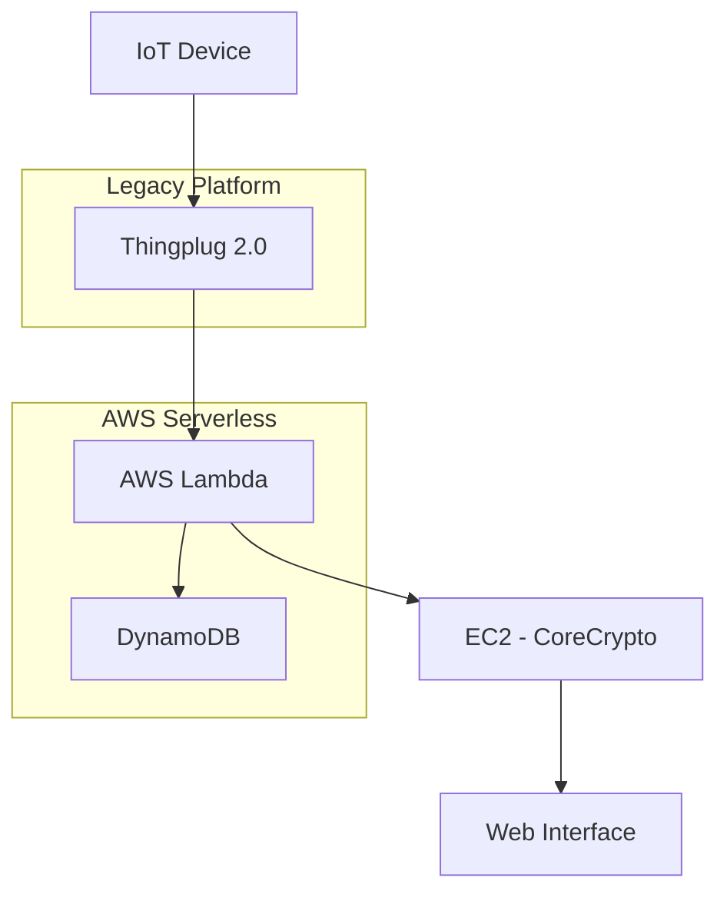

# Thingplug를 활용한 하드웨어 기반 키관리 및 접근제어 시스템 설계

## 🎯 Summary

**Thingplug 2.0 기반 IoT 보안 시스템의 핵심 설계 포인트**

```yaml
# 시스템 아키텍처 개요
플랫폼: Thingplug 2.0
클라우드: AWS (Lambda, DynamoDB, EC2)
보안: CoreCrypto 라이브러리
구조: Serverless + 하이브리드

# 핵심 구성요소
1. 데이터베이스: DynamoDB (키 관리)
2. API 연동: AWS Lambda 함수
3. 암호화: CoreCrypto (C 라이브러리)
4. 컴퓨팅: EC2 (CoreCrypto 전용)
5. 인터페이스: 웹 서비스
```

**즉시 적용 가능한 설계 패턴:**

```javascript
// Thingplug API 연동 Lambda 함수 구조
const thingplugConnector = {
  endpoint: 'https://thingplugapi.sktiot.com',
  authentication: 'Bearer token',
  keyManagement: 'DynamoDB integration',
  security: 'CoreCrypto encryption'
};

// 개발 우선순위 (2개월 일정)
const developmentPhases = [
  '1. DynamoDB 스키마 설계',
  '2. Thingplug API 연동',
  '3. CoreCrypto 라이브러리 구현',
  '4. Lambda 함수 개발',
  '5. 웹 인터페이스 구축'
];
```

---

## 📚 상세 설명

### 배경 및 필요성

사물인터넷(IoT) 환경에서 하드웨어 기반의 키 관리와 접근 제어는 보안의 핵심입니다. 당초 AWS IoT를 고려했으나 프로젝트 요구사항에 따라 Thingplug 2.0을 선택하게 되었습니다. 비록 지원이 종료된 플랫폼이지만, 기존 시스템과의 호환성과 프로젝트 제약사항을 고려한 현실적인 선택이었습니다.

### 시스템 아키텍처 설계

#### 1. 플랫폼 선택 및 제약사항

**Thingplug 2.0 특징:**
- SKT에서 개발한 IoT 플랫폼
- oneM2M 표준 기반
- 현재 지원 종료 상태
- 기존 API 및 문서 활용 가능

**설계 제약사항:**
- CoreCrypto 라이브러리: C 언어 기반, OS/비트 제약
- 비용 최적화: 시연용 서비스 고려
- 개발 일정: 2개월 내 완료

#### 2. 클라우드 아키텍처 구성



**핵심 구성요소:**

1. **DynamoDB**: 키 관리 데이터베이스
   - NoSQL 기반 확장성
   - Serverless 아키텍처 부합
   - 비용 효율적

2. **AWS Lambda**: API 연동 레이어
   - Thingplug API 호출 처리
   - 이벤트 기반 확장성
   - 개발 및 유지보수 용이성

3. **EC2 인스턴스**: CoreCrypto 전용
   - C 라이브러리 실행 환경
   - OS 의존성 해결
   - 보안 연산 처리

### 기술적 세부사항

#### Phase 1: 데이터베이스 설계 (DynamoDB)

```javascript
// DynamoDB 테이블 스키마 예시
const keyManagementSchema = {
  TableName: 'IoTKeyManagement',
  KeySchema: [
    {
      AttributeName: 'deviceId',
      KeyType: 'HASH'  // Partition key
    },
    {
      AttributeName: 'keyVersion',
      KeyType: 'RANGE'  // Sort key
    }
  ],
  AttributeDefinitions: [
    {
      AttributeName: 'deviceId',
      AttributeType: 'S'
    },
    {
      AttributeName: 'keyVersion',
      AttributeType: 'N'
    }
  ],
  GlobalSecondaryIndexes: [
    {
      IndexName: 'KeyStatusIndex',
      KeySchema: [
        {
          AttributeName: 'keyStatus',
          KeyType: 'HASH'
        }
      ]
    }
  ]
};
```

#### Phase 2: Thingplug API 연동

```javascript
// Lambda 함수 - Thingplug API 연동
const AWS = require('aws-sdk');
const axios = require('axios');

exports.handler = async (event) => {
  const thingplugConfig = {
    baseURL: 'https://thingplugapi.sktiot.com',
    headers: {
      'Accept': 'application/json',
      'X-M2M-RI': generateRequestId(),
      'X-M2M-Origin': process.env.THINGPLUG_ORIGIN
    }
  };

  try {
    // Thingplug API 호출
    const response = await axios.post(
      `${thingplugConfig.baseURL}/oneM2M/v1/CSEBase`,
      event.body,
      { headers: thingplugConfig.headers }
    );

    // DynamoDB에 결과 저장
    const dynamodb = new AWS.DynamoDB.DocumentClient();
    await dynamodb.put({
      TableName: 'IoTKeyManagement',
      Item: {
        deviceId: event.deviceId,
        keyVersion: Date.now(),
        encryptedKey: response.data.encryptedKey,
        timestamp: new Date().toISOString()
      }
    }).promise();

    return {
      statusCode: 200,
      body: JSON.stringify({
        success: true,
        data: response.data
      })
    };
  } catch (error) {
    console.error('Thingplug API 연동 오류:', error);
    return {
      statusCode: 500,
      body: JSON.stringify({
        success: false,
        error: error.message
      })
    };
  }
};
```

#### Phase 3-4: CoreCrypto 라이브러리 연동

```c
// CoreCrypto 라이브러리 인터페이스 예시
#include "corecrypto/cc_priv.h"
#include <stdio.h>

// 키 생성 함수
int generate_device_key(const char* device_id, char* output_key) {
    // CoreCrypto를 활용한 키 생성 로직
    cc_unit key_buffer[CC_SHA256_DIGEST_LENGTH];
    
    // 디바이스 ID 기반 키 생성
    if (cc_sha256(strlen(device_id), device_id, key_buffer) != 0) {
        return -1;
    }
    
    // Base64 인코딩 후 반환
    base64_encode(key_buffer, CC_SHA256_DIGEST_LENGTH, output_key);
    return 0;
}

// Lambda에서 호출 가능한 HTTP 엔드포인트
int main() {
    // HTTP 서버 설정
    start_http_server(8080);
    return 0;
}
```

#### Phase 5: 웹 인터페이스 구현

```javascript
// React 기반 관리 인터페이스
import React, { useState, useEffect } from 'react';
import axios from 'axios';

const IoTKeyManagement = () => {
  const [devices, setDevices] = useState([]);
  const [selectedDevice, setSelectedDevice] = useState(null);

  // 디바이스 목록 조회
  useEffect(() => {
    const fetchDevices = async () => {
      try {
        const response = await axios.get('/api/devices');
        setDevices(response.data);
      } catch (error) {
        console.error('디바이스 조회 실패:', error);
      }
    };

    fetchDevices();
  }, []);

  // 키 재생성 요청
  const regenerateKey = async (deviceId) => {
    try {
      await axios.post(`/api/devices/${deviceId}/regenerate-key`);
      alert('키가 성공적으로 재생성되었습니다.');
    } catch (error) {
      alert('키 재생성에 실패했습니다.');
    }
  };

  return (
    <div className="key-management-dashboard">
      <h2>IoT 키 관리 시스템</h2>
      <div className="device-list">
        {devices.map(device => (
          <div key={device.id} className="device-card">
            <h3>{device.name}</h3>
            <p>상태: {device.status}</p>
            <p>마지막 키 업데이트: {device.lastKeyUpdate}</p>
            <button onClick={() => regenerateKey(device.id)}>
              키 재생성
            </button>
          </div>
        ))}
      </div>
    </div>
  );
};

export default IoTKeyManagement;
```

### 실제 활용 사례

#### 보안 고려사항

1. **암호화 키 라이프사이클 관리**
   - 정기적인 키 순환(Key Rotation)
   - 키 폐기 및 아카이브 정책
   - 접근 권한 로깅

2. **네트워크 보안**
   - TLS/SSL 암호화 통신
   - API 인증 토큰 관리
   - VPC 및 보안 그룹 설정

#### 에러 처리 및 모니터링

```javascript
// CloudWatch 로깅 및 알림 설정
const cloudwatch = new AWS.CloudWatch();

const logMetric = async (metricName, value, unit = 'Count') => {
  const params = {
    Namespace: 'IoTKeyManagement',
    MetricData: [
      {
        MetricName: metricName,
        Value: value,
        Unit: unit,
        Timestamp: new Date()
      }
    ]
  };

  try {
    await cloudwatch.putMetricData(params).promise();
  } catch (error) {
    console.error('CloudWatch 메트릭 전송 실패:', error);
  }
};

// 사용 예시
await logMetric('KeyRegenerationSuccess', 1);
await logMetric('ThingplugAPIError', 1);
```

#### 비용 최적화 전략

1. **Serverless 우선**: Lambda 함수로 사용량 기반 과금
2. **DynamoDB On-Demand**: 예측 불가능한 트래픽 대응
3. **EC2 Spot Instance**: CoreCrypto 처리용 비용 절감

## 결론

Thingplug 2.0 기반 IoT 보안 시스템 설계에서 핵심은 **레거시 플랫폼과 현대적 클라우드 아키텍처의 효과적인 결합**입니다. 비록 지원이 종료된 플랫폼을 사용해야 하는 제약이 있지만, AWS의 Serverless 서비스들을 적극 활용하여 확장성과 비용 효율성을 동시에 확보할 수 있었습니다.

**핵심 인사이트:**
- **하이브리드 아키텍처**: 레거시 시스템과 클라우드 네이티브 서비스의 조화
- **단계별 개발**: 5단계 체계적 접근으로 복잡성 관리
- **보안 우선**: CoreCrypto 활용한 하드웨어 기반 암호화

**다음 단계:**
2개월 개발 일정에 맞춰 Phase 1(데이터베이스 설계)부터 순차적으로 진행하며, 각 단계별 테스트와 검증을 통해 안정적인 시스템 구축을 목표로 합니다. 특히 CoreCrypto 라이브러리 연동 부분에서는 충분한 테스트 시간을 확보하여 보안 요구사항을 만족시킬 계획입니다.
