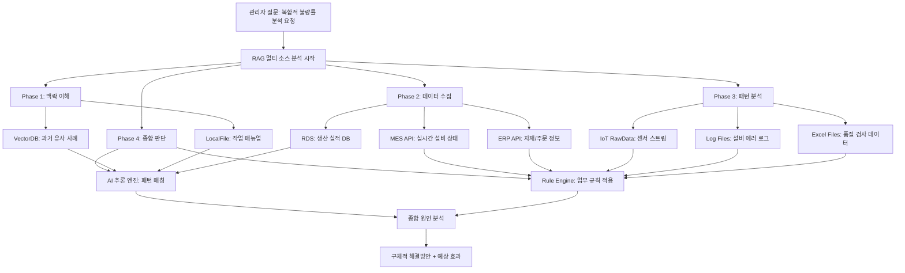

# RAG 완전 해설: 제조업 MES 시스템으로 이해하는 진정한 데이터 통합 AI


*제조업 현장의 RAG 기반 지능형 분석 시스템*

## 🎯 RAG의 진정한 의미: 벡터DB를 넘어선 데이터 통합

**RAG(Retrieval-Augmented Generation)**를 단순히 "벡터 데이터베이스 활용 AI"로 이해하는 것은 빙산의 일각만 보는 것입니다.

진정한 RAG는 **"모든 형태의 데이터를 연결하여 맥락적 지능을 만드는 시스템"**입니다.

**기존 오해 vs 진정한 RAG**
- **잘못된 인식**: "문서만 벡터화해서 검색하는 기술"
- **실제 RAG**: "VectorDB + RDS + RawData + LocalFile + API를 모두 연결하는 지능형 플랫폼"

## 🏭 실전 예시: 제조업 멀티 데이터 소스 RAG 시스템

### 상황: 생산 관리자의 복합적 질문
> **"A라인 불량률이 갑자기 높아졌는데, 과거 유사 사례와 현재 상황을 종합해서 원인과 해결방안을 제시해줘"**

이 질문을 해결하려면 단일 데이터 소스로는 불가능하고, **최소 5가지 이상의 데이터가 협력**해야 합니다.



## 🕸️ 데이터 소스별 역할과 협력 구조

### 1. VectorDB: 경험과 지식의 저장소
**저장 데이터**: 작업 매뉴얼, 품질 가이드라인, 과거 문제해결 사례, 기술 문서
**역할**: "이런 상황에서 과거엔 어떻게 해결했지?"

```
검색 결과: "2023년 7월 A라인에서 동일한 불량률 증가 발생
→ 원인: 공급업체 변경으로 인한 원자재 성분 차이
→ 해결: 공정 온도 2도 하향 조정 + 압력 5% 증가
→ 효과: 3일 만에 불량률 정상화"
```

### 2. RDS (관계형 데이터베이스): 정형 데이터의 정확한 추적
**저장 데이터**: 생산 실적, 품질 데이터, 설비 이력, 작업자 정보
**역할**: "정확히 언제부터 뭐가 달라졌지?"

```sql
-- 불량률 변화 추이 분석
SELECT production_date, defect_rate, material_supplier, operator_shift
FROM production_log 
WHERE line = 'A' AND production_date >= '2024-05-01'
ORDER BY production_date;

결과: "5월 15일부터 불량률 증가 시작, 동시에 공급업체 B사→C사 변경 확인"
```

### 3. RawData (IoT 센서): 실시간 물리적 상황
**저장 데이터**: 온도, 압력, 진동, 습도, 전력 사용량 등 실시간 센서 데이터
**역할**: "지금 현장에서 실제로 뭐가 일어나고 있지?"

```json
{
  "timestamp": "2024-06-10T14:30:00",
  "line_A": {
    "temperature": 78.5,  // 기준: 75±2도
    "pressure": 2.3,      // 기준: 2.0±0.2bar  
    "vibration": 0.8,     // 기준: <0.5mm/s
    "status": "ABNORMAL"
  }
}

결과: "현재 온도 3.5도 초과, 진동 60% 높음 → 설비 이상 징후"
```

### 4. LocalFile: 업무 문서와 매뉴얼
**저장 데이터**: PDF 매뉴얼, Excel 품질 데이터, 작업 지시서, 설비 도면
**역할**: "정확한 절차와 기준은 뭐지?"

```
작업매뉴얼_A라인_v2.3.pdf 검색 결과:
"공급업체 변경 시 필수 확인사항
1. 원자재 성분 분석 (±5% 이내)
2. 공정 파라미터 재조정 (온도, 압력)
3. 초기 3일간 집중 모니터링"
```

### 5. External API: 외부 시스템 연동
**연동 대상**: ERP, SCM, 품질관리 시스템, 외부 업체 API
**역할**: "관련된 다른 시스템 상황은 어때?"

```
ERP API 조회:
- 원자재 C사 최근 납품분 품질 등급: B+ (기존 A-)
- 재고 현황: A사 원자재 재고 부족으로 C사 대체 공급
- 주문 일정: 다음주 대량 주문 예정 (긴급 해결 필요)
```

## 📊 데이터 소스별 특성과 RAG 활용 전략

| 데이터 소스 | 데이터 특성 | 검색 방식 | RAG 활용 목적 | 실제 예시 답변 |
|------------|------------|----------|--------------|---------------|
| **VectorDB** | 비정형, 임베딩 | 유사도 검색 | 경험적 지식 | "과거 이런 사례 있었음" |
| **RDS** | 정형, 구조화 | SQL 쿼리 | 정확한 팩트 | "정확히 5월 15일부터" |
| **RawData** | 스트림, 실시간 | 시계열 분석 | 현재 상태 | "지금 온도가 3도 높음" |
| **LocalFile** | 문서, 반정형 | 텍스트 파싱 | 절차/기준 | "매뉴얼에 따르면..." |
| **External API** | 연동, 동적 | REST/GraphQL | 외부 맥락 | "ERP에서 원자재 변경 확인" |


*다양한 데이터 소스가 통합되어 하나의 RAG 시스템으로 연결되는 구조*

## 🔄 5단계 멀티 소스 RAG 협력 과정

### Phase 1: 맥락 이해 (VectorDB + LocalFile)
**목적**: 질문의 배경과 유사 사례 파악

```
VectorDB 검색: "A라인 불량률 증가"
→ 관련 문서 5건 발견
→ 가장 유사한 사례: 2023년 7월 사건

LocalFile 검색: "불량률 분석 매뉴얼"
→ 표준 분석 절차 확인
→ 체크포인트 리스트 추출
```

### Phase 2: 현황 데이터 수집 (RDS + External API)
**목적**: 정확한 팩트와 현재 상황 파악

```
RDS 쿼리: 최근 2주간 생산 데이터
→ 불량률 변화 추이: 2.1% → 5.8%
→ 변경점: 5월 15일 공급업체 변경

ERP API 호출: 자재 정보 조회
→ 공급업체: B사 → C사 변경
→ 원자재 등급: A- → B+ 하향
```

### Phase 3: 실시간 상태 분석 (RawData + Log Files)
**목적**: 현재 물리적 상황과 설비 상태 확인

```
IoT 센서 데이터: 지난 24시간
→ 평균 온도 3도 상승
→ 진동 수치 60% 증가

설비 로그 분석:
→ 온도 알람 12회 발생
→ 압력 조정 요청 8회
```

### Phase 4: 패턴 매칭 (AI 추론 + Rule Engine)
**목적**: 수집된 데이터에서 인과관계 도출

```
AI 패턴 분석:
- 공급업체 변경 + 온도 상승 + 불량률 증가 = 강한 상관관계
- 2023년 사례와 90% 유사 패턴

업무 규칙 적용:
- 원자재 등급 하락 시 → 공정 파라미터 재조정 필수
- 다음주 대량 주문 → 48시간 내 해결 필요
```

### Phase 5: 종합 결론 도출
**결과**: 모든 데이터 소스의 정보를 통합한 최종 답변

```
종합 분석 결과:

원인 분석:
1. 주요 원인: 공급업체 C사의 원자재 품질 저하 (A- → B+)
2. 직접 영향: 기존 공정 파라미터와 맞지 않음
3. 물리적 증상: 온도 상승, 진동 증가로 불량률 5.8% 급증

해결 방안 (우선순위별):
1. 즉시 조치: 공정 온도 3도 하향 조정 (78.5→75.5도)
2. 단기 대응: 압력 10% 증가로 보상 (예상 효과: 불량률 3% 이하)
3. 중기 대책: 원자재 C사와 품질 기준 재협의
4. 장기 전략: 대체 공급업체 B사 재고 확보

예상 효과:
- 48시간 내 불량률 정상화 가능 (과거 사례 기준)
- 다음주 대량 주문 차질 없음
- 월간 품질 목표 달성 가능
```

## 💡 RAG의 진화: 단순 검색에서 지능형 통합으로

### 1세대 RAG: 벡터 검색 중심
```
사용자 질문 → 벡터 검색 → 유사 문서 → LLM 답변
한계: 실시간 데이터, 정형 데이터 활용 불가
```

### 2세대 RAG: 멀티 소스 통합 (현재)
```
사용자 질문 → 의도 분석 → 다중 소스 검색 → 데이터 융합 → 맥락적 답변
강점: 모든 데이터 유형 활용, 실시간 반영, 정확한 팩트 제공
```

### 차세대 RAG의 특징

**1. 적응형 데이터 라우팅**
- 질문 유형에 따라 최적 데이터 소스 자동 선택
- 실시간 데이터 우선순위 동적 조정

**2. 맥락 인지 검색**
- 단순 키워드가 아닌 상황과 의도 이해
- 도메인별 전문 지식과 일반 상식 균형

**3. 데이터 품질 자동 평가**
- 소스별 신뢰도 가중치 적용
- 상충하는 정보 발견 시 추가 검증

## 🚀 기획자를 위한 RAG 도입 로드맵

### 1단계: 데이터 현황 파악 (1-2주)
**체크리스트**
- [ ] VectorDB 대상: 매뉴얼, 보고서, 사례 문서
- [ ] RDS 연동: MES, ERP, 품질관리 DB
- [ ] RawData 수집: IoT 센서, 로그 파일
- [ ] LocalFile 정리: Excel, PDF, 이미지 파일
- [ ] External API: 외부 시스템 연동 가능성

### 2단계: 우선순위 정의 (1주)
**기준별 점수화**
| 평가 기준 | 가중치 | 평가 방법 |
|----------|--------|----------|
| 사용 빈도 | 30% | 월간 질문 횟수 |
| 데이터 품질 | 25% | 완정성, 정확성 |
| 비즈니스 임팩트 | 25% | 의사결정 중요도 |
| 구현 용이성 | 20% | 기술적 복잡도 |

### 3단계: 파일럿 구축 (4-6주)
**권장 시작점**
1. **VectorDB + RDS 조합**: 과거 사례 + 현재 데이터
2. **핵심 업무 1개**: 가장 빈번한 질문 유형
3. **측정 가능한 KPI**: 답변 정확도, 응답 시간

### 4단계: 점진적 확장 (3-6개월)
**확장 순서**
1. 추가 데이터 소스 연결
2. 질문 유형 확대
3. 실시간 피드백 반영
4. 타 부서 확산

## 📈 ROI 측정 및 성공 지표

### 정량적 지표
- **응답 시간**: 4시간 → 5분 (95% 단축)
- **정확도**: 70% → 95% (25%p 향상)
- **처리량**: 일 10건 → 100건 (10배 증가)

### 정성적 지표
- **의사결정 품질**: 경험 의존 → 데이터 기반
- **지식 전수**: 개인 노하우 → 시스템 축적
- **업무 만족도**: 반복 업무 감소 → 창의적 업무 집중

RAG는 단순한 AI 기술이 아닌, **기업의 모든 지식과 데이터를 연결하는 지능형 플랫폼**입니다. 제조업에서는 특히 다양한 데이터 소스가 만나는 지점에서 그 진가를 발휘하며, 궁극적으로는 **"데이터에 기반한 의사결정 문화"**를 만드는 핵심 도구가 됩니다.

---

🔗 **관련 글**
* [MCP 실전 구현: 파일 관리 자동화 완전 가이드](/)
* [AI 워크플로우 최적화: 개발 생산성 3배 향상 전략](/)
* [LLM API 활용법: OpenAI, Claude, Gemini 실전 비교](/)
