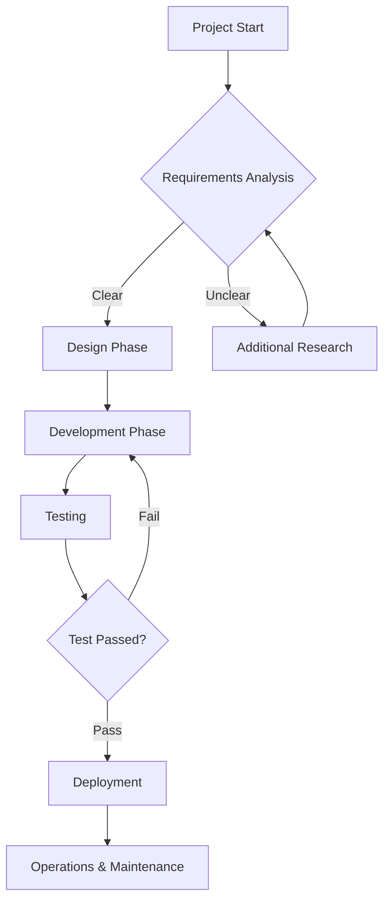
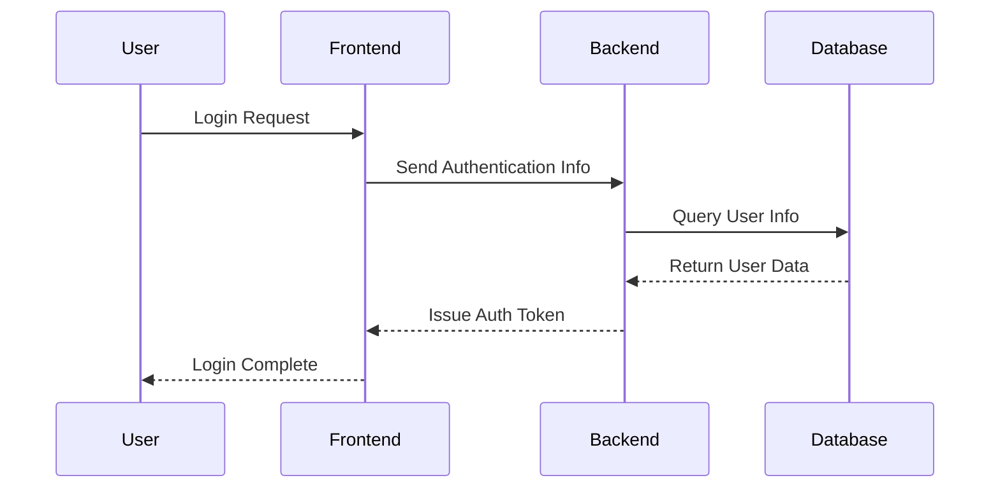
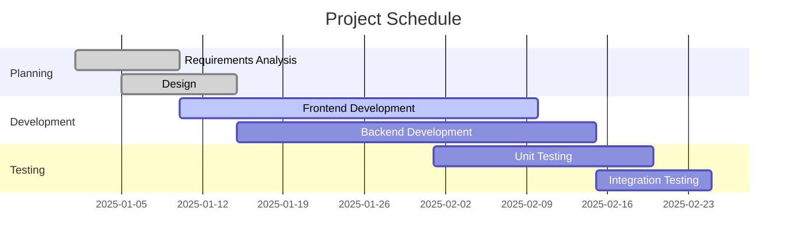
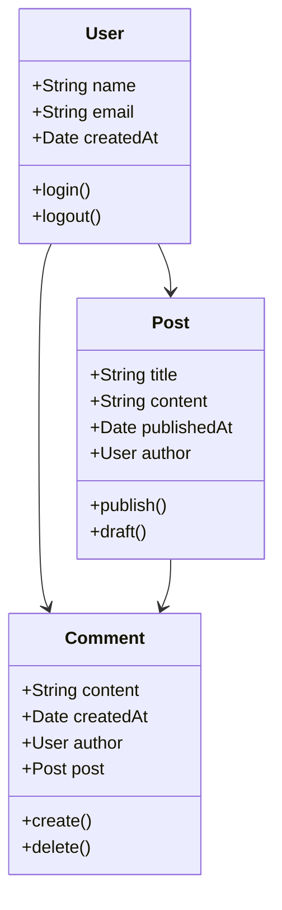
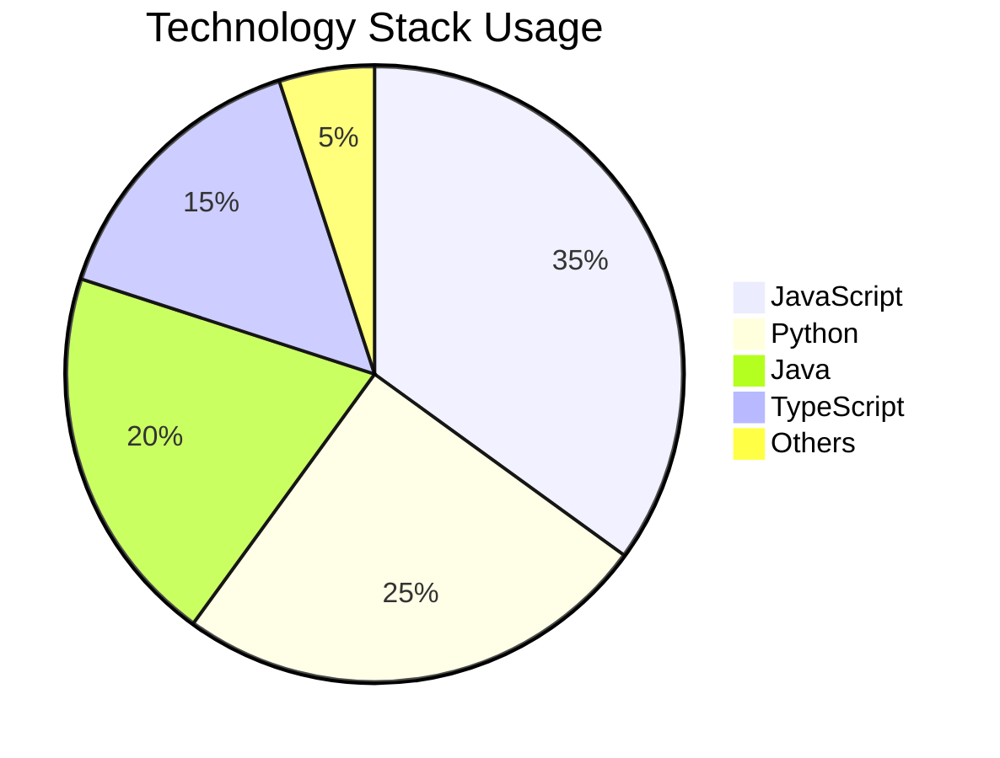
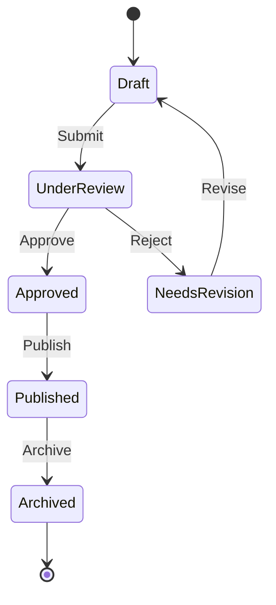
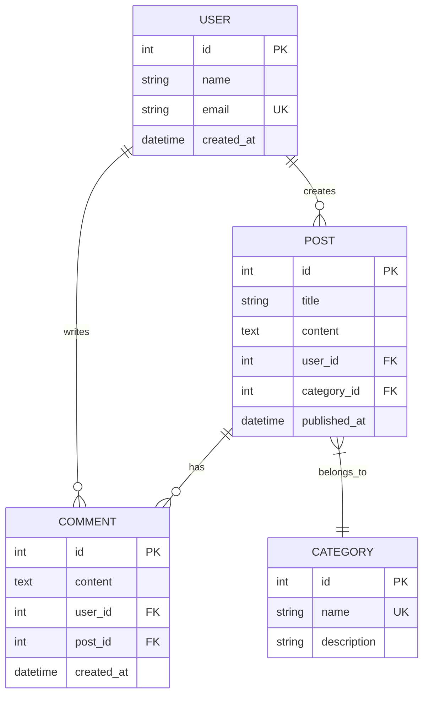

# Mermaid Diagram Functionality Test

This post is a sample to test the newly added Mermaid diagram functionality.

## 📊 Flowchart Example



## 🔄 Sequence Diagram



## 📈 Gantt Chart



## 🏗️ Class Diagram



## 🔢 Pie Chart



## 📋 State Diagram



## 🌐 ER Diagram



## ✅ Usage Guide

To use Mermaid diagrams in your posts:

1. **Add configuration to Front Matter:**
   ```yaml
   ---
   layout: post
   title: "Post Title"
   mermaid: true  # Add this line!
   ---
   ```

2. **Use in Markdown:**
   ````markdown
   ```mermaid
   graph TD
       A[Start] --> B[End]
   ```
   ````

3. **Supported Diagram Types:**
   - Flowchart (`graph`, `flowchart`)
   - Sequence Diagram (`sequenceDiagram`)
   - Class Diagram (`classDiagram`)
   - State Diagram (`stateDiagram`)
   - ER Diagram (`erDiagram`)
   - Gantt Chart (`gantt`)
   - Pie Chart (`pie`)
   - And many more...

For detailed information about Mermaid syntax, please refer to the [official documentation](https://mermaid.js.org/)!