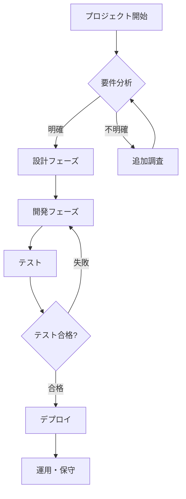
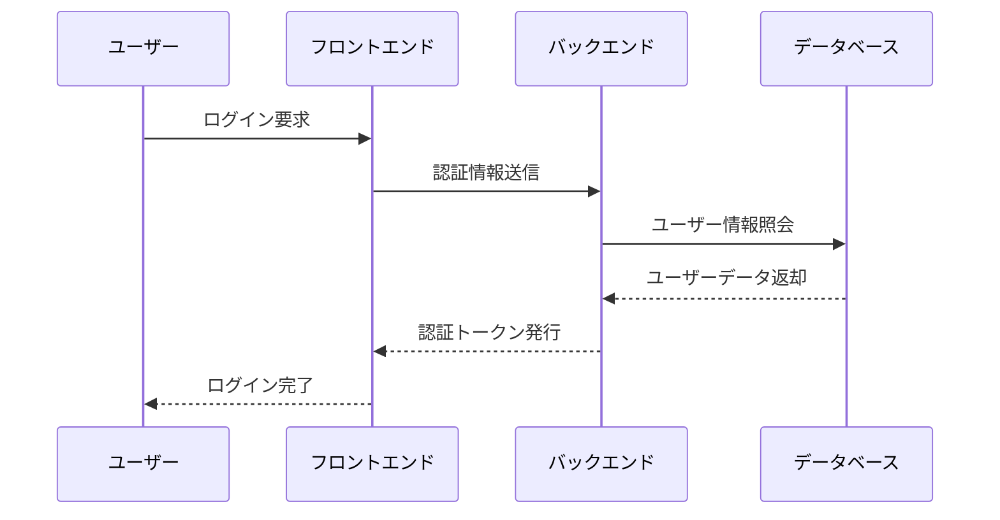
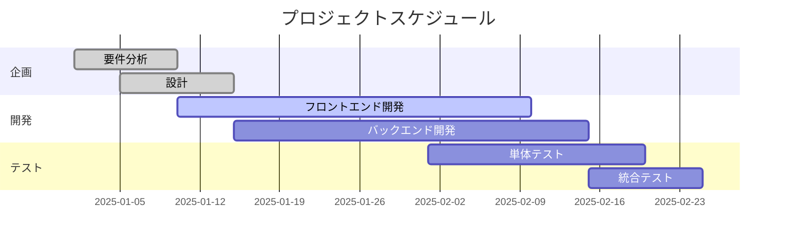
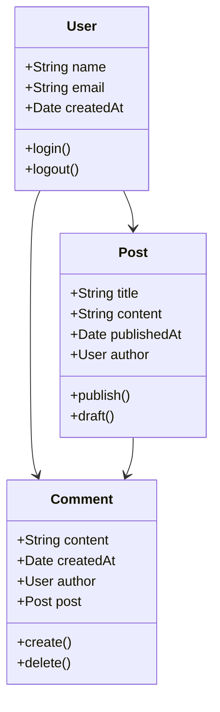
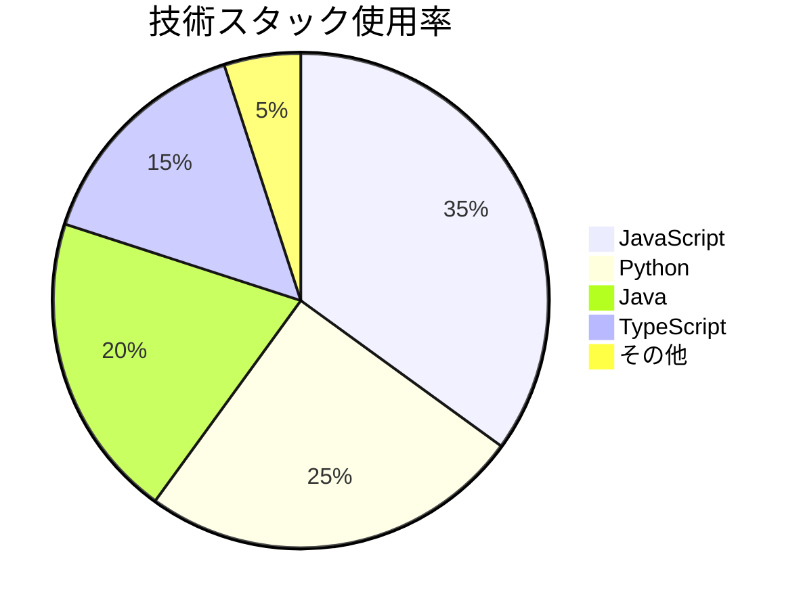
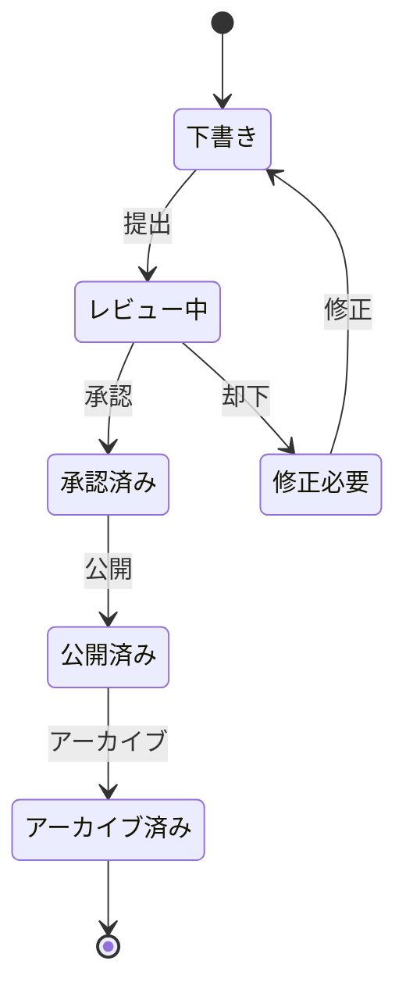
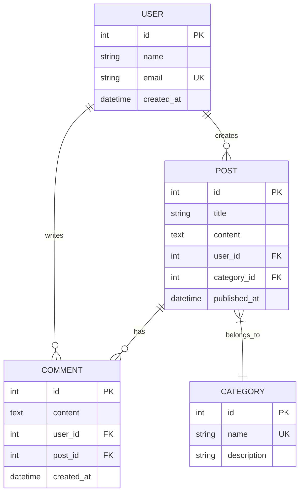

# Mermaid ダイアグラム機能テスト

この投稿は新しく追加されたMermaidダイアグラム機能をテストするためのサンプル投稿です。

## 📊 フローチャート例



## 🔄 シーケンス図



## 📈 ガントチャート



## 🏗️ クラス図



## 🔢 円グラフ



## 📋 状態図



## 🌐 ER図



## ✅ 使用方法ガイド

投稿でMermaidダイアグラムを使用するには：

1. **Front Matterに設定を追加：**
   ```yaml
   ---
   layout: post
   title: "投稿タイトル"
   mermaid: true  # この行を追加！
   ---
   ```

2. **Markdownで使用：**
   ````markdown
   ```mermaid
   graph TD
       A[開始] --> B[終了]
   ```
   ````

3. **サポートされているダイアグラムタイプ：**
   - フローチャート (`graph`, `flowchart`)
   - シーケンス図 (`sequenceDiagram`)
   - クラス図 (`classDiagram`)
   - 状態図 (`stateDiagram`)
   - ER図 (`erDiagram`)
   - ガントチャート (`gantt`)
   - 円グラフ (`pie`)
   - その他多数...

Mermaid記法の詳細については、[公式ドキュメント](https://mermaid.js.org/)をご参照ください！