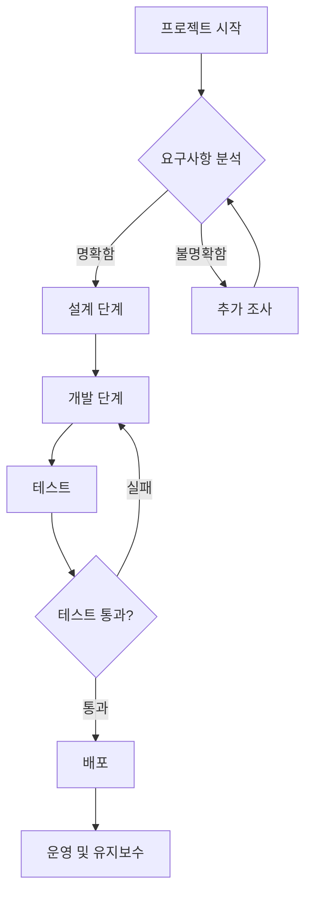
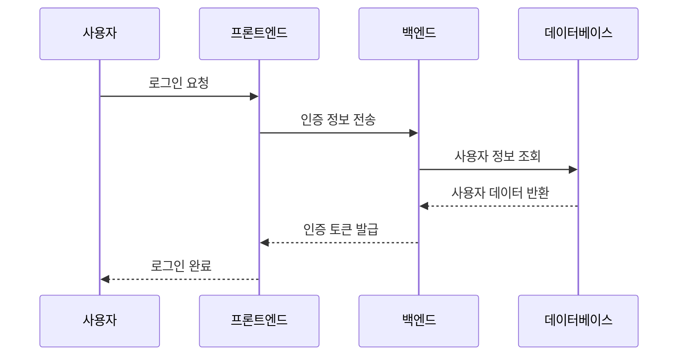
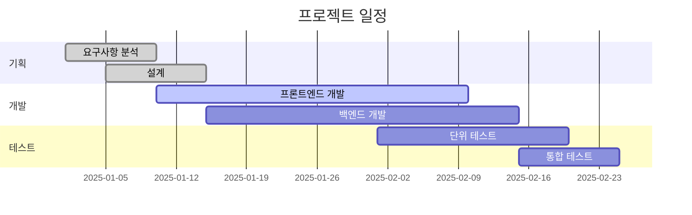
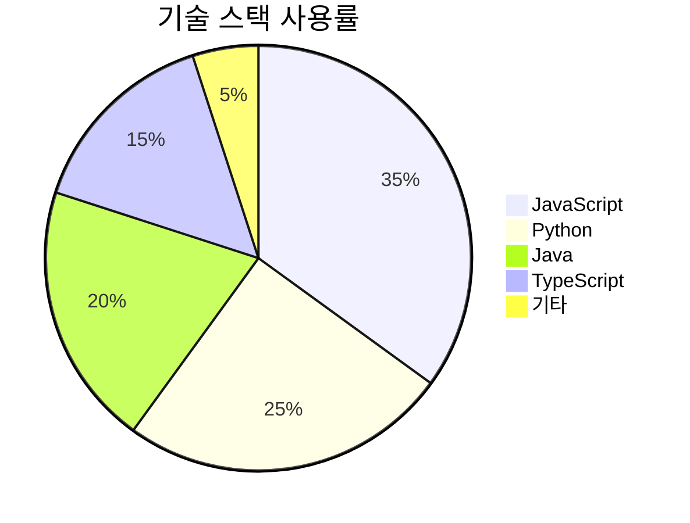
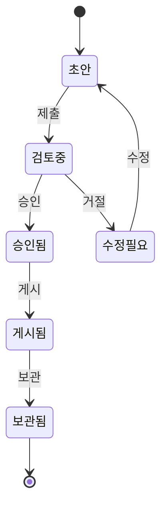
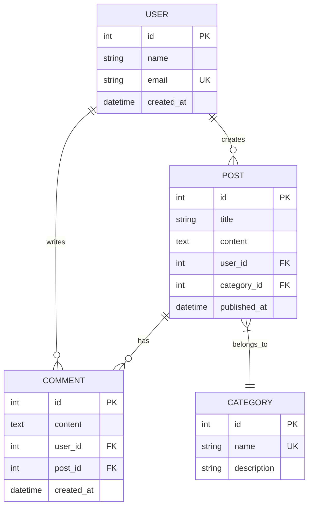

# Mermaid 다이어그램 기능 테스트

이 포스트는 새롭게 추가된 Mermaid 다이어그램 기능을 테스트하기 위한 샘플 포스트입니다.

## 📊 플로우차트 예시



## 🔄 시퀀스 다이어그램



## 📈 간트 차트



## 🏗️ 클래스 다이어그램

```mermaid
classDiagram
    class User {
        +String name
        +String email
        +Date createdAt
        +login()
        +logout()
    }
    
    class Post {
        +String title
        +String content
        +Date publishedAt
        +User author
        +publish()
        +draft()
    }
    
    class Comment {
        +String content
        +Date createdAt
        +User author
        +Post post
        +create()
        +delete()
    }
    
    User ||--o{ Post : writes
    User ||--o{ Comment : writes
    Post ||--o{ Comment : has
```

## 🔢 파이 차트



## 📋 상태 다이어그램



## 🌐 ER 다이어그램



## ✅ 사용법 안내

포스팅에서 Mermaid 다이어그램을 사용하려면:

1. **Front Matter에 설정 추가:**
   ```yaml
   ---
   layout: post
   title: "포스트 제목"
   mermaid: true  # 이 줄 추가!
   ---
   ```

2. **마크다운에서 사용:**
   ````markdown
   ```mermaid
   graph TD
       A[시작] --> B[끝]
   ```
   ````

3. **지원되는 다이어그램 종류:**
   - 플로우차트 (`graph`, `flowchart`)
   - 시퀀스 다이어그램 (`sequenceDiagram`)
   - 클래스 다이어그램 (`classDiagram`)
   - 상태 다이어그램 (`stateDiagram`)
   - ER 다이어그램 (`erDiagram`)
   - 간트 차트 (`gantt`)
   - 파이 차트 (`pie`)
   - 그리고 더 많은 종류...

Mermaid 문법에 대한 자세한 정보는 [공식 문서](https://mermaid.js.org/)를 참고하세요! 