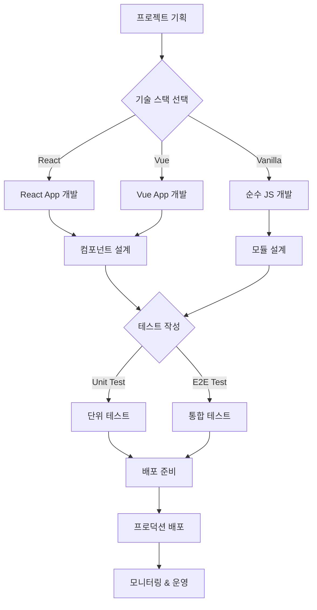
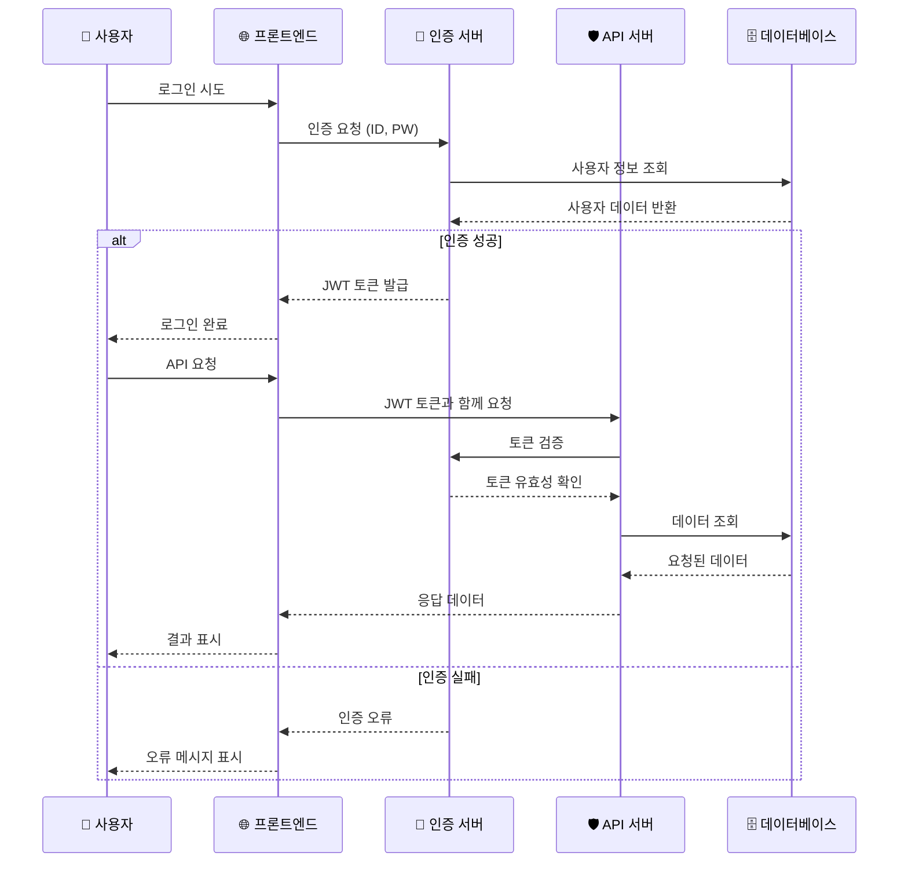
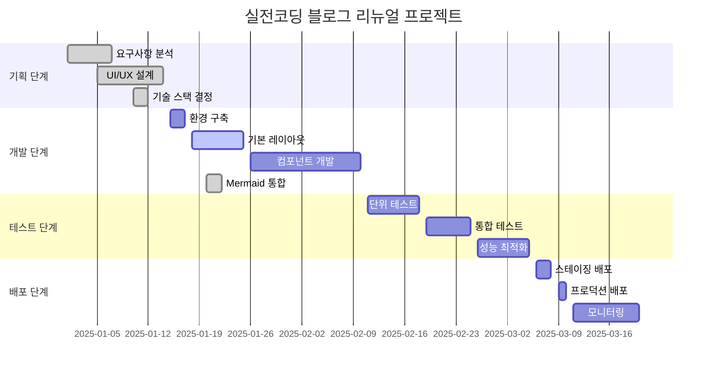
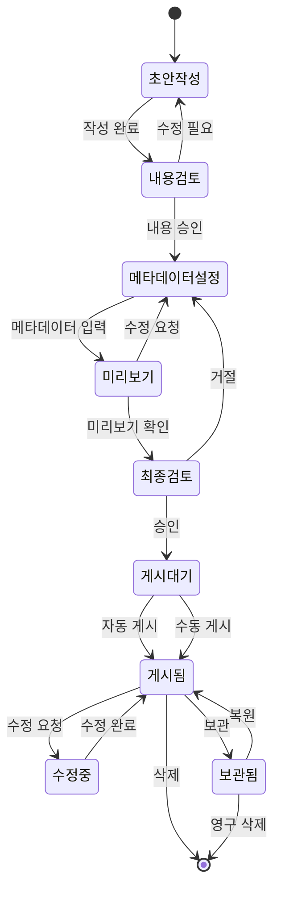
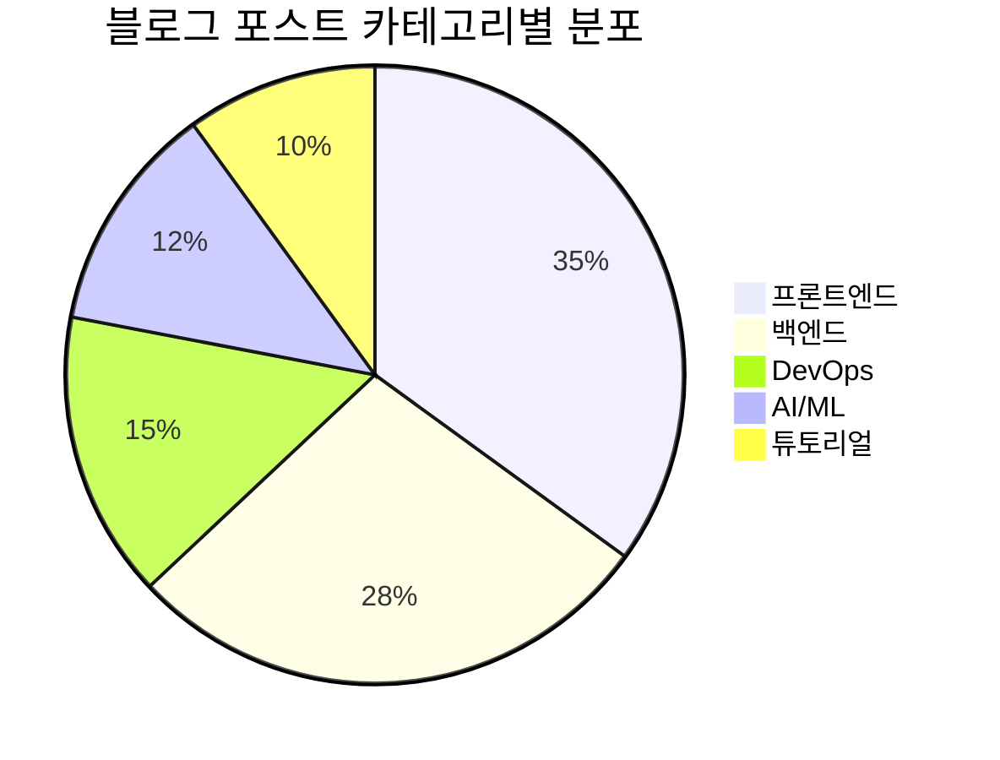
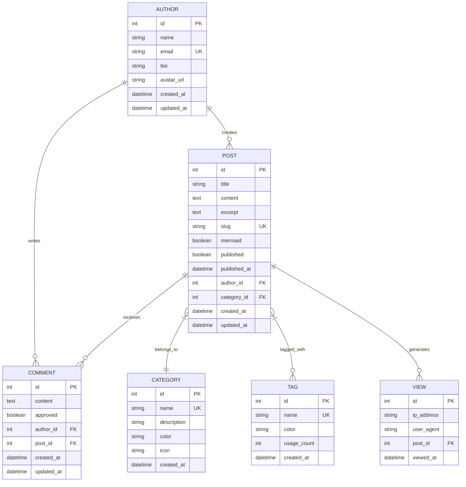

# 사이트 맞춤형 Mermaid 스타일링

이 포스트는 사이트의 **보라-핑크 그라데이션** 톤앤매너에 맞춰 커스터마이징된 Mermaid 다이어그램을 테스트합니다. 모든 다이어그램이 사이트의 디자인 시스템과 일관된 색상과 스타일을 사용합니다.

## 🎨 **사이트 색상 체계**

- **Primary**: `#667eea` (보라빛 블루)
- **Secondary**: `#764ba2` (진보라) 
- **Accent**: `#f093fb` (핑크)
- **Gradient**: Primary → Secondary 선형 그라데이션

---

## 📊 **커스텀 스타일 플로우차트**



## 🔄 **시퀀스 다이어그램 - API 인증 플로우**



## 📈 **간트 차트 - 블로그 리뉴얼 프로젝트**



## 🏗️ **클래스 다이어그램 - 블로그 시스템 설계**

```mermaid
classDiagram
    class BlogPost {
        +String title
        +String content
        +Date publishedAt
        +String[] tags
        +Category category
        +Author author
        +Boolean mermaid
        +publish()
        +draft()
        +addTag(tag)
        +setCategory(category)
    }
    
    class Author {
        +String name
        +String email
        +String bio
        +String avatar
        +Date joinedAt
        +write(post)
        +updateProfile()
    }
    
    class Category {
        +String name
        +String description
        +String color
        +Integer postCount
        +addPost(post)
        +removePost(post)
    }
    
    class Comment {
        +String content
        +Date createdAt
        +Author author
        +BlogPost post
        +Boolean approved
        +create()
        +approve()
        +delete()
    }
    
    class Tag {
        +String name
        +String color
        +Integer usageCount
        +increaseUsage()
        +decreaseUsage()
    }
    
    Author ||--o{ BlogPost : writes
    Category ||--o{ BlogPost : contains
    BlogPost ||--o{ Comment : has
    BlogPost }|--|| Tag : tagged_with
    Author ||--o{ Comment : writes
```

## 🌊 **상태 다이어그램 - 포스트 게시 워크플로우**



## 🔢 **파이 차트 - 블로그 포스트 카테고리 분포**



## 🌐 **ER 다이어그램 - 블로그 데이터베이스 설계**



---

## ✨ **스타일링 특징**

### 🎯 **적용된 커스터마이징**

1. **색상 체계**
   - Primary: `#667eea` → `#764ba2` 그라데이션
   - 사이트 CSS 변수와 완벽 연동
   - 라이트/다크 모드 자동 대응

2. **타이포그래피**
   - Inter 폰트 패밀리 사용 (사이트와 동일)
   - 적절한 폰트 크기와 가중치

3. **레이아웃**
   - 카드 스타일 배경과 그림자
   - 호버 효과 (약간의 리프트)
   - 반응형 패딩과 마진

4. **접근성**
   - 모션 감소 설정 대응
   - 인쇄 모드 최적화
   - 모바일 반응형 지원

### 🛠 **기술적 구현**

- **Mermaid 11** Base 테마 + 커스텀 변수
- **자동 다크모드** 감지 및 색상 조정
- **SVG 그라데이션** 동적 삽입
- **CSS 변수** 활용으로 사이트 테마와 동기화

이제 모든 Mermaid 다이어그램이 **실전코딩 블로그**의 세련된 톤앤매너와 완벽하게 조화를 이룹니다! 🎨✨ 