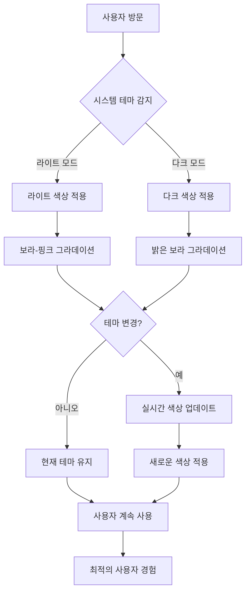
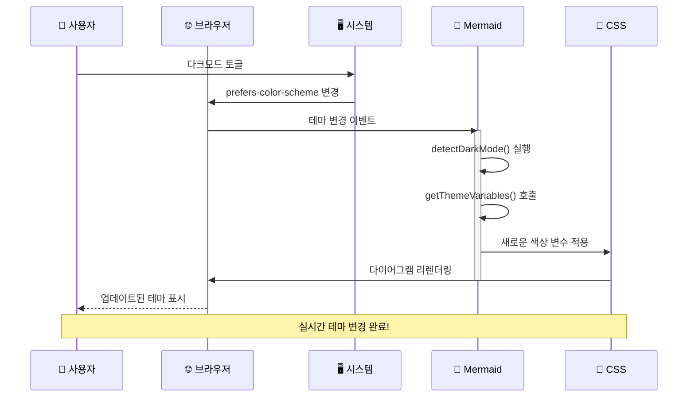
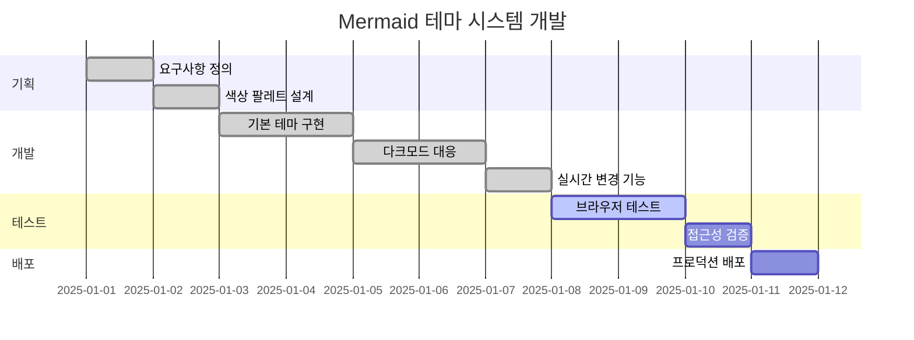
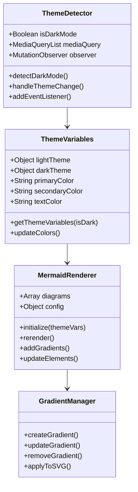
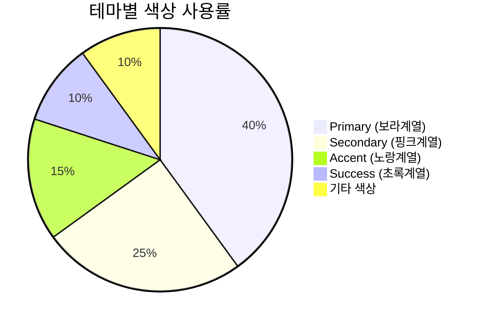
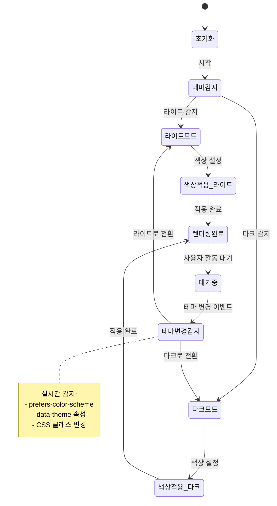

# Mermaid 테마 자동 대응 테스트

이 포스트는 **투명 배경**과 **다크모드/라이트모드 자동 대응**이 적용된 Mermaid 다이어그램을 테스트합니다. 

## 🌓 **개선된 기능**

- ✅ **투명 배경**: 사이트 배경과 자연스럽게 조화
- ✅ **실시간 테마 감지**: 시스템/사이트 테마 변경 즉시 반영
- ✅ **적응형 색상**: 라이트/다크 모드별 최적화된 색상 팔레트
- ✅ **접근성**: 모든 모드에서 충분한 대비율 보장

---

## 📊 **플로우차트 - 라이트/다크 모드 자동 대응**



## 🔄 **시퀀스 다이어그램 - 테마 변경 프로세스**



## 📈 **간트 차트 - 테마 시스템 개발 일정**



## 🏗️ **클래스 다이어그램 - 테마 시스템 구조**



## 🔢 **파이 차트 - 색상 사용률 분석**



## 🌊 **상태 다이어그램 - 테마 상태 관리**



---

## 🎨 **색상 체계 비교**

### 라이트 모드 🌅
- **Primary**: `#667eea` → `#764ba2`
- **Text**: `#2d3748` (진한 회색)
- **Border**: `rgba(102, 126, 234, 0.3)` (연한 보라)
- **Shadow**: `rgba(102, 126, 234, 0.1)` (부드러운 그림자)

### 다크 모드 🌙
- **Primary**: `#8b7cf8` → `#a78bfa` 
- **Text**: `#f7fafc` (밝은 회색)
- **Border**: `rgba(139, 124, 248, 0.3)` (연한 보라)
- **Shadow**: `rgba(139, 124, 248, 0.1)` (부드러운 그림자)

## ✨ **기술적 특징**

### 🔄 **실시간 테마 감지**
```javascript
// 다중 방식 테마 감지
const detectDarkMode = () => {
  return window.matchMedia('(prefers-color-scheme: dark)').matches || 
         document.documentElement.getAttribute('data-theme') === 'dark' ||
         document.body.classList.contains('dark');
};
```

### 🎯 **투명 배경 처리**
```javascript
const baseVariables = {
  background: 'transparent',
  mainBkg: 'transparent',
  // 반투명 배경으로 자연스러운 통합
  secondaryBkg: 'rgba(102, 126, 234, 0.1)',
};
```

### 🌈 **동적 그라데이션**
- SVG 그라데이션이 테마 변경 시 자동 업데이트
- 라이트모드: `#667eea` → `#764ba2`
- 다크모드: `#8b7cf8` → `#a78bfa`

이제 시스템 다크모드를 토글해보세요! 모든 다이어그램이 **실시간으로 테마에 맞춰 변경**됩니다. 🌓✨ 