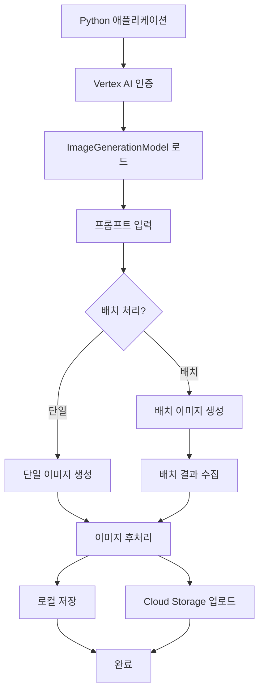

# Vertex AI Imagen Python 패키지로 고품질 이미지 생성하기


*Python으로 Google의 최신 AI 이미지 생성 모델을 활용하는 완전 가이드*

## 🎯 Summary

Google Cloud의 Vertex AI Imagen을 Python에서 바로 사용할 수 있습니다. 복잡한 설정 없이 몇 줄의 코드로 고품질 이미지를 생성하세요.

```python
from vertexai.preview.vision_models import ImageGenerationModel

# 모델 로드 및 이미지 생성
model = ImageGenerationModel.from_pretrained("imagegeneration@006")
images = model.generate_images(
    prompt="A futuristic cityscape at sunset, cyberpunk style",
    number_of_images=1,
    guidance_scale=15,
    seed=42
)

# 이미지 저장
images[0].save("generated_image.png")
```

**핵심 장점:**
- Google의 최신 Imagen 3.0 모델 직접 활용
- 프로덕션 환경에서 안정적인 API 호출
- 배치 처리 및 고급 파라미터 제어 가능
- 상업적 이용 가능한 라이선스

---

## 📚 상세 설명

### 배경 및 필요성

Google의 Vertex AI Imagen은 현재 가장 발전된 텍스트-이미지 생성 모델 중 하나입니다. 기존의 오픈소스 모델들과 달리 상업적 이용이 가능하고, Google Cloud의 인프라를 통해 안정적인 서비스를 제공받을 수 있습니다.


*Google Cloud Vertex AI와 Python 환경을 연결하는 워크플로우*

### 설치 및 초기 설정

#### 1. 필수 패키지 설치

```bash
# Google Cloud SDK 설치 (필수)
curl https://sdk.cloud.google.com | bash
exec -l $SHELL

# Python 라이브러리 설치
pip install google-cloud-aiplatform
```

#### 2. 인증 설정

```bash
# Google Cloud 프로젝트 설정
gcloud config set project YOUR_PROJECT_ID

# 애플리케이션 기본 자격증명 설정
gcloud auth application-default login

# Vertex AI API 활성화
gcloud services enable aiplatform.googleapis.com
```

#### 3. 기본 연결 테스트

```python
import vertexai
from vertexai.preview.vision_models import ImageGenerationModel

# 프로젝트 초기화
vertexai.init(project="your-project-id", location="us-central1")

# 모델 로드 확인
model = ImageGenerationModel.from_pretrained("imagegeneration@006")
print("✅ Vertex AI Imagen 연결 성공!")
```

### 기본 이미지 생성 방법


*Python 코드에서 AI 이미지가 생성되는 과정*

#### 1. 단일 이미지 생성

```python
from vertexai.preview.vision_models import ImageGenerationModel

def generate_single_image(prompt, filename="output.png"):
    """단일 이미지 생성 및 저장"""
    
    # 모델 로드
    model = ImageGenerationModel.from_pretrained("imagegeneration@006")
    
    # 이미지 생성
    response = model.generate_images(
        prompt=prompt,
        number_of_images=1,
        guidance_scale=15,      # 프롬프트 준수도 (1-20)
        seed=42,               # 재현 가능한 결과를 위한 시드
        safety_filter_level="block_some",  # 안전 필터 레벨
        aspect_ratio="1:1"     # 이미지 비율
    )
    
    # 결과 저장
    generated_image = response.images[0]
    generated_image.save(filename)
    
    print(f"✅ 이미지 생성 완료: {filename}")
    return generated_image

# 사용 예시
image = generate_single_image(
    prompt="A serene mountain landscape at golden hour, photorealistic style",
    filename="mountain_landscape.png"
)
```

#### 2. 배치 이미지 생성

```python
def generate_batch_images(prompts, output_dir="generated_images"):
    """여러 프롬프트로 배치 이미지 생성"""
    import os
    
    # 출력 디렉토리 생성
    os.makedirs(output_dir, exist_ok=True)
    
    model = ImageGenerationModel.from_pretrained("imagegeneration@006")
    results = []
    
    for i, prompt in enumerate(prompts):
        try:
            response = model.generate_images(
                prompt=prompt,
                number_of_images=1,
                guidance_scale=12,
                seed=i * 10  # 각기 다른 결과를 위한 시드
            )
            
            filename = f"{output_dir}/image_{i+1:03d}.png"
            response.images[0].save(filename)
            
            results.append({
                "prompt": prompt,
                "filename": filename,
                "success": True
            })
            
            print(f"✅ 생성 완료 ({i+1}/{len(prompts)}): {prompt[:50]}...")
            
        except Exception as e:
            print(f"❌ 생성 실패: {prompt[:50]}... - {str(e)}")
            results.append({
                "prompt": prompt,
                "filename": None,
                "success": False,
                "error": str(e)
            })
    
    return results

# 사용 예시
prompts = [
    "A modern office building at night, architectural photography",
    "Abstract digital art with flowing colors and geometric shapes",
    "A cozy coffee shop interior, warm lighting, photorealistic"
]

batch_results = generate_batch_images(prompts)
```

### 고급 기능 및 최적화


*Vertex AI Imagen을 활용한 프로덕션 시스템 아키텍처*

#### Vertex AI Imagen 워크플로우



#### 1. 프롬프트 엔지니어링

```python
class PromptOptimizer:
    """효과적인 프롬프트 생성을 위한 헬퍼 클래스"""
    
    def __init__(self):
        self.style_modifiers = {
            "photorealistic": "photorealistic, high resolution, professional photography",
            "artistic": "digital art, artistic style, creative composition",
            "minimal": "clean, minimal design, simple composition",
            "vintage": "vintage style, retro aesthetic, classic look"
        }
        
        self.quality_enhancers = [
            "high quality", "detailed", "sharp focus", 
            "professional", "award winning"
        ]
    
    def enhance_prompt(self, base_prompt, style="photorealistic", add_quality=True):
        """프롬프트에 스타일과 품질 수식어 추가"""
        enhanced = base_prompt
        
        # 스타일 수식어 추가
        if style in self.style_modifiers:
            enhanced += f", {self.style_modifiers[style]}"
        
        # 품질 수식어 추가
        if add_quality:
            enhanced += f", {', '.join(self.quality_enhancers[:3])}"
        
        return enhanced
    
    def create_variations(self, base_prompt, styles=None):
        """하나의 기본 프롬프트로 여러 스타일 변형 생성"""
        if styles is None:
            styles = list(self.style_modifiers.keys())
        
        variations = []
        for style in styles:
            enhanced = self.enhance_prompt(base_prompt, style)
            variations.append({
                "style": style,
                "prompt": enhanced
            })
        
        return variations

# 사용 예시
optimizer = PromptOptimizer()

base_prompt = "A modern workspace with laptop and coffee"
variations = optimizer.create_variations(base_prompt)

for var in variations:
    print(f"스타일: {var['style']}")
    print(f"프롬프트: {var['prompt']}\n")
```

#### 2. 에러 처리 및 재시도 로직

```python
import time
import random
from typing import Optional

class RobustImageGenerator:
    """안정적인 이미지 생성을 위한 래퍼 클래스"""
    
    def __init__(self, project_id: str, location: str = "us-central1"):
        vertexai.init(project=project_id, location=location)
        self.model = ImageGenerationModel.from_pretrained("imagegeneration@006")
        
    def generate_with_retry(self, 
                          prompt: str,
                          max_retries: int = 3,
                          backoff_factor: float = 1.5) -> Optional[object]:
        """재시도 로직이 포함된 이미지 생성"""
        
        for attempt in range(max_retries):
            try:
                response = self.model.generate_images(
                    prompt=prompt,
                    number_of_images=1,
                    guidance_scale=15,
                    seed=random.randint(1, 10000)
                )
                
                return response.images[0]
                
            except Exception as e:
                wait_time = backoff_factor ** attempt
                print(f"시도 {attempt + 1} 실패: {str(e)}")
                
                if attempt < max_retries - 1:
                    print(f"{wait_time:.1f}초 후 재시도...")
                    time.sleep(wait_time)
                else:
                    print("모든 재시도 실패")
                    raise e
        
        return None
    
    def safe_generate(self, prompt: str, fallback_prompt: str = None):
        """안전한 이미지 생성 (폴백 포함)"""
        try:
            return self.generate_with_retry(prompt)
        except Exception as e:
            if fallback_prompt:
                print(f"원본 프롬프트 실패, 폴백 사용: {fallback_prompt}")
                return self.generate_with_retry(fallback_prompt)
            else:
                raise e

# 사용 예시
generator = RobustImageGenerator("your-project-id")

image = generator.safe_generate(
    prompt="A complex detailed scene with many elements",
    fallback_prompt="A simple modern design"
)
```

#### 3. 비용 최적화 전략

```python
class CostOptimizedGenerator:
    """비용 효율적인 이미지 생성 관리"""
    
    def __init__(self, daily_budget_usd: float = 50.0):
        self.daily_budget = daily_budget_usd
        self.cost_per_image = 0.02  # 대략적인 비용 (변동 가능)
        self.generated_today = 0
        
    def can_generate(self, count: int = 1) -> bool:
        """예산 내에서 생성 가능한지 확인"""
        estimated_cost = count * self.cost_per_image
        current_cost = self.generated_today * self.cost_per_image
        
        return (current_cost + estimated_cost) <= self.daily_budget
    
    def generate_with_budget_check(self, generator, prompt: str):
        """예산 확인 후 이미지 생성"""
        if not self.can_generate():
            remaining_budget = self.daily_budget - (self.generated_today * self.cost_per_image)
            raise Exception(f"일일 예산 초과. 남은 예산: ${remaining_budget:.2f}")
        
        image = generator.generate_with_retry(prompt)
        self.generated_today += 1
        
        return image
    
    def get_budget_status(self):
        """현재 예산 사용 현황 반환"""
        used = self.generated_today * self.cost_per_image
        remaining = self.daily_budget - used
        
        return {
            "budget": self.daily_budget,
            "used": used,
            "remaining": remaining,
            "images_generated": self.generated_today,
            "max_additional_images": int(remaining / self.cost_per_image)
        }
```

### 실제 활용 사례


*Vertex AI Imagen의 실제 비즈니스 활용 사례들*

#### 1. 이커머스 상품 이미지 생성

```python
class ProductImageGenerator:
    """상품 이미지 자동 생성 시스템"""
    
    def __init__(self, generator):
        self.generator = generator
        self.product_templates = {
            "fashion": "professional product photography, white background, studio lighting, high resolution, commercial quality",
            "electronics": "clean tech product shot, minimal background, professional lighting, detailed view",
            "furniture": "modern interior setting, natural lighting, lifestyle photography, home decor"
        }
    
    def generate_product_images(self, product_name: str, category: str, variations: list):
        """상품 카테고리별 이미지 생성"""
        base_template = self.product_templates.get(category, self.product_templates["fashion"])
        images = []
        
        for variation in variations:
            prompt = f"{product_name} {variation}, {base_template}"
            
            try:
                image = self.generator.generate_with_retry(prompt)
                filename = f"{product_name.replace(' ', '_')}_{variation.replace(' ', '_')}.png"
                image.save(f"products/{filename}")
                
                images.append({
                    "variation": variation,
                    "filename": filename,
                    "prompt": prompt
                })
                
            except Exception as e:
                print(f"이미지 생성 실패: {variation} - {e}")
        
        return images

# 사용 예시
product_gen = ProductImageGenerator(generator)

product_images = product_gen.generate_product_images(
    product_name="modern office chair",
    category="furniture",
    variations=["front view", "side angle", "in office setting"]
)
```

#### 2. 소셜 미디어 콘텐츠 생성

```python
class SocialMediaContentGenerator:
    """소셜 미디어용 이미지 자동 생성"""
    
    def __init__(self, generator):
        self.generator = generator
        
        # 플랫폼별 최적 비율
        self.aspect_ratios = {
            "instagram_post": "1:1",
            "instagram_story": "9:16", 
            "facebook_post": "1.91:1",
            "twitter_header": "3:1",
            "linkedin_post": "1.91:1"
        }
        
        # 플랫폼별 스타일 가이드
        self.platform_styles = {
            "instagram": "vibrant colors, trendy aesthetic, social media style",
            "linkedin": "professional, business aesthetic, clean design",
            "twitter": "engaging, modern design, eye-catching"
        }
    
    def create_campaign_images(self, campaign_theme: str, platforms: list):
        """캠페인 테마로 다중 플랫폼 이미지 생성"""
        campaign_images = {}
        
        for platform in platforms:
            platform_name = platform.split('_')[0]  # instagram_post -> instagram
            style = self.platform_styles.get(platform_name, "modern, engaging design")
            ratio = self.aspect_ratios.get(platform, "1:1")
            
            prompt = f"{campaign_theme}, {style}, optimized for {platform_name}"
            
            try:
                # 모델에서 비율 지원하는 경우
                response = self.generator.model.generate_images(
                    prompt=prompt,
                    aspect_ratio=ratio,
                    number_of_images=1
                )
                
                filename = f"campaign_{platform}_{campaign_theme.replace(' ', '_')}.png"
                response.images[0].save(f"social_media/{filename}")
                
                campaign_images[platform] = {
                    "filename": filename,
                    "aspect_ratio": ratio,
                    "prompt": prompt
                }
                
            except Exception as e:
                print(f"플랫폼 {platform} 이미지 생성 실패: {e}")
        
        return campaign_images

# 사용 예시  
social_gen = SocialMediaContentGenerator(generator)

campaign_assets = social_gen.create_campaign_images(
    campaign_theme="sustainable technology innovation",
    platforms=["instagram_post", "linkedin_post", "twitter_header"]
)
```

#### 3. 자동화된 콘텐츠 파이프라인

```python
import schedule
import json
from datetime import datetime

class AutomatedContentPipeline:
    """완전 자동화된 콘텐츠 생성 파이프라인"""
    
    def __init__(self, config_file: str):
        with open(config_file, 'r') as f:
            self.config = json.load(f)
        
        self.generator = RobustImageGenerator(self.config['project_id'])
        self.cost_manager = CostOptimizedGenerator(self.config['daily_budget'])
        
    def daily_content_generation(self):
        """일일 자동 콘텐츠 생성"""
        today = datetime.now().strftime("%Y%m%d")
        daily_prompts = self.config['daily_prompts']
        
        results = {
            "date": today,
            "generated": [],
            "failed": [],
            "budget_status": None
        }
        
        for prompt_config in daily_prompts:
            try:
                if self.cost_manager.can_generate():
                    image = self.cost_manager.generate_with_budget_check(
                        self.generator, 
                        prompt_config['prompt']
                    )
                    
                    filename = f"{today}_{prompt_config['name']}.png"
                    image.save(f"automated/{filename}")
                    
                    results["generated"].append({
                        "name": prompt_config['name'],
                        "filename": filename,
                        "prompt": prompt_config['prompt']
                    })
                    
                else:
                    print("일일 예산 초과로 생성 중단")
                    break
                    
            except Exception as e:
                results["failed"].append({
                    "name": prompt_config['name'],
                    "error": str(e)
                })
        
        results["budget_status"] = self.cost_manager.get_budget_status()
        
        # 결과 로깅
        with open(f"logs/generation_log_{today}.json", 'w') as f:
            json.dump(results, f, indent=2)
        
        return results
    
    def setup_scheduler(self):
        """스케줄러 설정"""
        schedule.every().day.at("09:00").do(self.daily_content_generation)
        
        while True:
            schedule.run_pending()
            time.sleep(60)  # 1분마다 확인

# 설정 파일 예시 (config.json)
config_example = {
    "project_id": "your-project-id",
    "daily_budget": 30.0,
    "daily_prompts": [
        {
            "name": "tech_news_banner",
            "prompt": "modern tech news banner, clean professional design, technology theme"
        },
        {
            "name": "product_spotlight", 
            "prompt": "product showcase image, minimal elegant design, commercial quality"
        }
    ]
}
```

## 💡 팁과 모범 사례

### 프롬프트 작성 요령

1. **구체적이고 명확한 설명 사용**
   - ❌ "좋은 이미지"
   - ✅ "modern office interior, natural lighting, minimalist design"

2. **스타일과 품질 수식어 추가**
   - "professional photography", "high resolution", "award winning"

3. **원하지 않는 요소 명시** (negative prompts 활용)
   - "no blurry elements, no distorted features"

### 성능 최적화

- **배치 처리**: 여러 이미지를 한 번에 요청하여 API 호출 최소화
- **캐싱**: 동일한 프롬프트에 대한 결과 캐싱으로 비용 절약
- **비동기 처리**: 대량 생성 시 async/await 패턴 활용

### 보안 고려사항

- **API 키 관리**: 환경 변수나 안전한 저장소 사용
- **콘텐츠 필터링**: 부적절한 콘텐츠 자동 감지 및 차단
- **사용량 모니터링**: 예상치 못한 비용 발생 방지

## 결론

Vertex AI Imagen Python 패키지는 현업에서 즉시 활용 가능한 강력한 이미지 생성 도구입니다. Google Cloud의 안정적인 인프라와 상업적 라이선스를 통해 프로덕션 환경에서 안전하게 사용할 수 있으며, 적절한 최적화를 통해 비용 효율적인 운영이 가능합니다.

특히 이커머스, 마케팅, 콘텐츠 제작 분야에서 자동화된 이미지 생성 파이프라인을 구축한다면 상당한 시간과 비용 절약 효과를 얻을 수 있을 것입니다.