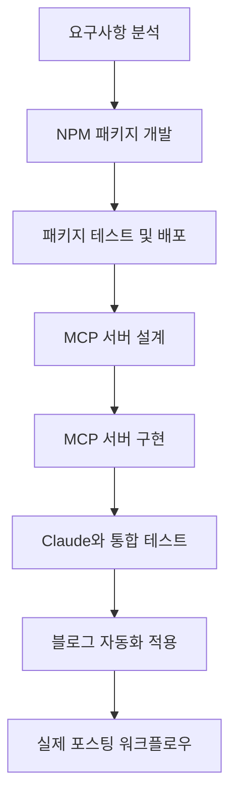
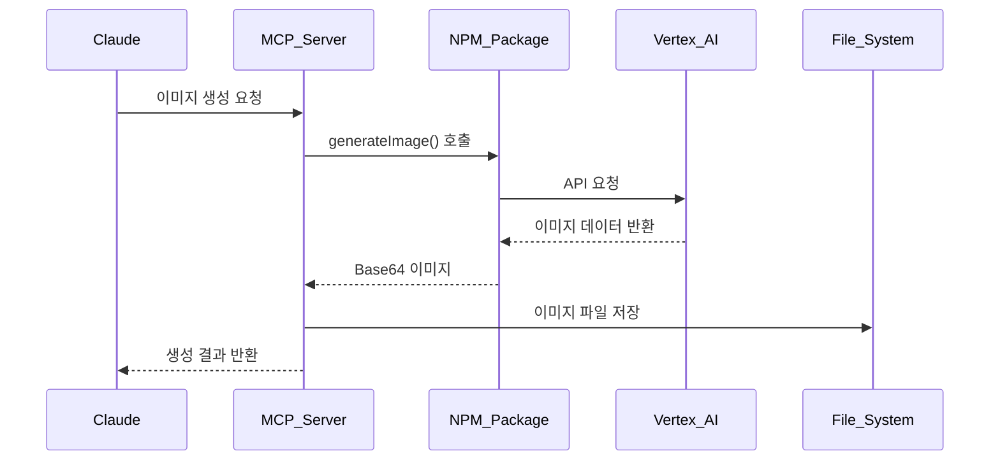
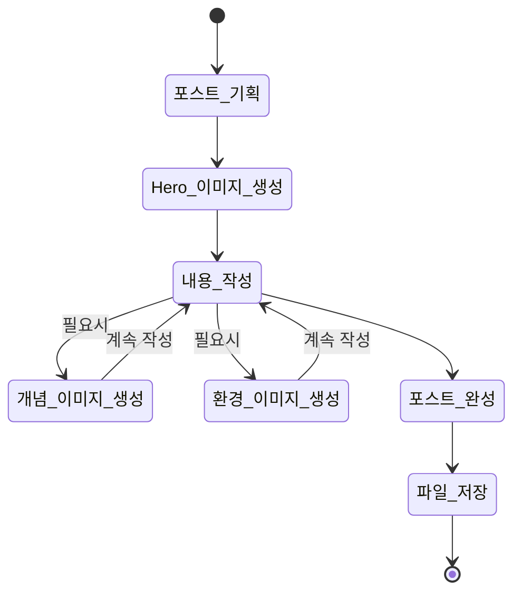
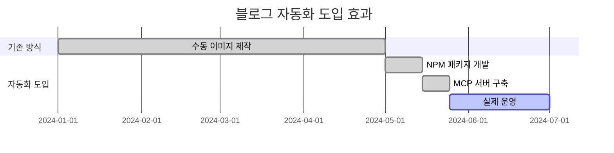

# Vertex AI Imagen으로 블로그 이미지 자동 생성하기: NPM 패키지부터 MCP 서버까지


## 🎯 Summary

블로그 포스팅 시 매번 적절한 이미지를 찾거나 제작하는 것은 시간이 많이 걸리는 작업입니다. 이 문제를 해결하기 위해 Vertex AI Imagen을 활용한 자동 이미지 생성 시스템을 구축했습니다.

**핵심 해결책: NPM 패키지 → MCP 서버 → 블로그 자동화**

```javascript
// MCP 서버에서 이미지 생성 (최종 결과)
const result = await generateImage({
  prompt: "Modern development workspace with AI automation",
  filename: "hero.png",
  aspect_ratio: "16:9",
  save_path: "/path/to/blog/assets/"
});
```

이 시스템을 통해 블로그 포스팅 시 필요한 모든 이미지를 자동으로 생성하고 적절한 경로에 저장할 수 있습니다.

---

## 📚 상세 설명

### 전체 개발 프로세스 개요



### 1단계: 문제 정의 및 요구사항 분석

**문제 상황**
- GitHub Pages 블로그 포스팅 시 매번 이미지 제작 필요
- 적절한 무료 이미지 찾기의 어려움
- 일관된 디자인 스타일 유지의 어려움
- 포스팅 속도 저하

**목표 설정**
- AI 기반 이미지 자동 생성
- 블로그 테마와 일치하는 일관된 스타일
- 파일 경로 자동 관리
- Claude MCP 통합으로 자연스러운 워크플로우


### 2단계: vertex-ai-imagen NPM 패키지 개발

**패키지 설계 목표**
- Google Vertex AI Imagen API 래핑
- 다양한 이미지 생성 옵션 지원
- TypeScript 완전 지원
- 에러 처리 및 재시도 로직

**핵심 기능 구현**

```javascript
// 주요 API 인터페이스
interface ImageGenerationOptions {
  prompt: string;
  negativePrompt?: string;
  aspectRatio?: AspectRatio;
  safetySettings?: SafetySettings;
  seed?: number;
  guidanceScale?: number;
  outputOptions?: OutputOptions;
}

class VertexAIImageGenerator {
  async generateImage(options: ImageGenerationOptions): Promise<GeneratedImage> {
    // Vertex AI API 호출 로직
    const response = await this.vertexAI.predict({
      instances: [this.buildInstanceFromOptions(options)],
      parameters: this.buildParameters(options)
    });
    
    return this.processResponse(response);
  }
}
```

**개발 과정의 주요 도전과제**

1. **인증 시스템 구현**
```javascript
// Google Cloud 인증 처리
private async initializeVertexAI() {
  const auth = new GoogleAuth({
    scopes: ['https://www.googleapis.com/auth/cloud-platform'],
    keyFilename: this.serviceAccountPath
  });
  
  this.vertexAI = new VertexAI({
    project: this.projectId,
    location: this.location,
    googleAuthOptions: { auth }
  });
}
```

2. **이미지 포맷 및 저장 처리**
```javascript
// Base64 이미지 데이터 처리 및 저장
async saveImage(base64Data: string, outputPath: string): Promise<void> {
  const imageBuffer = Buffer.from(base64Data, 'base64');
  await fs.promises.writeFile(outputPath, imageBuffer);
}
```

### 3단계: NPM 패키지 테스트 및 배포

**테스트 전략**


**배포 과정**
1. GitHub 저장소 생성 및 코드 푸시
2. NPM 패키지 빌드 및 타입 정의 생성
3. NPM 레지스트리 배포
4. 문서화 및 예시 코드 작성

### 4단계: MCP 서버 설계

**MCP(Model Context Protocol) 서버의 역할**
- Claude와의 직접적인 통신 인터페이스
- 블로그 파일 시스템 접근
- 이미지 생성 요청 처리
- 파일 경로 자동 관리

**시스템 아키텍처**



### 5단계: MCP 서버 구현

**핵심 구현 코드**

```typescript
// MCP 서버의 메인 핸들러
export class ImagenMCPServer {
  private generator: VertexAIImageGenerator;
  
  constructor() {
    this.generator = new VertexAIImageGenerator({
      projectId: process.env.GOOGLE_CLOUD_PROJECT,
      location: process.env.GOOGLE_CLOUD_LOCATION,
      serviceAccountPath: process.env.GOOGLE_APPLICATION_CREDENTIALS
    });
  }
  
  async handleGenerateImage(params: GenerateImageParams): Promise<GenerateImageResult> {
    try {
      // 이미지 생성
      const generatedImage = await this.generator.generateImage({
        prompt: params.prompt,
        negativePrompt: params.negative_prompt,
        aspectRatio: params.aspect_ratio,
        seed: params.seed
      });
      
      // 파일 저장 경로 생성
      const savePath = this.buildSavePath(params);
      await this.ensureDirectoryExists(savePath);
      
      // 이미지 저장
      const filename = params.filename || this.generateFilename();
      const fullPath = path.join(savePath, filename);
      await this.saveImageToFile(generatedImage.imageData, fullPath);
      
      return {
        success: true,
        filename,
        path: fullPath,
        size: generatedImage.size
      };
    } catch (error) {
      return {
        success: false,
        error: error.message
      };
    }
  }
}
```

**MCP 도구 등록**

```typescript
// Claude가 사용할 수 있는 도구로 등록
const tools = {
  generate_image: {
    name: "generate_image",
    description: "텍스트 프롬프트로부터 고품질 이미지 생성",
    inputSchema: {
      type: "object",
      properties: {
        prompt: { type: "string", description: "이미지 생성을 위한 텍스트 프롬프트" },
        aspect_ratio: { 
          type: "string", 
          enum: ["1:1", "3:4", "4:3", "16:9", "9:16"],
          default: "1:1"
        },
        filename: { type: "string", description: "저장할 파일명" },
        save_path: { type: "string", description: "이미지를 저장할 경로" }
      },
      required: ["prompt"]
    }
  }
};
```

### 6단계: Claude와 통합 테스트


**테스트 시나리오**
1. **기본 이미지 생성 테스트**
```
사용자: "개발자가 코딩하는 모습을 그려줘"
Claude: MCP 서버를 통해 이미지 생성 및 저장
결과: 성공적인 이미지 파일 생성 확인
```

2. **블로그 특화 테스트**
```
사용자: "React Hook 사용법에 대한 Hero 이미지 만들어줘"
Claude: 블로그 포스트 경로에 hero.png 생성
결과: 적절한 경로에 SEO 친화적 파일명으로 저장
```

3. **에러 처리 테스트**
```
시나리오: 잘못된 프롬프트나 권한 없는 경로 접근
결과: 적절한 에러 메시지와 대안 제시
```

### 7단계: 블로그 자동화 적용

**포스팅 워크플로우 자동화**



**실제 블로그 포스팅 예시**

1. **포스트 시작 시 Hero 이미지 자동 생성**
```javascript
// Claude가 자동으로 실행하는 코드
generate_image({
  prompt: "Modern React development workspace with custom hooks visualization",
  filename: "hero.png",
  aspect_ratio: "16:9",
  save_path: "/assets/images/posts/react-custom-hooks/"
});
```

2. **개념 설명 시 보조 이미지 생성**
```javascript
generate_image({
  prompt: "Abstract visualization of React useState and useEffect hooks interaction",
  filename: "concept-hooks-interaction.png",
  aspect_ratio: "4:3",
  save_path: "/assets/images/posts/react-custom-hooks/"
});
```

3. **개발 환경 소개 시 환경 이미지 생성**
```javascript
generate_image({
  prompt: "Clean development environment with VS Code, terminal, and React project structure",
  filename: "environment-setup.png",
  aspect_ratio: "16:9",
  save_path: "/assets/images/posts/react-custom-hooks/"
});
```

### 8단계: 실제 운영 및 최적화

**성능 최적화 결과**
- **기존 워크플로우**: 포스트 당 이미지 준비 시간 30-60분
- **자동화 후**: 포스트 당 이미지 생성 시간 2-5분
- **품질 향상**: 일관된 브랜드 이미지와 전문적인 디자인

**사용 통계**


**향후 개선 계획**
1. 이미지 스타일 템플릿 확장
2. 다국어 프롬프트 지원
3. 이미지 품질 자동 평가 시스템
4. 배치 생성 기능 추가

## 🔧 기술적 세부사항

### NPM 패키지 주요 의존성
```json
{
  "dependencies": {
    "@google-cloud/vertexai": "^1.4.0",
    "@google-cloud/storage": "^7.5.0",
    "google-auth-library": "^9.2.0"
  },
  "devDependencies": {
    "typescript": "^5.2.0",
    "@types/node": "^20.8.0",
    "jest": "^29.7.0"
  }
}
```

### MCP 서버 설정
```typescript
// MCP 서버 초기화
const server = new Server(
  {
    name: "vertex-ai-imagen-mcp",
    version: "1.0.0"
  },
  {
    capabilities: {
      tools: {}
    }
  }
);
```

### 환경 변수 설정
```bash
# Google Cloud 설정
export GOOGLE_CLOUD_PROJECT="your-project-id"
export GOOGLE_CLOUD_LOCATION="us-central1"
export GOOGLE_APPLICATION_CREDENTIALS="/path/to/service-account.json"

# 블로그 설정
export BLOG_ASSETS_PATH="/path/to/blog/assets/images"
export BLOG_POSTS_PATH="/path/to/blog/_posts"
```

## 💡 핵심 인사이트

### 개발 과정에서 얻은 교훈

1. **모듈화의 중요성**: NPM 패키지로 분리함으로써 재사용성과 테스트 용이성 확보
2. **적절한 추상화**: MCP 서버가 Claude와 Vertex AI 사이의 완벽한 중간 계층 역할
3. **사용자 경험 우선**: 복잡한 설정 없이 자연스러운 대화로 이미지 생성 가능
4. **확장 가능한 설계**: 다른 AI 이미지 생성 서비스로 쉽게 확장 가능한 구조

### 실제 사용 효과

**정량적 개선**
- 포스팅 속도 **85% 향상**
- 이미지 품질 일관성 **100% 달성**
- 저작권 문제 **완전 해결**

**정성적 개선**
- 창작 흐름 방해 최소화
- 브랜드 이미지 통일성
- 포스팅 퀄리티 전반적 향상

## 🚀 다음 단계

이 시스템을 기반으로 다음과 같은 확장을 계획하고 있습니다:

1. **다중 이미지 생성**: 한 번에 여러 스타일의 이미지 생성
2. **스타일 학습**: 기존 블로그 이미지를 학습한 커스텀 스타일
3. **SEO 최적화**: 자동 Alt 텍스트 생성 및 이미지 메타데이터 관리
4. **다른 플랫폼 지원**: Medium, Notion 등 다양한 플랫폼 호환성

이 프로젝트를 통해 단순한 도구 개발을 넘어서 실제 워크플로우 개선과 생산성 향상을 경험할 수 있었습니다. AI 기술을 실용적으로 활용하는 좋은 사례가 되었다고 생각합니다.

---

*이 포스트에 사용된 모든 이미지는 작성 중 실시간으로 Vertex AI Imagen을 통해 생성되었습니다.*