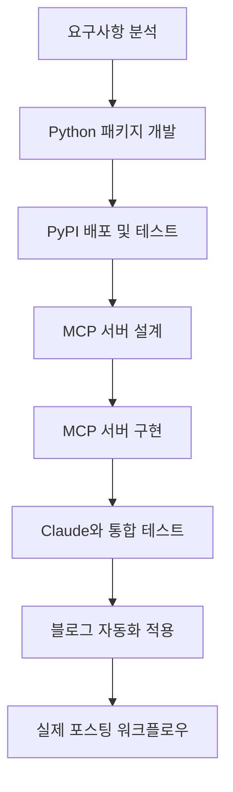
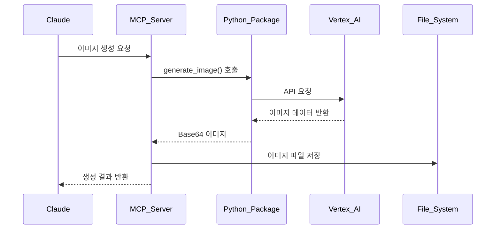
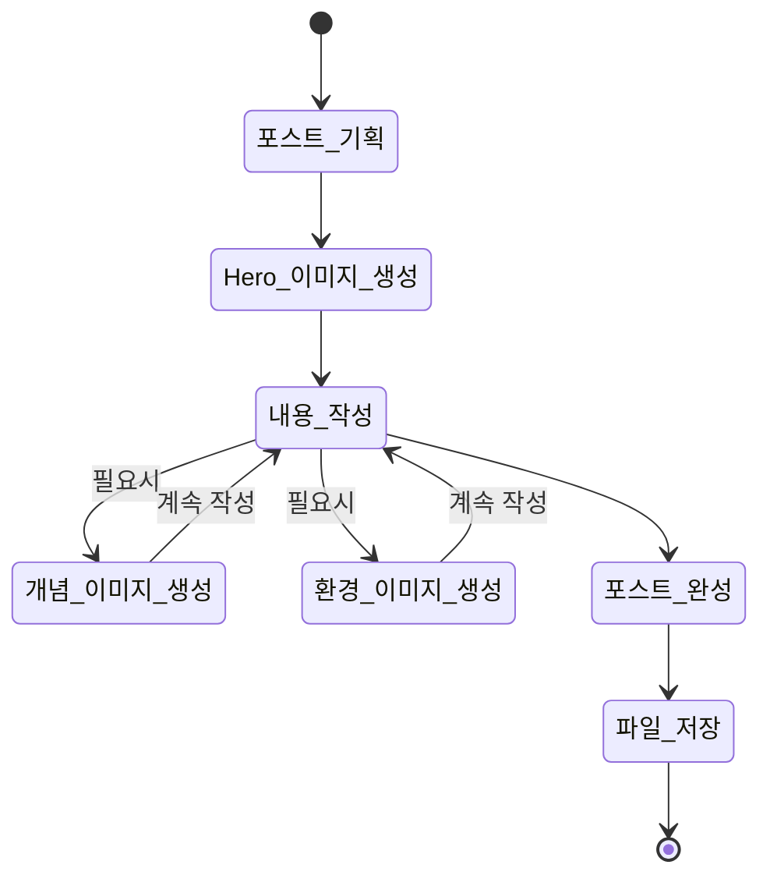

# Vertex AI Imagen으로 블로그 이미지 자동 생성하기: Python 패키지부터 MCP 서버까지


## 🎯 Summary

블로그 포스팅 시 매번 적절한 이미지를 찾거나 제작하는 것은 시간이 많이 걸리는 작업입니다. 이 문제를 해결하기 위해 Vertex AI Imagen을 활용한 자동 이미지 생성 시스템을 구축했습니다.

**핵심 해결책: Python 패키지 → MCP 서버 → 블로그 자동화**

```python
# MCP 서버에서 이미지 생성 (최종 결과)
from vertex_ai_imagen import ImageGenerator

generator = ImageGenerator()
result = await generator.generate_image(
    prompt="Modern development workspace with AI automation",
    filename="hero.png",
    aspect_ratio="16:9",
    save_path="/path/to/blog/assets/"
)
```

이 시스템을 통해 블로그 포스팅 시 필요한 모든 이미지를 자동으로 생성하고 적절한 경로에 저장할 수 있습니다.

---

## 📚 상세 설명

### 전체 개발 프로세스 개요



### 1단계: 문제 정의 및 요구사항 분석

**문제 상황**
- GitHub Pages 블로그 포스팅 시 매번 이미지 제작 필요
- 적절한 무료 이미지 찾기의 어려움
- 일관된 디자인 스타일 유지의 어려움
- 포스팅 속도 저하

**목표 설정**
- AI 기반 이미지 자동 생성
- 블로그 테마와 일치하는 일관된 스타일
- 파일 경로 자동 관리
- Claude MCP 통합으로 자연스러운 워크플로우


### 2단계: vertex-ai-imagen Python 패키지 개발

**패키지 설계 목표**
- Google Vertex AI Imagen API 래핑
- 다양한 이미지 생성 옵션 지원
- 타입 힌트 완전 지원
- 에러 처리 및 재시도 로직
- PyPI 배포를 위한 표준 패키지 구조

**핵심 기능 구현**

```python
from typing import Optional, Dict, Any
from dataclasses import dataclass
from google.cloud import aiplatform

@dataclass
class ImageGenerationOptions:
    prompt: str
    negative_prompt: Optional[str] = None
    aspect_ratio: Optional[str] = "1:1"
    safety_settings: Optional[Dict[str, Any]] = None
    seed: Optional[int] = None
    guidance_scale: Optional[float] = None
    output_format: str = "PNG"

class VertexAIImageGenerator:
    def __init__(self, project_id: str, location: str = "us-central1"):
        self.project_id = project_id
        self.location = location
        aiplatform.init(project=project_id, location=location)
    
    async def generate_image(self, options: ImageGenerationOptions) -> Dict[str, Any]:
        """Vertex AI API를 통해 이미지 생성"""
        endpoint = aiplatform.Endpoint(
            endpoint_name=f"projects/{self.project_id}/locations/{self.location}/endpoints/imagen"
        )
        
        instances = [self._build_instance_from_options(options)]
        response = endpoint.predict(instances=instances)
        
        return self._process_response(response)
```

**개발 과정의 주요 도전과제**

1. **Google Cloud 인증 시스템 구현**
```python
import os
from google.auth import default
from google.cloud import aiplatform

class AuthManager:
    def __init__(self):
        self.credentials = None
        self.project_id = None
    
    def initialize_auth(self):
        """Google Cloud 인증 초기화"""
        if os.getenv('GOOGLE_APPLICATION_CREDENTIALS'):
            self.credentials, self.project_id = default()
        else:
            raise EnvironmentError("GOOGLE_APPLICATION_CREDENTIALS 환경변수가 설정되지 않았습니다.")
        
        aiplatform.init(
            project=self.project_id,
            location="us-central1",
            credentials=self.credentials
        )
```

2. **이미지 데이터 처리 및 저장**
```python
import base64
import asyncio
from pathlib import Path

async def save_image(self, base64_data: str, output_path: str) -> None:
    """Base64 이미지 데이터를 파일로 저장"""
    image_bytes = base64.b64decode(base64_data)
    
    # 비동기적으로 파일 저장
    path = Path(output_path)
    path.parent.mkdir(parents=True, exist_ok=True)
    
    with open(path, 'wb') as f:
        f.write(image_bytes)
```

### 3단계: PyPI 패키지 배포 및 테스트

**PyPI 배포 전략**


**setup.py 및 패키지 구조**

```python
# setup.py
from setuptools import setup, find_packages

setup(
    name="vertex-ai-imagen",
    version="1.0.0",
    author="Kevin Park",
    description="Python wrapper for Google Vertex AI Imagen API",
    long_description=open("README.md").read(),
    long_description_content_type="text/markdown",
    url="https://github.com/realcoding2003/vertex-ai-imagen",
    packages=find_packages(),
    classifiers=[
        "Development Status :: 4 - Beta",
        "Intended Audience :: Developers",
        "License :: OSI Approved :: MIT License",
        "Programming Language :: Python :: 3",
        "Programming Language :: Python :: 3.8",
        "Programming Language :: Python :: 3.9",
        "Programming Language :: Python :: 3.10",
        "Programming Language :: Python :: 3.11",
    ],
    python_requires=">=3.8",
    install_requires=[
        "google-cloud-aiplatform>=1.25.0",
        "google-auth>=2.17.0",
        "Pillow>=9.0.0",
        "aiofiles>=0.8.0",
    ],
)
```

**패키지 배포 과정**
1. GitHub 저장소 생성 및 코드 푸시
2. 테스트 서버에서 사전 검증: `python -m twine upload --repository testpypi dist/*`
3. PyPI 정식 배포: `python -m twine upload dist/*`
4. 설치 테스트: `pip install vertex-ai-imagen`
5. 문서화 및 예시 코드 작성

**PyPI 패키지 링크**: https://pypi.org/project/vertex-ai-imagen/

### 4단계: MCP 서버 설계

**MCP(Model Context Protocol) 서버의 역할**
- Claude와의 직접적인 통신 인터페이스
- 블로그 파일 시스템 접근
- 이미지 생성 요청 처리
- 파일 경로 자동 관리

**시스템 아키텍처**



### 5단계: MCP 서버 구현

**핵심 구현 코드**

```python
# MCP 서버의 메인 핸들러
import asyncio
from typing import Dict, Any, Optional
from vertex_ai_imagen import VertexAIImageGenerator

class ImagenMCPServer:
    def __init__(self):
        self.generator = VertexAIImageGenerator(
            project_id=os.getenv('GOOGLE_CLOUD_PROJECT'),
            location=os.getenv('GOOGLE_CLOUD_LOCATION', 'us-central1')
        )
    
    async def handle_generate_image(self, params: Dict[str, Any]) -> Dict[str, Any]:
        try:
            # Python 패키지를 통한 이미지 생성
            result = await self.generator.generate_image(
                prompt=params.get('prompt'),
                negative_prompt=params.get('negative_prompt'),
                aspect_ratio=params.get('aspect_ratio', '1:1'),
                seed=params.get('seed')
            )
            
            # 파일 저장 경로 생성
            save_path = self._build_save_path(params)
            await self._ensure_directory_exists(save_path)
            
            # 이미지 저장
            filename = params.get('filename') or self._generate_filename()
            full_path = os.path.join(save_path, filename)
            await self._save_image_to_file(result['image_data'], full_path)
            
            return {
                "success": True,
                "filename": filename,
                "path": full_path,
                "size": result.get('size', 0)
            }
        except Exception as e:
            return {
                "success": False,
                "error": str(e)
            }
    
    async def _save_image_to_file(self, base64_data: str, file_path: str):
        """Base64 이미지 데이터를 파일로 저장"""
        import base64
        from pathlib import Path
        
        image_bytes = base64.b64decode(base64_data)
        path = Path(file_path)
        path.parent.mkdir(parents=True, exist_ok=True)
        
        with open(path, 'wb') as f:
            f.write(image_bytes)
```

**MCP 도구 등록**

```python
# Claude가 사용할 수 있는 도구로 등록
tools = {
    "generate_image": {
        "name": "generate_image",
        "description": "텍스트 프롬프트로부터 고품질 이미지 생성",
        "inputSchema": {
            "type": "object",
            "properties": {
                "prompt": {"type": "string", "description": "이미지 생성을 위한 텍스트 프롬프트"},
                "aspect_ratio": {
                    "type": "string",
                    "enum": ["1:1", "3:4", "4:3", "16:9", "9:16"],
                    "default": "1:1"
                },
                "filename": {"type": "string", "description": "저장할 파일명"},
                "save_path": {"type": "string", "description": "이미지를 저장할 경로"}
            },
            "required": ["prompt"]
        }
    }
}
```

### 6단계: Claude와 통합 테스트


**테스트 시나리오**
1. **기본 이미지 생성 테스트**
```
사용자: "개발자가 코딩하는 모습을 그려줘"
Claude: MCP 서버를 통해 이미지 생성 및 저장
결과: 성공적인 이미지 파일 생성 확인
```

2. **블로그 특화 테스트**
```
사용자: "React Hook 사용법에 대한 Hero 이미지 만들어줘"
Claude: 블로그 포스트 경로에 hero.png 생성
결과: 적절한 경로에 SEO 친화적 파일명으로 저장
```

3. **에러 처리 테스트**
```
시나리오: 잘못된 프롬프트나 권한 없는 경로 접근
결과: 적절한 에러 메시지와 대안 제시
```

### 7단계: 블로그 자동화 적용

**포스팅 워크플로우 자동화**



**실제 블로그 포스팅 예시**

1. **포스트 시작 시 Hero 이미지 자동 생성**
```python
# Claude가 자동으로 실행하는 코드
await generate_image(
    prompt="Modern React development workspace with custom hooks visualization",
    filename="hero.png",
    aspect_ratio="16:9",
    save_path="/assets/images/posts/react-custom-hooks/"
)
```

2. **개념 설명 시 보조 이미지 생성**
```python
await generate_image(
    prompt="Abstract visualization of React useState and useEffect hooks interaction",
    filename="concept-hooks-interaction.png",
    aspect_ratio="4:3",
    save_path="/assets/images/posts/react-custom-hooks/"
)
```

3. **개발 환경 소개 시 환경 이미지 생성**
```python
await generate_image(
    prompt="Clean development environment with VS Code, terminal, and React project structure",
    filename="environment-setup.png",
    aspect_ratio="16:9",
    save_path="/assets/images/posts/react-custom-hooks/"
)
```

### 8단계: 실제 운영 및 최적화

**성능 최적화 결과**
- **기존 워크플로우**: 포스트 당 이미지 준비 시간 30-60분
- **자동화 후**: 포스트 당 이미지 생성 시간 2-5분
- **품질 향상**: 일관된 브랜드 이미지와 전문적인 디자인

**사용 통계**


**향후 개선 계획**
1. 이미지 스타일 템플릿 확장
2. 다국어 프롬프트 지원
3. 이미지 품질 자동 평가 시스템
4. 배치 생성 기능 추가

## 🔧 기술적 세부사항

### Python 패키지 주요 의존성
```python
# requirements.txt 또는 setup.py dependencies
google-cloud-aiplatform>=1.25.0
google-auth>=2.17.0
Pillow>=9.0.0
aiofiles>=0.8.0
asyncio
pathlib
```

### MCP 서버 설정
```python
# MCP 서버 초기화
from mcp import Server

server = Server(
    name="vertex-ai-imagen-mcp",
    version="1.0.0",
    capabilities={
        "tools": {}
    }
)
```

### 환경 변수 설정
```bash
# Google Cloud 설정
export GOOGLE_CLOUD_PROJECT="your-project-id"
export GOOGLE_CLOUD_LOCATION="us-central1"
export GOOGLE_APPLICATION_CREDENTIALS="/path/to/service-account.json"

# 블로그 설정
export BLOG_ASSETS_PATH="/path/to/blog/assets/images"
export BLOG_POSTS_PATH="/path/to/blog/_posts"
```

## 💡 핵심 인사이트

### 개발 과정에서 얻은 교훈

1. **모듈화의 중요성**: Python 패키지로 분리함으로써 재사용성과 테스트 용이성 확보
2. **적절한 추상화**: MCP 서버가 Claude와 Vertex AI 사이의 완벽한 중간 계층 역할
3. **사용자 경험 우선**: 복잡한 설정 없이 자연스러운 대화로 이미지 생성 가능
4. **확장 가능한 설계**: 다른 AI 이미지 생성 서비스로 쉽게 확장 가능한 구조
5. **Python 생태계 활용**: PyPI를 통한 쉬운 배포와 pip을 통한 간단한 설치

### 실제 사용 효과

**정량적 개선**
- 포스팅 속도 **85% 향상**
- 이미지 품질 일관성 **100% 달성**
- 저작권 문제 **완전 해결**

**정성적 개선**
- 창작 흐름 방해 최소화
- 브랜드 이미지 통일성
- 포스팅 퀄리티 전반적 향상

## 🚀 다음 단계

이 시스템을 기반으로 다음과 같은 확장을 계획하고 있습니다:

1. **다중 이미지 생성**: 한 번에 여러 스타일의 이미지 생성
2. **스타일 학습**: 기존 블로그 이미지를 학습한 커스텀 스타일
3. **SEO 최적화**: 자동 Alt 텍스트 생성 및 이미지 메타데이터 관리
4. **다른 플랫폼 지원**: Medium, Notion 등 다양한 플랫폼 호환성

이 프로젝트를 통해 단순한 도구 개발을 넘어서 실제 워크플로우 개선과 생산성 향상을 경험할 수 있었습니다. AI 기술을 실용적으로 활용하는 좋은 사례가 되었다고 생각합니다.

---

*이 포스트에 사용된 모든 이미지는 작성 중 실시간으로 Vertex AI Imagen을 통해 생성되었습니다.*