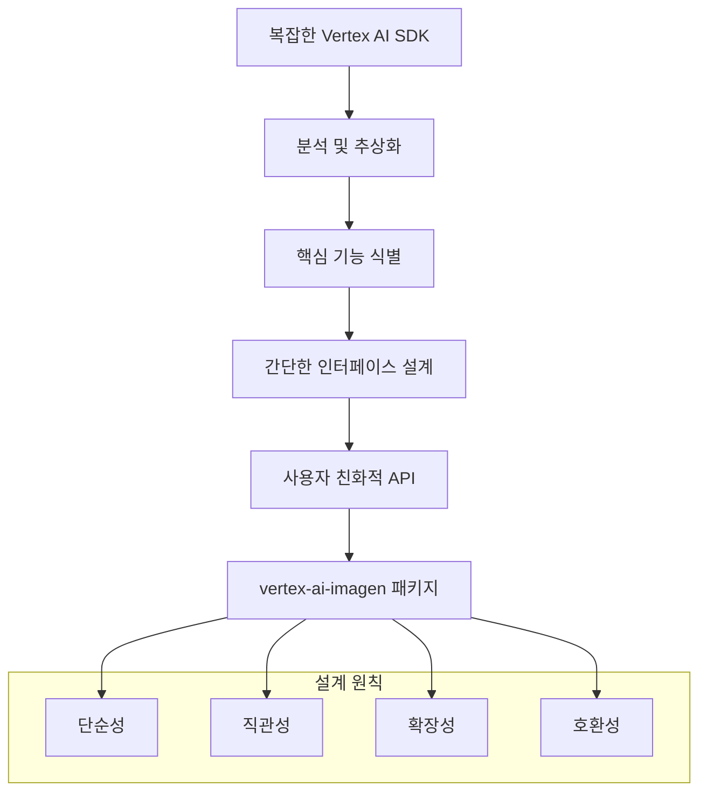
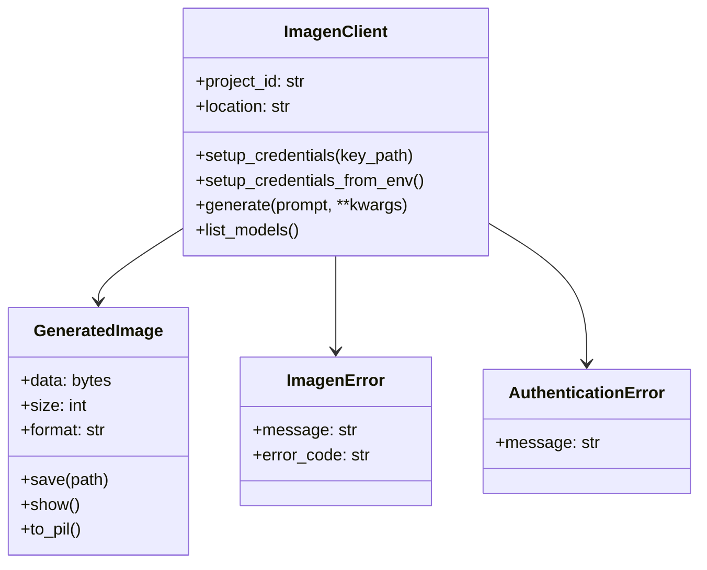
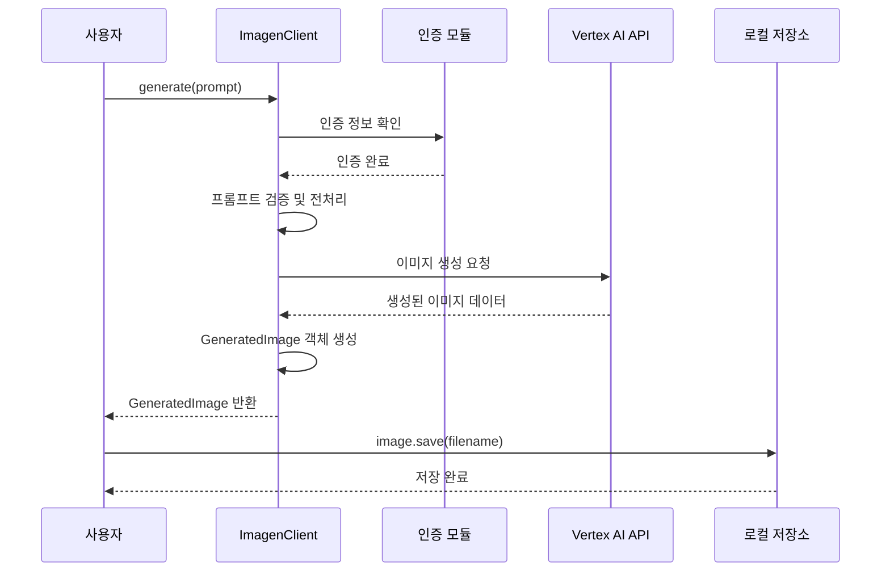
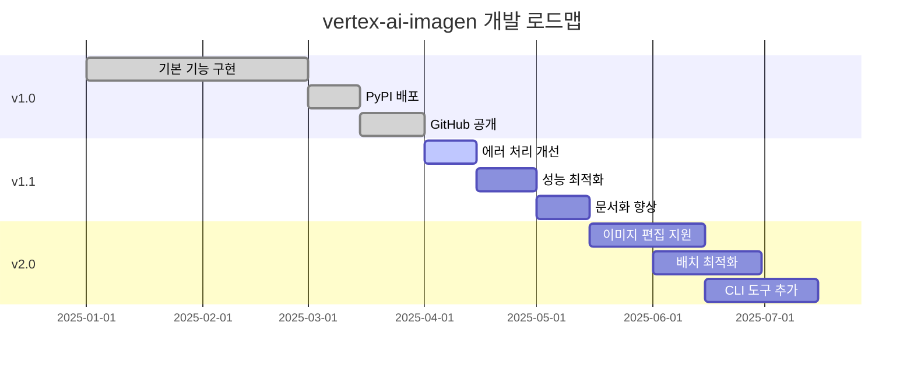

## 🎯 Summary

Google Vertex AI의 Imagen API를 사용하여 AI 이미지를 생성하고 싶지만 복잡한 설정과 긴 코드가 부담스러우셨나요? `vertex-ai-imagen` 패키지를 사용하면 몇 줄의 간단한 코드로 강력한 AI 이미지 생성 기능을 구현할 수 있습니다.

```python
import asyncio
from vertex_ai_imagen import ImagenClient

async def main():
    # 간단한 초기화
    client = ImagenClient(project_id="your-project")
    client.setup_credentials("path/to/service-account-key.json")
    
    # 이미지 생성
    image = await client.generate(
        prompt="A serene mountain landscape at sunset",
        aspect_ratio="16:9"
    )
    
    # 이미지 저장
    image.save("sunset.png")
    print(f"Image saved! Size: {image.size:,} bytes")

asyncio.run(main())
```

**주요 특징:**
- 🚀 **간편한 설정**: 복잡한 Vertex AI 설정을 간소화
- ⚡ **비동기 지원**: async/await 패턴으로 높은 성능
- 🎯 **타입 안전성**: 완전한 타입 힌트 지원
- 🔒 **보안**: Google Cloud 서비스 계정 인증
- 📦 **깔끔한 모델**: 직관적인 데이터 클래스

---

## 📚 상세 설명

### 패키지 설치 및 기본 설정

`vertex-ai-imagen`은 Google Vertex AI의 Imagen API를 Python에서 더 쉽게 사용할 수 있도록 설계된 래퍼 라이브러리입니다. 복잡한 인증 과정과 API 호출을 단순화하여 개발자가 이미지 생성 로직에만 집중할 수 있도록 도와줍니다.

```bash
# PyPI에서 패키지 설치
pip install vertex-ai-imagen
```

**📦 배포 정보:**
- **PyPI 패키지**: [https://pypi.org/project/vertex-ai-imagen/](https://pypi.org/project/vertex-ai-imagen/)
- **GitHub 레포지토리**: [https://github.com/realcoding2003/vertex-ai-imagen](https://github.com/realcoding2003/vertex-ai-imagen)
- **라이선스**: MIT License
- **지원 Python 버전**: Python 3.7+

### 왜 이 패키지가 필요한가?

Google Vertex AI의 기본 SDK는 매우 강력하지만, 때로는 복잡할 수 있습니다. 간단한 이미지 생성 작업을 위해서도 상당한 양의 보일러플레이트 코드가 필요하죠.

**기존 Vertex AI SDK 사용 시:**
```python
import vertexai
from vertexai.preview.vision_models import ImageGenerationModel

# 복잡한 초기화 과정
vertexai.init(project="your-project-id", location="us-central1")
model = ImageGenerationModel.from_pretrained("imagen-3.0-generate-002")

# 이미지 생성
images = model.generate_images(
    prompt="A serene mountain landscape at sunset",
    number_of_images=2,
    aspect_ratio="16:9",
    add_watermark=False,
    # 많은 선택적 파라미터들...
)

# 수동으로 이미지 저장
for i, image in enumerate(images.images):
    image.save(f"generated_image_{i}.png")
```

**vertex-ai-imagen 사용 시:**
```python
import asyncio
from vertex_ai_imagen import ImagenClient

async def main():
    # 간단한 초기화
    client = ImagenClient(project_id="your-project")
    client.setup_credentials("path/to/service-account-key.json")
    
    # 한 줄로 이미지 생성
    image = await client.generate(
        prompt="A serene mountain landscape at sunset",
        aspect_ratio="16:9"
    )
    
    # 이미지 저장
    image.save("sunset.png")
    print(f"Image saved! Size: {image.size:,} bytes")

asyncio.run(main())
```

### 개발 과정과 설계 철학

이 패키지는 다음과 같은 설계 원칙을 따라 개발되었습니다:



#### 1. 단순성 (Simplicity)
복잡한 설정 과정을 최소화하고, 필수 파라미터만으로도 동작하도록 설계했습니다.

#### 2. 직관성 (Intuitiveness)
메소드명과 파라미터명을 직관적으로 이해할 수 있도록 명명했습니다.

#### 3. 확장성 (Extensibility)
기본 기능은 간단하게 유지하면서, 고급 기능도 쉽게 접근할 수 있도록 했습니다.

#### 4. 호환성 (Compatibility)
기존 Vertex AI SDK와의 호환성을 유지하여 필요시 저수준 API에도 접근할 수 있습니다.

### 주요 기능과 사용법

#### 기본 이미지 생성
```python
import asyncio
from vertex_ai_imagen import ImagenClient

async def main():
    # 클라이언트 초기화
    client = ImagenClient(project_id="your-gcp-project")
    client.setup_credentials("path/to/service-account-key.json")
    
    # 단일 이미지 생성
    image = await client.generate(
        prompt="A futuristic city skyline with flying cars",
        aspect_ratio="16:9",
        model="imagen-3.0-generate-002"
    )
    
    # 이미지 저장 및 정보 출력
    image.save("futuristic_city.png")
    print(f"Generated image size: {image.size:,} bytes")

asyncio.run(main())
```

#### 배치 이미지 생성
```python
import asyncio
from vertex_ai_imagen import ImagenClient

async def main():
    client = ImagenClient(project_id="your-project")
    client.setup_credentials_from_env()  # 환경변수에서 인증 정보 로드
    
    # 여러 이미지 동시 생성
    prompts = [
        "A peaceful forest scene",
        "A bustling marketplace", 
        "A calm ocean sunset"
    ]
    
    for i, prompt in enumerate(prompts):
        images = await client.generate(
            prompt=prompt,
            count=2,  # 각 프롬프트당 2개씩 생성
            aspect_ratio="1:1"
        )
        
        # 자동 명명으로 저장
        for j, image in enumerate(images):
            image.save(f"scene_{i}_{j}.png")

asyncio.run(main())
```

#### 고급 설정 옵션



### 환경 설정 및 인증

패키지를 사용하기 전에 Google Cloud 인증을 설정해야 합니다:

```python
from vertex_ai_imagen import ImagenClient

# 방법 1: 서비스 계정 키 파일을 직접 지정
client = ImagenClient(project_id="your-project")
client.setup_credentials("path/to/service-account-key.json")

# 방법 2: 환경 변수 사용 (권장)
import os
os.environ['GOOGLE_APPLICATION_CREDENTIALS'] = 'path/to/service-account-key.json'

client = ImagenClient(project_id="your-project")
client.setup_credentials_from_env()
```

**Google Cloud 설정:**
```bash
# 1. API 활성화
gcloud services enable aiplatform.googleapis.com

# 2. 서비스 계정 생성
gcloud iam service-accounts create imagen-client \
    --display-name="Imagen Client"

# 3. 권한 부여
gcloud projects add-iam-policy-binding PROJECT_ID \
    --member="serviceAccount:imagen-client@PROJECT_ID.iam.gserviceaccount.com" \
    --role="roles/aiplatform.user"

# 4. 서비스 계정 키 생성
gcloud iam service-accounts keys create key.json \
    --iam-account=imagen-client@PROJECT_ID.iam.gserviceaccount.com
```

### 에러 처리 및 베스트 프랙티스

```python
import asyncio
from vertex_ai_imagen import ImagenClient
from vertex_ai_imagen.exceptions import ImagenError, AuthenticationError

async def safe_generate():
    try:
        client = ImagenClient(project_id="your-project")
        client.setup_credentials_from_env()
        
        # 안전한 이미지 생성
        image = await client.generate(
            prompt="A beautiful landscape",
            model="imagen-3.0-generate-002",
            safety_setting="block_medium_and_above"
        )
        
        image.save("landscape.png")
        print(f"✅ 성공: {image.size:,} bytes")
        
    except AuthenticationError:
        print("❌ 인증 오류: 서비스 계정 키를 확인하세요")
    except ImagenError as e:
        print(f"❌ 이미지 생성 실패: {e}")
    except Exception as e:
        print(f"❌ 예상치 못한 오류: {e}")

asyncio.run(safe_generate())
```

**지원되는 모델들:**
```python
client = ImagenClient(project_id="your-project")
models = client.list_models()
print(models)
# 출력: ['imagegeneration@006', 'imagen-3.0-generate-001', 'imagen-3.0-fast-generate-001', ...]
```

| 모델 | 속도 | 품질 | 사용 용도 |
|------|------|------|----------|
| `imagen-3.0-fast-generate-001` | ⚡ 빠름 | 🟢 좋음 | 프로토타이핑, 배치 생성 |
| `imagegeneration@006` | 🟡 보통 | 🔵 우수 | 일반적인 용도 |
| `imagen-3.0-generate-002` | 🟡 보통 | 🟣 최고 | 고품질 작업 |

### 실제 사용 사례

#### 1. 웹 애플리케이션 통합
```python
from flask import Flask, request, jsonify
import asyncio
from vertex_ai_imagen import ImagenClient

app = Flask(__name__)
client = ImagenClient(project_id="your-project")
client.setup_credentials_from_env()

@app.route('/generate-image', methods=['POST'])
def generate_image():
    prompt = request.json.get('prompt')
    
    async def generate():
        try:
            image = await client.generate(
                prompt=prompt,
                aspect_ratio="1:1",
                model="imagen-3.0-fast-generate-001"
            )
            
            # 클라우드 스토리지에 저장
            image_url = save_to_storage(image)
            
            return {
                'success': True,
                'image_url': image_url,
                'size': image.size
            }
        except Exception as e:
            return {
                'success': False,
                'error': str(e)
            }
    
    # 비동기 함수를 동기적으로 실행
    result = asyncio.run(generate())
    
    if result['success']:
        return jsonify(result)
    else:
        return jsonify(result), 500
```

#### 2. 배치 처리 스크립트
```python
import csv
import asyncio
from vertex_ai_imagen import ImagenClient

async def process_bulk_generation(csv_file):
    client = ImagenClient(project_id="your-project")
    client.setup_credentials_from_env()
    
    with open(csv_file, 'r') as file:
        reader = csv.DictReader(file)
        
        for row in reader:
            prompt = row['prompt']
            filename = row['filename']
            
            try:
                image = await client.generate(
                    prompt=prompt,
                    model="imagen-3.0-fast-generate-001"  # 빠른 생성
                )
                
                image.save(f"output/{filename}")
                print(f"✅ 생성 완료: {filename} ({image.size:,} bytes)")
                
            except Exception as e:
                print(f"❌ 생성 실패: {filename} - {e}")

# 사용법
asyncio.run(process_bulk_generation('image_prompts.csv'))
```

### 성능 최적화와 비용 관리

```python
import asyncio
from vertex_ai_imagen import ImagenClient

async def cost_efficient_generation():
    client = ImagenClient(project_id="your-project")
    client.setup_credentials_from_env()
    
    # 비용 효율적인 설정
    image = await client.generate(
        prompt="A beautiful landscape",
        model="imagen-3.0-fast-generate-001",  # 빠르고 저렴한 모델
        aspect_ratio="1:1",  # 작은 크기로 비용 절약
        enhance_prompt=False,  # 프롬프트 향상 비활성화
        seed=12345  # 재현 가능한 결과
    )
    
    return image

# 고급 옵션 활용
async def advanced_generation():
    client = ImagenClient(project_id="your-project")
    client.setup_credentials_from_env()
    
    images = await client.generate(
        prompt="A futuristic cityscape at night",
        model="imagen-3.0-generate-002",  # 최고 품질
        aspect_ratio="16:9",
        count=3,  # 여러 변형 생성
        negative_prompt="blurry, low quality, distorted",
        safety_setting="block_medium_and_above"
    )
    
    return images

asyncio.run(cost_efficient_generation())
```

**지원되는 가로세로 비율:**
- `1:1` - 정사각형
- `16:9` - 와이드스크린 
- `9:16` - 세로 (모바일)
- `4:3` - 전통적인 가로
- `3:4` - 전통적인 세로

### API 호출 흐름



### 패키지의 장점과 한계

#### 장점
- **🚀 간편한 설정**: 복잡한 Vertex AI 설정을 단순화
- **⚡ 비동기 지원**: async/await 패턴으로 높은 성능
- **🎯 타입 안전성**: 완전한 타입 힌트 지원으로 IDE 자동완성
- **🔒 보안**: Google Cloud 서비스 계정 인증
- **📦 깔끔한 모델**: 직관적인 데이터 클래스
- **🎛️ 완전한 제어**: 모든 Imagen 파라미터 접근 가능
- **📚 풍부한 예제**: [GitHub 예제 디렉토리](https://github.com/realcoding2003/vertex-ai-imagen/tree/master/examples) 제공

#### 한계
- **Python 3.7+ 요구**: 구버전 Python 미지원
- **Google Cloud 의존성**: GCP 프로젝트와 인증 필수
- **비동기 패턴**: async/await에 익숙하지 않은 개발자에게는 학습 곡선
- **네트워크 의존**: 인터넷 연결과 Google Cloud 서비스 가용성 필수

### 리소스 및 참고자료

**📚 공식 문서 및 리소스:**
- **PyPI 패키지**: [https://pypi.org/project/vertex-ai-imagen/](https://pypi.org/project/vertex-ai-imagen/)
- **GitHub 레포지토리**: [https://github.com/realcoding2003/vertex-ai-imagen](https://github.com/realcoding2003/vertex-ai-imagen)
- **기본 사용법 예제**: [basic_usage.py](https://github.com/realcoding2003/vertex-ai-imagen/blob/master/examples/basic_usage.py)
- **고급 기능 데모**: [test_image_generation.py](https://github.com/realcoding2003/vertex-ai-imagen/blob/master/examples/test_image_generation.py)

**🔧 개발 환경 설정:**
```bash
# 1. 패키지 설치
pip install vertex-ai-imagen

# 2. 환경 변수 설정 (선택사항)
export GOOGLE_CLOUD_PROJECT="your-project-id"
export GOOGLE_APPLICATION_CREDENTIALS="/path/to/key.json"

# 3. 빠른 테스트
python -c "from vertex_ai_imagen import ImagenClient; print('설치 완료!')"
```

**💡 주피터 노트북에서 사용:**
```python
# 노트북에서 이미지 직접 표시
import asyncio
from vertex_ai_imagen import ImagenClient

async def notebook_demo():
    client = ImagenClient(project_id="your-project")
    client.setup_credentials_from_env()
    
    image = await client.generate("A cute cat wearing a hat")
    image.show()  # 노트북에서 인라인 표시

# Jupyter에서 실행
await notebook_demo()  # 또는 asyncio.run(notebook_demo())
```

### 향후 계획과 로드맵



**계획된 기능:**
- 🎨 **이미지 편집**: 기존 이미지 수정 및 향상 기능
- 🚀 **배치 최적화**: 대량 이미지 생성 최적화
- 💻 **CLI 도구**: 명령줄에서 직접 사용 가능한 도구
- 🐳 **Docker 지원**: 컨테이너화된 배포 지원
- 📊 **사용량 추적**: 비용 및 사용량 모니터링

## 결론

`vertex-ai-imagen` 패키지는 Google Vertex AI의 강력한 이미지 생성 기능을 더 쉽고 직관적으로 사용할 수 있게 해주는 훌륭한 도구입니다. 복잡한 설정 과정을 단순화하고, 비동기 처리를 통한 높은 성능을 제공하며, 타입 안전성을 보장하여 개발자가 창의적인 작업에 집중할 수 있도록 도와줍니다.

**주요 성과:**
- ✅ **PyPI 공식 배포**: [pypi.org/project/vertex-ai-imagen](https://pypi.org/project/vertex-ai-imagen/)
- ✅ **오픈소스 공개**: [GitHub 레포지토리](https://github.com/realcoding2003/vertex-ai-imagen)
- ✅ **MIT 라이선스**: 자유로운 사용과 기여 가능
- ✅ **완전한 문서화**: 풍부한 예제와 가이드 제공

**적합한 사용 사례:**
- 🚀 **빠른 프로토타이핑**: AI 이미지 생성 아이디어를 신속히 검증
- 🎨 **창작 도구**: 아티스트와 디자이너를 위한 AI 보조 도구
- 📱 **웹/앱 개발**: 동적 이미지 생성이 필요한 애플리케이션
- 🏢 **기업 솔루션**: 대량 이미지 생성 및 자동화 워크플로우

**커뮤니티 기여:**
패키지의 지속적인 발전을 위해 GitHub에서 이슈 리포트, 기능 제안, Pull Request를 환영합니다. MIT 라이선스 하에 누구나 자유롭게 사용하고 기여할 수 있습니다.

특히 AI 이미지 생성을 처음 시작하는 개발자들이나, 빠른 프로토타이핑이 필요한 프로젝트에 매우 유용합니다. 패키지의 직관적인 API와 충실한 문서화는 학습 곡선을 크게 낮춰주며, 동시에 고급 사용자들을 위한 모든 Imagen 기능에 대한 완전한 접근성을 제공합니다.

앞으로도 지속적인 업데이트와 기능 개선을 통해 더욱 강력하고 사용하기 쉬운 패키지로 발전할 것으로 기대됩니다. AI 이미지 생성 프로젝트를 계획하고 있다면, `vertex-ai-imagen` 패키지를 한번 시도해보시기 바랍니다!