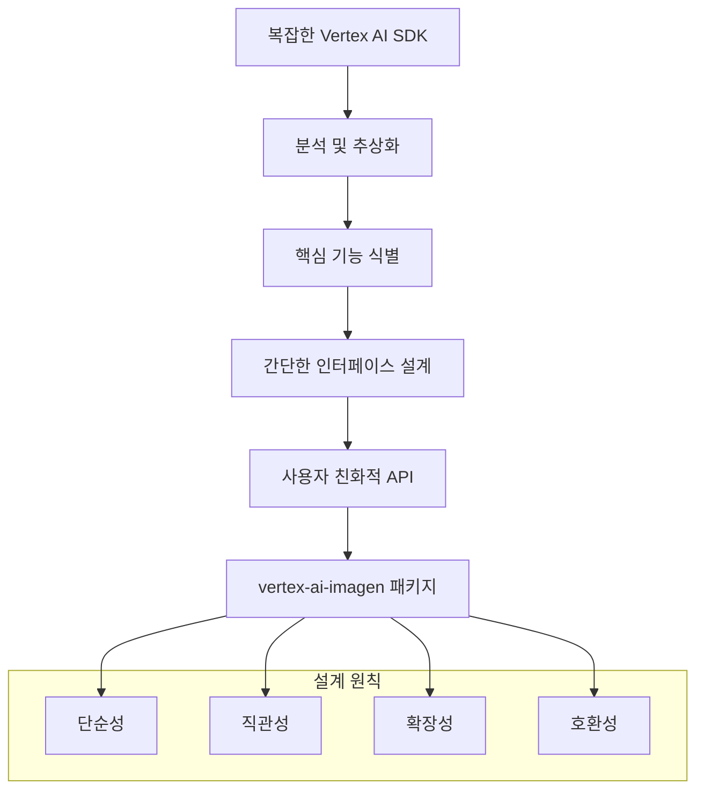
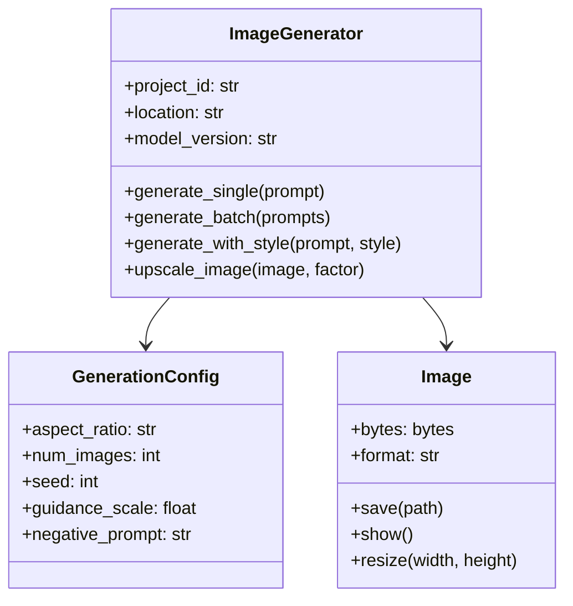
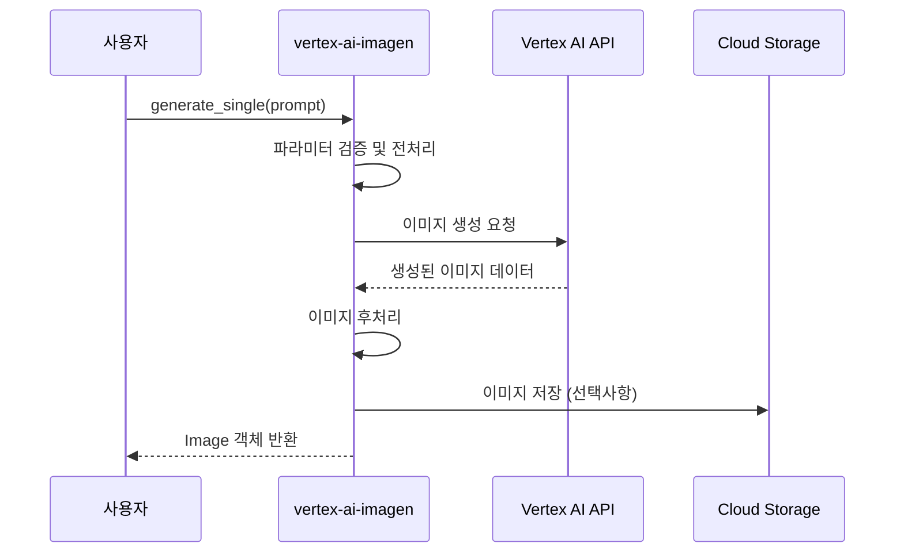
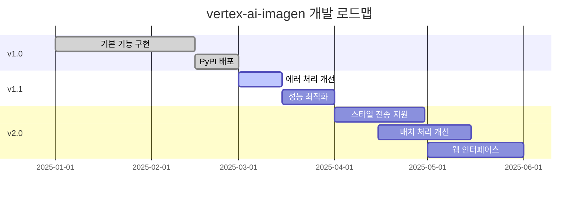

## 🎯 Summary

Google Vertex AI의 Imagen API를 사용하여 AI 이미지를 생성하고 싶지만 복잡한 설정과 긴 코드가 부담스러우셨나요? `vertex-ai-imagen` 패키지를 사용하면 몇 줄의 간단한 코드로 강력한 AI 이미지 생성 기능을 구현할 수 있습니다.

```python
from vertex_ai_imagen import ImageGenerator

# 간단한 초기화
generator = ImageGenerator(project_id="your-project", location="us-central1")

# 이미지 생성
images = generator.generate(
    prompt="A serene mountain landscape at sunset",
    num_images=2
)

# 이미지 저장
for i, image in enumerate(images):
    image.save(f"generated_image_{i}.png")
```

**주요 특징:**
- 🚀 **간편한 설정**: 복잡한 Vertex AI 설정을 간소화
- 🎨 **직관적인 API**: 이해하기 쉬운 메소드와 파라미터
- 💾 **자동 저장**: 생성된 이미지 자동 저장 기능
- 🔧 **유연한 설정**: 다양한 이미지 생성 옵션 제공

---

## 📚 상세 설명

### 패키지 설치 및 기본 설정

`vertex-ai-imagen`은 Google Vertex AI의 Imagen API를 Python에서 더 쉽게 사용할 수 있도록 설계된 래퍼 라이브러리입니다. 복잡한 인증 과정과 API 호출을 단순화하여 개발자가 이미지 생성 로직에만 집중할 수 있도록 도와줍니다.

```bash
# PyPI에서 패키지 설치
pip install vertex-ai-imagen
```

### 왜 이 패키지가 필요한가?

Google Vertex AI의 기본 SDK는 매우 강력하지만, 때로는 복잡할 수 있습니다. 간단한 이미지 생성 작업을 위해서도 상당한 양의 보일러플레이트 코드가 필요하죠.

**기존 Vertex AI SDK 사용 시:**
```python
import vertexai
from vertexai.preview.vision_models import ImageGenerationModel

# 복잡한 초기화 과정
vertexai.init(project="your-project-id", location="us-central1")
model = ImageGenerationModel.from_pretrained("imagen-3.0-generate-002")

# 이미지 생성
images = model.generate_images(
    prompt="A serene mountain landscape at sunset",
    number_of_images=2,
    aspect_ratio="16:9",
    add_watermark=False,
    # 많은 선택적 파라미터들...
)

# 수동으로 이미지 저장
for i, image in enumerate(images.images):
    image.save(f"generated_image_{i}.png")
```

**vertex-ai-imagen 사용 시:**
```python
from vertex_ai_imagen import ImageGenerator

# 간단한 초기화
generator = ImageGenerator(project_id="your-project", location="us-central1")

# 한 줄로 이미지 생성 및 저장
images = generator.generate_and_save(
    prompt="A serene mountain landscape at sunset",
    num_images=2,
    aspect_ratio="16:9"
)
```

### 개발 과정과 설계 철학

이 패키지는 다음과 같은 설계 원칙을 따라 개발되었습니다:



#### 1. 단순성 (Simplicity)
복잡한 설정 과정을 최소화하고, 필수 파라미터만으로도 동작하도록 설계했습니다.

#### 2. 직관성 (Intuitiveness)
메소드명과 파라미터명을 직관적으로 이해할 수 있도록 명명했습니다.

#### 3. 확장성 (Extensibility)
기본 기능은 간단하게 유지하면서, 고급 기능도 쉽게 접근할 수 있도록 했습니다.

#### 4. 호환성 (Compatibility)
기존 Vertex AI SDK와의 호환성을 유지하여 필요시 저수준 API에도 접근할 수 있습니다.

### 주요 기능과 사용법

#### 기본 이미지 생성
```python
from vertex_ai_imagen import ImageGenerator

# 인스턴스 생성
generator = ImageGenerator(
    project_id="your-gcp-project",
    location="us-central1"
)

# 단일 이미지 생성
image = generator.generate_single(
    prompt="A futuristic city skyline with flying cars",
    width=1024,
    height=768
)

# 이미지 저장
image.save("futuristic_city.png")
```

#### 배치 이미지 생성
```python
# 여러 이미지 동시 생성
images = generator.generate_batch(
    prompts=[
        "A peaceful forest scene",
        "A bustling marketplace",
        "A calm ocean sunset"
    ],
    num_images_per_prompt=2
)

# 자동 명명으로 저장
generator.save_images(images, prefix="scene_")
```

#### 고급 설정 옵션



### 환경 설정 및 인증

패키지를 사용하기 전에 Google Cloud 인증을 설정해야 합니다:

```python
# 환경 변수를 통한 인증 (권장)
import os
os.environ['GOOGLE_APPLICATION_CREDENTIALS'] = 'path/to/service-account.json'

# 또는 직접 credentials 전달
from google.auth import load_credentials_from_file

credentials, project = load_credentials_from_file('path/to/service-account.json')
generator = ImageGenerator(
    project_id=project,
    location="us-central1",
    credentials=credentials
)
```

### 에러 처리 및 베스트 프랙티스

```python
from vertex_ai_imagen import ImageGenerator, ImageGenerationError

try:
    generator = ImageGenerator(project_id="your-project")
    
    # 안전한 이미지 생성
    image = generator.generate_single(
        prompt="A beautiful landscape",
        safety_filter=True,  # 안전 필터 활성화
        timeout=30  # 타임아웃 설정
    )
    
except ImageGenerationError as e:
    print(f"이미지 생성 실패: {e}")
except Exception as e:
    print(f"예상치 못한 오류: {e}")
```

### 실제 사용 사례

#### 1. 웹 애플리케이션 통합
```python
from flask import Flask, request, jsonify
from vertex_ai_imagen import ImageGenerator

app = Flask(__name__)
generator = ImageGenerator(project_id="your-project")

@app.route('/generate-image', methods=['POST'])
def generate_image():
    prompt = request.json.get('prompt')
    
    try:
        image = generator.generate_single(prompt)
        image_url = save_to_storage(image)  # 클라우드 스토리지에 저장
        
        return jsonify({
            'success': True,
            'image_url': image_url
        })
    except Exception as e:
        return jsonify({
            'success': False,
            'error': str(e)
        }), 500
```

#### 2. 배치 처리 스크립트
```python
import csv
from vertex_ai_imagen import ImageGenerator

def process_bulk_generation(csv_file):
    generator = ImageGenerator(project_id="your-project")
    
    with open(csv_file, 'r') as file:
        reader = csv.DictReader(file)
        
        for row in reader:
            prompt = row['prompt']
            filename = row['filename']
            
            try:
                image = generator.generate_single(prompt)
                image.save(f"output/{filename}")
                print(f"✅ 생성 완료: {filename}")
                
            except Exception as e:
                print(f"❌ 생성 실패: {filename} - {e}")

# 사용법
process_bulk_generation('image_prompts.csv')
```

### 성능 최적화와 비용 관리

```python
# 배치 생성으로 API 호출 최적화
generator = ImageGenerator(
    project_id="your-project",
    enable_caching=True,  # 결과 캐싱
    batch_size=4  # 배치 크기 설정
)

# 비용 효율적인 설정
images = generator.generate_batch(
    prompts=prompts,
    model_version="imagen-3.0-fast",  # 빠르고 저렴한 모델
    aspect_ratio="1:1",  # 작은 크기로 비용 절약
    quality="standard"  # 품질 vs 비용 트레이드오프
)
```

### API 호출 흐름



### 패키지의 장점과 한계

#### 장점
- **개발 속도 향상**: 보일러플레이트 코드 제거로 빠른 프로토타이핑
- **낮은 학습 곡선**: 직관적인 API로 쉬운 학습
- **오류 처리 개선**: 명확한 에러 메시지와 예외 처리
- **유지보수성**: 깔끔하고 읽기 쉬운 코드

#### 한계
- **고급 기능 제한**: 일부 저수준 기능은 직접 접근 불가
- **의존성**: 기본 Vertex AI SDK의 업데이트에 따른 호환성 문제 가능성
- **커스터마이징**: 특수한 요구사항에 대한 제한된 유연성

### 향후 계획과 로드맵



## 결론

`vertex-ai-imagen` 패키지는 Google Vertex AI의 강력한 이미지 생성 기능을 더 쉽고 직관적으로 사용할 수 있게 해주는 훌륭한 도구입니다. 복잡한 설정 과정을 단순화하고, 개발자가 창의적인 작업에 집중할 수 있도록 도와줍니다.

특히 AI 이미지 생성을 처음 시작하는 개발자들이나, 빠른 프로토타이핑이 필요한 프로젝트에 매우 유용합니다. 패키지의 직관적인 API와 충실한 문서화는 학습 곡선을 크게 낮춰주며, 동시에 고급 사용자들을 위한 확장성도 제공합니다.

앞으로도 지속적인 업데이트와 기능 개선을 통해 더욱 강력하고 사용하기 쉬운 패키지로 발전할 것으로 기대됩니다. AI 이미지 생성 프로젝트를 계획하고 있다면, `vertex-ai-imagen` 패키지를 한번 시도해보시기 바랍니다!