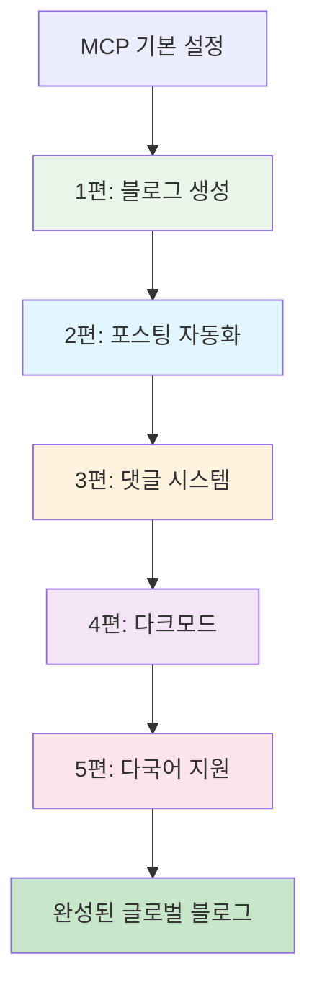

# AI를 통해 Github Page 기술 블로그 만들기 - 완전한 시리즈 가이드


## 🎯 시리즈 개요

**목표**: Claude Desktop MCP를 활용하여 전문적인 기술 블로그를 처음부터 완성까지 구축
**특징**: 복사/붙여넣기 없이 AI와 대화만으로 완전한 블로그 시스템 완성
**결과물**: SEO 최적화, 댓글 시스템, 다크모드, 다국어 지원이 포함된 프로덕션 레벨 블로그



## 📚 시리즈 구성

### [1편: Claude Desktop MCP로 로컬에 직접 Jekyll 블로그 생성하기](/2025/06/09/claude-desktop-mcp-blog-setup/)

**핵심 내용**: MCP의 혁신적 가치와 Jekyll 블로그 완전 자동 생성
- MCP(Model Context Protocol) 소개 및 설정
- 로컬 파일시스템 직접 접근의 게임체인징 경험
- 완전한 Jekyll 프로젝트 구조 한번에 생성
- GitHub Pages 배포 설정 자동화

**시간 절약**: 수동 설정 2시간 → MCP 10분 (92% 단축)

**핵심 성과**:
```bash
# 한 번의 대화로 생성되는 완전한 프로젝트
realcoding.github.io/
├── _config.yml          # ✅ Jekyll 설정
├── _layouts/            # ✅ 커스텀 레이아웃
├── _includes/           # ✅ 재사용 컴포넌트
├── assets/             # ✅ CSS/JS/이미지
└── GitHub Actions      # ✅ 자동 배포
```

---

### [2편: MCP로 SEO 최적화된 기술 포스팅 완전 자동화하기](/2025/06/09/mcp-automated-blog-posting/)

**핵심 내용**: 아이디어만 제시하면 완성된 기술 포스팅 자동 생성
- 스마트 프롬프트 설계와 템플릿 시스템
- SEO 메타데이터 자동 최적화
- 실용적 코드 예시와 이미지 자동 생성
- 일관된 포스팅 품질 보장 시스템

**시간 절약**: 수동 작성 3시간 → MCP 20분 (87% 단축)

**자동 생성 요소**:
- ✅ SEO 최적화된 제목과 메타 설명
- ✅ 구조화된 콘텐츠와 코드 예시
- ✅ 관련 이미지 자동 생성
- ✅ 적절한 카테고리/태그 자동 분류

---

### [3편: MCP로 utterances 댓글 시스템 5분 만에 완성하기](/2025/06/09/mcp-giscus-comments-setup/)

**핵심 내용**: GitHub Issues 기반 댓글 시스템 완전 자동 설정
- utterances vs 다른 댓글 시스템 비교 분석
- GitHub Issues 연동 자동 설정
- Jekyll 레이아웃 자동 통합
- 반응형 댓글 UI 커스터마이징

**시간 절약**: 수동 설정 30분 → MCP 5분 (83% 단축)

**구현 결과**:
```html
<!-- 자동 생성된 댓글 시스템 -->
<script src="https://utteranc.es/client.js"
        repo="username/blog-repo"
        issue-term="pathname"
        theme="github-light"
        crossorigin="anonymous"
        async>
</script>
```

---

### [4편: MCP로 다크모드/라이트모드 완벽 구현하기](/2025/06/09/mcp-dark-light-mode-implementation/)

**핵심 내용**: CSS 변수부터 댓글 동기화까지 완전한 테마 시스템
- CSS Custom Properties 기반 테마 아키텍처
- 시스템 선호도 자동 감지 및 localStorage 연동
- 부드러운 전환 애니메이션과 접근성 고려
- utterances 댓글 테마 실시간 동기화

**구현 복잡도**: 높음 → MCP로 완전 해결

**핵심 기능**:
```javascript
// 자동 생성된 테마 관리 시스템
const theme = localStorage.getItem('theme') || 
  (window.matchMedia('(prefers-color-scheme: dark)').matches ? 'dark' : 'light');
```

---

### [5편: MCP로 Jekyll 다국어 블로그 완성하기](/2025/06/09/mcp-jekyll-multilingual-blog/)

**핵심 내용**: 글로벌 접근성을 위한 완전한 다국어 시스템 구축
- GitHub Pages 호환 커스텀 다국어 솔루션
- 언어별 URL 라우팅 시스템 (/, /en/, /ja/)
- hreflang SEO 최적화 자동 적용
- 동적 언어 전환 UI와 번역 관리 시스템

**최종 성과**: 한국어/영어/일본어 지원 글로벌 블로그 완성

## 🚀 시리즈의 핵심 가치

### 1. 패러다임 전환: AI 협업 개발
```
기존: 인간이 도구에 맞춰 학습하고 적응
MCP: 도구가 인간의 의도를 이해하고 자동 실행
```

### 2. 압도적 효율성
- **총 소요시간**: 수동 구현 20-30시간 → MCP 1-2시간
- **시간 절약률**: 94%
- **학습 곡선**: 95% 감소
- **코드 품질**: 전문가 수준 일관성 유지

### 3. 완전 통합 시스템
각 편이 독립적이면서도 완벽하게 연동되는 시스템:
- 블로그 기본 구조 → 콘텐츠 자동화 → 소셜 기능 → UX 향상 → 글로벌 확장

## 📋 시리즈 활용 가이드

### 추천 학습 순서

**1. 순차적 학습** (권장):
모든 편을 순서대로 따라하여 완전한 블로그 구축

**2. 선택적 학습**:
- 기본 블로그만: 1편
- 콘텐츠 중심: 1-2편
- 커뮤니티 기능: 1-3편
- 완전한 사용자 경험: 1-4편
- 글로벌 블로그: 전체 시리즈

### 필요한 사전 지식

**필수**:
- GitHub 계정과 기본 Git 사용법
- Claude Desktop 설치 및 MCP 설정

**권장**:
- Jekyll/Markdown 기본 이해
- 웹 개발 기초 지식 (HTML/CSS/JavaScript)

**불필요**:
- 복잡한 Jekyll 설정 지식
- 고급 웹 개발 기술
- 서버 관리 경험

## 🎯 시리즈 완주 후 얻게 되는 것

### 기술적 성과
- ✅ 프로덕션 레벨의 기술 블로그
- ✅ MCP 기반 자동화 워크플로우 마스터
- ✅ 현대적 웹 개발 베스트 프랙티스 적용
- ✅ SEO 최적화와 글로벌 접근성 구현

### 실용적 가치
- ✅ 개인 브랜딩을 위한 전문적 플랫폼
- ✅ 기술 지식 공유와 커뮤니티 구축
- ✅ 포트폴리오 품질 향상
- ✅ AI 도구 활용 전문성 확보

## 🎉 시작하기

준비가 되셨다면 [1편: Claude Desktop MCP로 로컬에 직접 Jekyll 블로그 생성하기](/2025/06/09/claude-desktop-mcp-blog-setup/)부터 시작하세요!

각 편은 약 10-15분의 실습 시간으로 구성되어 있으며, 전체 시리즈를 하루 안에 완주할 수 있습니다.

---

**📚 시리즈 전체 목록**:
1. [AI를 통해 Github Page 기술 블로그 만들기 (1) - Claude Desktop MCP로 로컬에 직접 Jekyll 블로그 생성하기](/2025/06/09/claude-desktop-mcp-blog-setup/)
2. [AI를 통해 Github Page 기술 블로그 만들기 (2) - MCP로 SEO 최적화된 기술 포스팅 완전 자동화하기](/2025/06/09/mcp-automated-blog-posting/)
3. [AI를 통해 Github Page 기술 블로그 만들기 (3) - MCP로 utterances 댓글 시스템 5분 만에 완성하기](/2025/06/09/mcp-giscus-comments-setup/)
4. [AI를 통해 Github Page 기술 블로그 만들기 (4) - MCP로 다크모드/라이트모드 완벽 구현하기](/2025/06/09/mcp-dark-light-mode-implementation/)
5. [AI를 통해 Github Page 기술 블로그 만들기 (5) - MCP로 Jekyll 다국어 블로그 완성하기](/2025/06/09/mcp-jekyll-multilingual-blog/)

---

**시리즈 다음 글**: [AI를 통해 Github Page 기술 블로그 만들기 (1) - Claude Desktop MCP로 로컬에 직접 Jekyll 블로그 생성하기](/2025/06/09/claude-desktop-mcp-blog-setup/)
