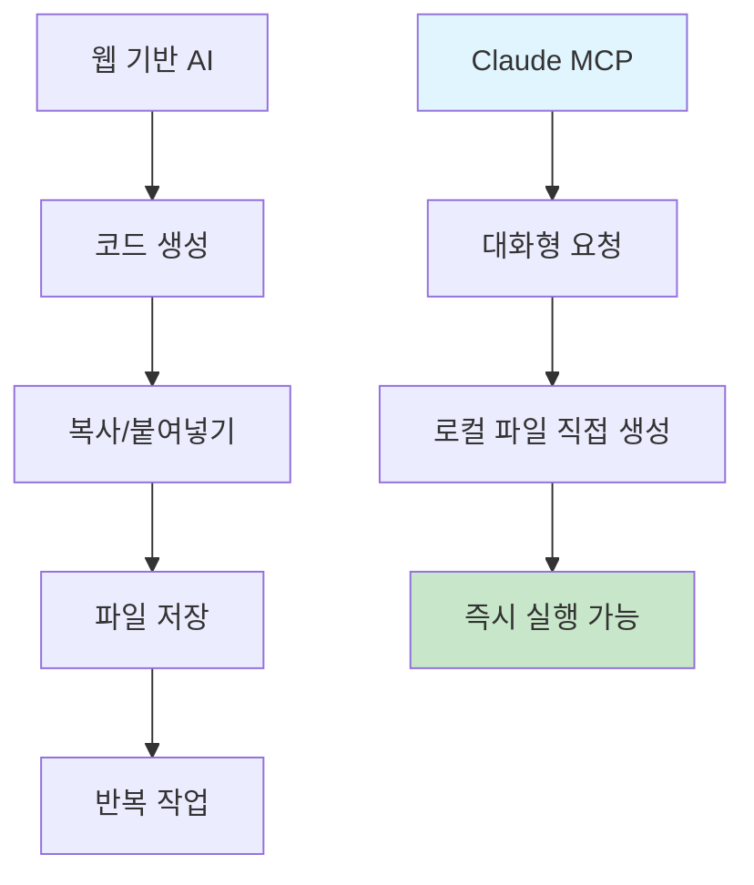

# AI를 통해 Github Page 기술 블로그 만들기 (1) - Claude Desktop MCP로 로컬에 직접 Jekyll 블로그 생성하기


## 🎯 핵심 요약
**기존 문제**: AI 코딩 도구 사용 시 코드 복사/붙여넣기의 번거로움과 파일별 수동 생성
**MCP 해결책**: Claude Desktop이 로컬 파일시스템에 직접 접근하여 완전한 프로젝트 구조를 한 번에 생성

```bash
# MCP가 생성한 결과물을 바로 실행
cd /path/to/generated/blog
bundle exec jekyll serve
# ✨ 완성된 블로그가 즉시 실행됨
```

## 🚀 MCP(Model Context Protocol)란?

MCP는 Claude Desktop이 로컬 환경과 직접 상호작용할 수 있게 해주는 프로토콜입니다. 웹 기반 AI 도구들과의 결정적 차이점:

**웹 기반 AI**: 코드 생성 → 복사 → 붙여넣기 → 파일 저장 (반복)
**Claude MCP**: 대화 → 로컬 파일 직접 생성 → 즉시 실행 가능



## 🛠️ MCP로 Jekyll 블로그 생성 실전

### 1단계: MCP 서버 설정 확인

Claude Desktop에서 MCP 연결 상태 확인:
```
Claude에게 질문: "내 로컬 파일 시스템에 접근할 수 있어?"
```

MCP가 정상 작동하면 Claude가 현재 디렉토리 구조를 보여줍니다.

### 2단계: 프로젝트 생성 명령

```
실제 사용한 프롬프트:
"내 로컬 `/Users/kevinpark/Documents/projects/` 폴더에 
realcoding.github.io 라는 Jekyll 기술 블로그를 생성해줘.

요구사항:
- 깔끔한 개발자 테마
- 카테고리/태그 기능
- 검색 기능
- SEO 최적화
- GitHub Pages 배포 설정

모든 파일을 로컬에 직접 생성해줘."
```

### 3단계: MCP의 실제 작업 과정

Claude MCP가 수행한 작업들:

**파일 구조 생성**:
```
realcoding.github.io/
├── _config.yml          # ✅ MCP 직접 생성
├── Gemfile              # ✅ MCP 직접 생성  
├── _layouts/
│   ├── default.html     # ✅ MCP 직접 생성
│   └── post.html        # ✅ MCP 직접 생성
├── _includes/
│   ├── header.html      # ✅ MCP 직접 생성
│   └── footer.html      # ✅ MCP 직접 생성
├── _sass/
│   └── main.scss        # ✅ MCP 직접 생성
├── assets/
│   └── css/main.scss    # ✅ MCP 직접 생성
├── _posts/              # ✅ MCP 직접 생성
└── index.html           # ✅ MCP 직접 생성
```

**한 번의 명령으로 생성된 것들**:
- 완전한 Jekyll 프로젝트 구조
- 커스텀 레이아웃 및 스타일
- GitHub Actions 배포 워크플로우
- SEO 메타태그 템플릿
- 반응형 CSS 스타일시트

### 4단계: 즉시 실행 및 확인

```bash
cd realcoding.github.io

# MCP가 생성한 Gemfile로 의존성 설치
bundle install

# 로컬 서버 실행
bundle exec jekyll serve

# 브라우저에서 http://localhost:4000 확인
```

## 💡 MCP의 게임 체인징 포인트

### 1. 완전 자동화된 워크플로우
- **기존**: 각 파일별로 복사/붙여넣기 20-30회
- **MCP**: 한 번의 대화로 완전한 프로젝트 생성

### 2. 실시간 디버깅
```
에러 발생 시:
"Jekyll 빌드에서 에러가 났어: [에러 메시지]"

Claude MCP 응답:
→ 문제 파일 자동 식별
→ 로컬 파일 직접 수정
→ 수정 완료 알림
```

### 3. 점진적 개선
프로젝트가 생성된 후에도 Claude와 대화하며:
- 새로운 레이아웃 추가
- CSS 스타일 수정  
- 플러그인 설정 변경
- 배포 스크립트 최적화

모든 작업이 로컬 파일에 직접 반영됩니다.

## 📊 실제 작업 시간 비교

**전통적 방법 (수동 설정)**:
- Jekyll 문서 읽기: 30분
- 테마 선택 및 다운로드: 20분  
- 설정 파일 수정: 40분
- 디버깅: 30분
- **총 소요시간: 2시간**

**Claude MCP 방법**:
- 요구사항 정리: 5분
- MCP로 프로젝트 생성: 3분
- 로컬 실행 확인: 2분
- **총 소요시간: 10분**

## 🎉 다음 단계와 시리즈 예고

MCP로 기본 블로그 골격이 완성됐습니다. 다음 포스팅들에서 다룰 내용:

1. **샘플 포스팅 생성**: MCP로 마크다운 파일 직접 생성
2. **댓글 시스템**: Giscus 설정을 MCP로 자동화
3. **다크모드**: 테마 토글 기능을 MCP로 구현
4. **다국어**: i18n 설정을 MCP로 일괄 적용

## 결론

Claude Desktop의 MCP는 단순한 코드 생성 도구를 넘어 **로컬 개발환경과 완전 통합된 AI 어시스턴트**입니다. 복사/붙여넣기의 번거로움 없이 생각을 바로 코드로 구현할 수 있는 혁신적 경험을 제공합니다.

---

**📚 시리즈 전체 목록**:
1. [AI를 통해 Github Page 기술 블로그 만들기 (1) - Claude Desktop MCP로 로컬에 직접 Jekyll 블로그 생성하기](/2025/06/09/claude-desktop-mcp-blog-setup/) ← 현재 글
2. [AI를 통해 Github Page 기술 블로그 만들기 (2) - MCP로 SEO 최적화된 기술 포스팅 완전 자동화하기](/2025/06/09/mcp-automated-blog-posting/)
3. [AI를 통해 Github Page 기술 블로그 만들기 (3) - MCP로 utterances 댓글 시스템 5분 만에 완성하기](/2025/06/09/mcp-giscus-comments-setup/)
4. [AI를 통해 Github Page 기술 블로그 만들기 (4) - MCP로 다크모드/라이트모드 완벽 구현하기](/2025/06/09/mcp-dark-light-mode-implementation/)
5. [AI를 통해 Github Page 기술 블로그 만들기 (5) - MCP로 Jekyll 다국어 블로그 완성하기](/2025/06/09/mcp-jekyll-multilingual-blog/)

---

**시리즈 다음 글**: [AI를 통해 Github Page 기술 블로그 만들기 (2) - MCP로 SEO 최적화된 기술 포스팅 완전 자동화하기](/2025/06/09/mcp-automated-blog-posting/)
