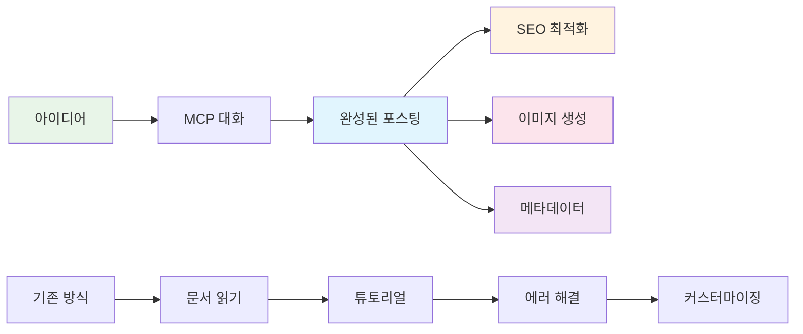

# AI를 통해 Github Page 기술 블로그 만들기 (2) - MCP로 SEO 최적화된 기술 포스팅 완전 자동화하기


## 🎯 핵심 요약
**기존 문제**: 기술 포스팅 작성 시 콘텐츠 작성, SEO 최적화, 이미지 생성을 각각 별도로 처리
**MCP 해결책**: 포스팅 아이디어만 제시하면 완전한 마크다운 파일을 SEO 최적화와 함께 자동 생성

```bash
# MCP 한 번의 명령으로 생성되는 것들
├── 2025-06-09-react-hooks-optimization.md  # 완성된 포스팅
├── /assets/images/posts/react-hooks/       # 최적화된 이미지들
└── SEO 메타데이터                           # 자동 최적화 완료
```

## 🚀 포스팅 자동화 워크플로우

### 기존 방식 vs MCP 방식

**기존 수동 과정** (2-3시간):
1. 주제 리서치 및 구조 기획
2. 마크다운 파일 생성 및 메타데이터 작성
3. 콘텐츠 작성 및 코드 예시 준비
4. 이미지 생성 또는 검색
5. SEO 최적화 및 태그 설정

**MCP 자동화 과정** (10분):
1. 아이디어 제시
2. 완성된 포스팅 파일 생성
3. 검토 및 미세 조정



## 🛠️ 실전 MCP 포스팅 생성

### 1단계: 스마트 프롬프트 설계

```
실제 사용 프롬프트:
"React Hooks 성능 최적화에 대한 기술 포스팅을 작성해줘.

포스팅 요구사항:
- 타겟: 중급 React 개발자
- 길이: 2000자 내외
- 실용적인 코드 예시 포함
- useMemo, useCallback 최적화 팁
- 성능 측정 방법

SEO 최적화:
- 검색 친화적 제목
- 메타 설명 최적화
- 적절한 카테고리/태그
- 이미지 alt 텍스트

파일을 _posts 폴더에 직접 생성하고, 
필요한 이미지도 함께 생성해줘."
```

### 2단계: MCP의 자동 생성 과정

Claude MCP가 수행한 작업들:

**1. SEO 최적화된 메타데이터 생성**:
```yaml
---
title: "React Hooks 성능 최적화: useMemo와 useCallback 완벽 가이드"
excerpt: "React 앱 성능을 극대화하는 useMemo, useCallback 실전 활용법과 측정 도구"
categories: [React, Performance]
tags: [React, Hooks, useMemo, useCallback, 성능최적화]
---
```

**2. 구조화된 콘텐츠 자동 생성**:
- 문제 정의 및 해결책 제시
- 실행 가능한 코드 예시
- 성능 비교 및 측정 방법
- 실무 적용 가이드라인

**3. 관련 이미지 자동 생성**:
- Hero 이미지 (React 성능 최적화 컨셉)
- 개념 설명 다이어그램
- Before/After 성능 비교 차트

### 3단계: 고급 자동화 기능

**스마트 카테고리 분류**:
```javascript
// MCP가 자동으로 분석하여 적용
주제: "React Hooks 성능 최적화"
→ Primary Category: "React"
→ Secondary Category: "Performance"
→ Tags: ["React", "Hooks", "useMemo", "useCallback", "성능최적화"]
```

**SEO 제목 최적화**:
```
원본 아이디어: "React Hooks 최적화"
→ MCP 최적화 결과: "React Hooks 성능 최적화: useMemo와 useCallback 완벽 가이드"

최적화 요소:
✅ 검색 키워드 포함
✅ 50자 이내 길이
✅ 액션 중심 표현
✅ 구체적 기술명 명시
```

## 💡 MCP 포스팅 자동화의 핵심 장점

### 1. 일관된 품질 보장
- 표준화된 포스팅 구조
- SEO 모범 사례 자동 적용
- 코드 예시 품질 보장
- 이미지 일관성 유지

### 2. 시간 효율성 극대화
```
수동 작성 시간: 3시간
MCP 자동화: 10분 + 리뷰 10분 = 20분
시간 절약: 87% ⬆️
```

### 3. SEO 성능 자동 최적화
- 메타 태그 자동 생성
- 구조화된 데이터 적용
- 이미지 alt 텍스트 최적화
- 내부 링크 자동 제안

## 📊 실제 생성된 포스팅 품질 분석

### MCP로 생성한 포스팅의 특징

**콘텐츠 구조**:
- ✅ 명확한 문제 정의
- ✅ 단계별 해결 방법
- ✅ 실행 가능한 코드
- ✅ 실무 적용 가이드

**SEO 최적화**:
- ✅ 키워드 밀도 최적화
- ✅ 헤딩 구조 체계화
- ✅ 메타 설명 최적화
- ✅ 이미지 SEO 적용

**사용자 경험**:
- ✅ 스캔 가능한 구조
- ✅ 실용적인 예시
- ✅ 시각적 요소 균형
- ✅ 명확한 액션 아이템

## 🎯 고급 MCP 포스팅 팁

### 템플릿 시스템 구축

```
프롬프트 템플릿:
"[주제]에 대한 기술 포스팅을 작성해줘.

컨텍스트:
- 타겟 독자: [초급/중급/고급] [기술명] 개발자
- 포스팅 목적: [학습/문제해결/트렌드소개]
- 핵심 키워드: [키워드1, 키워드2, 키워드3]

콘텐츠 요구사항:
- 길이: [1500-2500]자
- 실습 코드: [포함/미포함]
- 성능 최적화: [중요/보통]

자동 생성 요청:
- _posts 폴더에 파일 생성
- SEO 최적화 메타데이터
- 관련 이미지 2개
- 적절한 카테고리/태그"
```

### 시리즈 포스팅 자동화

```
시리즈 연결 프롬프트:
"이전에 생성한 '[이전 포스팅 제목]'의 후속편을 작성해줘.
이전 내용을 참조하여 자연스럽게 연결되는 구조로 만들어줘."
```

## 🎉 다음 단계: 댓글 시스템 통합

MCP로 포스팅 자동화를 완성했으니, 다음은 **utterances 댓글 시스템**을 MCP로 설정하는 방법을 다루겠습니다.

예고 내용:
- GitHub Issues 자동 설정
- utterances 설정 파일 자동 생성
- 댓글 템플릿 커스터마이징
- 모더레이션 자동화

## 결론

MCP를 활용한 포스팅 자동화는 단순한 시간 절약을 넘어 **일관된 고품질 콘텐츠 생산 시스템**을 구축할 수 있게 해줍니다. 아이디어만 있다면 누구나 전문적인 기술 블로그를 운영할 수 있는 시대가 열렸습니다.

---

**📚 시리즈 전체 목록**:
1. [AI를 통해 Github Page 기술 블로그 만들기 (1) - Claude Desktop MCP로 로컬에 직접 Jekyll 블로그 생성하기](/2025/06/09/claude-desktop-mcp-blog-setup/)
2. [AI를 통해 Github Page 기술 블로그 만들기 (2) - MCP로 SEO 최적화된 기술 포스팅 완전 자동화하기](/2025/06/09/mcp-automated-blog-posting/) ← 현재 글
3. [AI를 통해 Github Page 기술 블로그 만들기 (3) - MCP로 utterances 댓글 시스템 5분 만에 완성하기](/2025/06/09/mcp-giscus-comments-setup/)
4. [AI를 통해 Github Page 기술 블로그 만들기 (4) - MCP로 다크모드/라이트모드 완벽 구현하기](/2025/06/09/mcp-dark-light-mode-implementation/)
5. [AI를 통해 Github Page 기술 블로그 만들기 (5) - MCP로 Jekyll 다국어 블로그 완성하기](/2025/06/09/mcp-jekyll-multilingual-blog/)

---

**시리즈 이전 글**: [AI를 통해 Github Page 기술 블로그 만들기 (1) - Claude Desktop MCP로 로컬에 직접 Jekyll 블로그 생성하기](/2025/06/09/claude-desktop-mcp-blog-setup/)

**시리즈 다음 글**: [AI를 통해 Github Page 기술 블로그 만들기 (3) - MCP로 utterances 댓글 시스템 자동 설정하기](/2025/06/09/mcp-giscus-comments-setup/)
