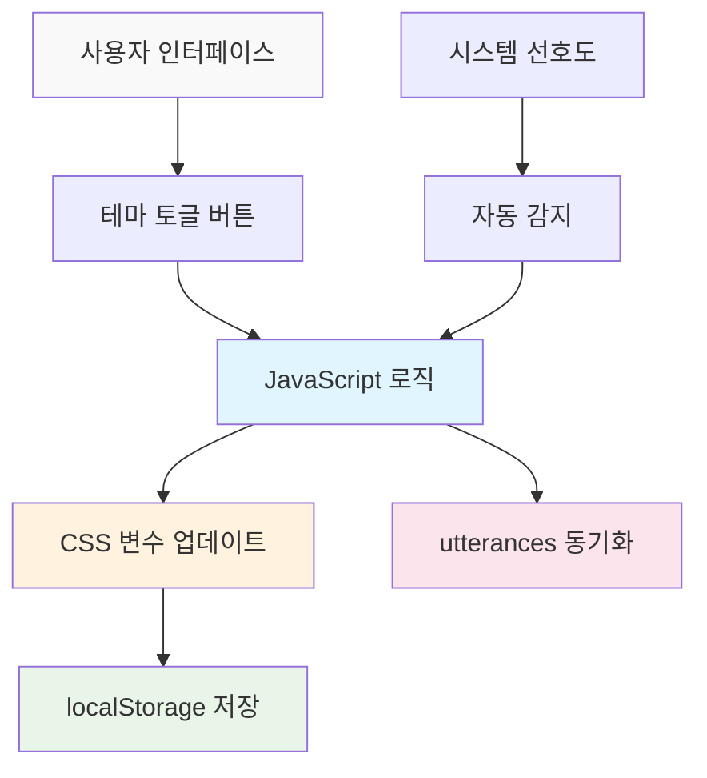

# AI를 통해 Github Page 기술 블로그 만들기 (4) - MCP로 다크모드/라이트모드 완벽 구현하기


## 🎯 핵심 요약
**문제**: 다크모드 구현은 CSS 변수, JavaScript 로직, 상태 저장, 컴포넌트 동기화 등 복잡한 요소들이 얽혀있음
**해결책**: MCP가 완전한 테마 시스템을 자동 구축하여 사용자 경험과 개발 효율성을 동시에 달성

```javascript
// MCP 생성 결과물의 핵심 기능
const theme = localStorage.getItem('theme') || 
  (window.matchMedia('(prefers-color-scheme: dark)').matches ? 'dark' : 'light');
document.documentElement.setAttribute('data-theme', theme);
```

## 🛠️ 기본 사용법 (핵심 코드)

### MCP 프롬프트로 완전한 테마 시스템 생성

```
MCP 실행 프롬프트:
"Jekyll 블로그에 완전한 다크모드/라이트모드 시스템을 구현해줘.

요구사항:
4. CSS Custom Properties 기반 테마 시스템
2. 토글 버튼과 부드러운 전환 애니메이션  
3. 사용자 선택 localStorage 저장
4. 시스템 선호도 자동 감지
5. utterances 댓글 테마 동기화
6. 모든 페이지에 일관된 테마 적용

생성할 파일들:
- assets/css/themes.css (테마 CSS 변수)
- assets/js/theme-toggle.js (토글 로직)
- _includes/theme-toggle.html (토글 버튼)
- _layouts/default.html 수정 (테마 적용)
- utterances 설정 업데이트

모든 파일을 직접 생성하고 기존 파일들을 적절히 수정해줘."
```



## 📊 MCP가 자동 생성하는 핵심 컴포넌트

### 1. CSS 테마 변수 시스템 (themes.css)

```css
/* MCP 자동 생성 - 완전한 테마 변수 */
:root {
  /* Light Mode (기본값) */
  --bg-primary: #ffffff;
  --bg-secondary: #f8f9fa;
  --text-primary: #212529;
  --text-secondary: #6c757d;
  --accent: #007bff;
  --border: #dee2e6;
  --shadow: rgba(0,0,0,0.1);
  
  /* 전환 애니메이션 */
  --transition: all 0.3s cubic-bezier(0.4, 0, 0.2, 1);
}

[data-theme="dark"] {
  /* Dark Mode */
  --bg-primary: #1a1a1a;
  --bg-secondary: #2d2d2d;
  --text-primary: #ffffff;
  --text-secondary: #a0a0a0;
  --accent: #4dabf7;
  --border: #404040;
  --shadow: rgba(255,255,255,0.1);
}

/* 모든 요소에 테마 적용 */
body {
  background-color: var(--bg-primary);
  color: var(--text-primary);
  transition: var(--transition);
}
```

### 2. 스마트 테마 토글 로직 (theme-toggle.js)

```javascript
// MCP 자동 생성 - 완전한 테마 관리 시스템
class ThemeManager {
  constructor() {
    this.init();
  }
  
  init() {
    // 저장된 테마 또는 시스템 선호도 확인
    const savedTheme = localStorage.getItem('theme');
    const systemPreference = window.matchMedia('(prefers-color-scheme: dark)').matches ? 'dark' : 'light';
    const initialTheme = savedTheme || systemPreference;
    
    this.setTheme(initialTheme);
    this.setupToggle();
    this.watchSystemChanges();
  }
  
  setTheme(theme) {
    document.documentElement.setAttribute('data-theme', theme);
    localStorage.setItem('theme', theme);
    this.updateUtterances(theme);
    this.updateToggleButton(theme);
  }
  
  toggleTheme() {
    const currentTheme = document.documentElement.getAttribute('data-theme');
    const newTheme = currentTheme === 'dark' ? 'light' : 'dark';
    this.setTheme(newTheme);
  }
  
  updateUtterances(theme) {
    // utterances 댓글 테마 동기화
    const utterancesFrame = document.querySelector('.utterances-frame');
    if (utterancesFrame) {
      const message = {
        type: 'set-theme',
        theme: theme === 'dark' ? 'github-dark' : 'github-light'
      };
      utterancesFrame.contentWindow.postMessage(message, 'https://utteranc.es');
    }
  }
}

// 페이지 로드 시 테마 매니저 초기화
document.addEventListener('DOMContentLoaded', () => {
  window.themeManager = new ThemeManager();
});
```

### 3. 우아한 토글 버튼 (theme-toggle.html)

```html
<!-- MCP 자동 생성 - 애니메이션 토글 버튼 -->
<button class="theme-toggle" onclick="window.themeManager.toggleTheme()" aria-label="테마 전환">
  <svg class="sun-icon" width="20" height="20" viewBox="0 0 24 24">
    <path d="M12 7a5 5 0 1 1 0 10 5 5 0 0 1 0-10z"/>
    <path d="M12 1v2M12 21v2M4.22 4.22l1.42 1.42M18.36 18.36l1.42 1.42M1 12h2M21 12h2"/>
  </svg>
  <svg class="moon-icon" width="20" height="20" viewBox="0 0 24 24">
    <path d="M21 12.79A9 9 0 1 1 11.21 3 7 7 0 0 0 21 12.79z"/>
  </svg>
</button>

<style>
.theme-toggle {
  position: relative;
  background: var(--bg-secondary);
  border: 1px solid var(--border);
  border-radius: 50%;
  width: 44px;
  height: 44px;
  cursor: pointer;
  transition: var(--transition);
}

.theme-toggle:hover {
  transform: scale(1.1);
  box-shadow: 0 4px 12px var(--shadow);
}

[data-theme="light"] .moon-icon,
[data-theme="dark"] .sun-icon {
  opacity: 0;
  transform: rotate(180deg);
}

[data-theme="light"] .sun-icon,
[data-theme="dark"] .moon-icon {
  opacity: 1;
  transform: rotate(0deg);
}

.sun-icon, .moon-icon {
  position: absolute;
  top: 50%;
  left: 50%;
  transform: translate(-50%, -50%);
  transition: var(--transition);
  stroke: var(--text-primary);
  fill: none;
  stroke-width: 2;
}
</style>
```

## 💭 고급 기능 구현

### 시스템 선호도 실시간 감지

```javascript
// MCP가 자동으로 포함하는 고급 기능
watchSystemChanges() {
  const mediaQuery = window.matchMedia('(prefers-color-scheme: dark)');
  mediaQuery.addListener((e) => {
    // 사용자가 수동으로 설정하지 않았다면 시스템 변경 따라가기
    if (!localStorage.getItem('theme')) {
      this.setTheme(e.matches ? 'dark' : 'light');
    }
  });
}
```

### 페이지 로드 최적화

```html
<!-- MCP가 <head>에 자동 추가하는 플리커 방지 코드 -->
<script>
(function() {
  const theme = localStorage.getItem('theme') || 
    (window.matchMedia('(prefers-color-scheme: dark)').matches ? 'dark' : 'light');
  document.documentElement.setAttribute('data-theme', theme);
})();
</script>
```

### utterances 완벽 동기화

```javascript
// MCP가 자동 구현하는 댓글 테마 동기화
updateUtterancesTheme(theme) {
  const iframe = document.querySelector('.utterances-frame');
  if (iframe) {
    const message = {
      type: 'set-theme',
      theme: theme === 'dark' ? 'github-dark' : 'github-light'
    };
    iframe.contentWindow.postMessage(message, 'https://utteranc.es');
  }
}
```

## 📈 사용자 경험 최적화

### 1. 부드러운 전환 애니메이션
- 모든 색상 변경에 300ms cubic-bezier 애니메이션
- 토글 버튼 호버 효과와 아이콘 회전
- 페이지 로드 시 플리커 방지

### 2. 접근성 고려사항
- ARIA 레이블과 키보드 네비게이션 지원
- 고대비 색상 조합
- 사용자 선호도 존중

### 3. 성능 최적화
- CSS 변수를 통한 효율적인 스타일링
- localStorage 기반 상태 지속성
- 최소한의 JavaScript 코드

## 🎉 완성된 테마 시스템의 특징

MCP로 구축된 테마 시스템의 최종 결과:

- ✅ **완전 자동화**: 한 번의 명령으로 모든 파일 생성
- ✅ **시스템 통합**: OS 다크모드와 완벽 연동
- ✅ **상태 지속**: 사용자 선택 기억 및 복원
- ✅ **컴포넌트 동기화**: utterances 포함 모든 요소 테마 적용
- ✅ **성능 최적화**: 플리커 없는 즉시 로딩
- ✅ **사용자 경험**: 부드러운 애니메이션과 직관적 UI

## 다음 단계: 다국어 지원

테마 시스템이 완성됐으니, 시리즈 마지막으로 **다국어(i18n) 지원 시스템**을 MCP로 구현하는 방법을 다루겠습니다. 테마와 연동되는 완전한 다국어 블로그를 만들어보겠습니다.

---

**📚 시리즈 전체 목록**:
1. [AI를 통해 Github Page 기술 블로그 만들기 (1) - Claude Desktop MCP로 로컬에 직접 Jekyll 블로그 생성하기](/2025/06/09/claude-desktop-mcp-blog-setup/)
2. [AI를 통해 Github Page 기술 블로그 만들기 (2) - MCP로 SEO 최적화된 기술 포스팅 완전 자동화하기](/2025/06/09/mcp-automated-blog-posting/)
3. [AI를 통해 Github Page 기술 블로그 만들기 (3) - MCP로 utterances 댓글 시스템 5분 만에 완성하기](/2025/06/09/mcp-giscus-comments-setup/)
4. [AI를 통해 Github Page 기술 블로그 만들기 (4) - MCP로 다크모드/라이트모드 완벽 구현하기](/2025/06/09/mcp-dark-light-mode-implementation/) ← 현재 글
5. [AI를 통해 Github Page 기술 블로그 만들기 (5) - MCP로 Jekyll 다국어 블로그 완성하기](/2025/06/09/mcp-jekyll-multilingual-blog/)

---

**시리즈 이전 글**: [AI를 통해 Github Page 기술 블로그 만들기 (3) - MCP로 utterances 댓글 시스템 5분 만에 완성하기](/2025/06/09/mcp-giscus-comments-setup/)

**시리즈 다음 글**: [AI를 통해 Github Page 기술 블로그 만들기 (5) - MCP로 Jekyll 다국어 블로그 완성하기](/2025/06/09/mcp-jekyll-multilingual-blog/)
