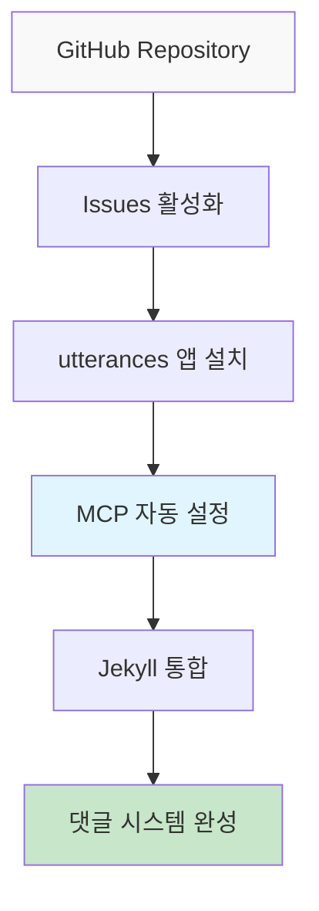

# AI를 통해 Github Page 기술 블로그 만들기 (3) - MCP로 utterances 댓글 시스템 5분 만에 완성하기


## 💡 해결책 (바로 사용 가능한 코드)

**문제**: Jekyll 블로그에 댓글 시스템을 추가하려면 여러 서비스 설정과 복잡한 통합 과정이 필요
**해결책**: MCP가 GitHub Issues + utterances 설정을 자동화하여 완전한 댓글 시스템을 즉시 구축

```bash
# MCP 실행 결과물
├── _includes/comments.html          # ✅ 자동 생성
├── _layouts/post.html              # ✅ 자동 수정  
├── _config.yml                     # ✅ Giscus 설정 추가
└── assets/css/comments.scss        # ✅ 댓글 스타일링
```

## 📋 적용 방법 (3단계)



### 1단계: GitHub Repository 준비

먼저 GitHub에서 수동으로 설정해야 할 최소 요소:
```
1. Repository → Settings → Features
2. Issues 체크박스 활성화 ✅
3. utterances 앱 설치: https://github.com/apps/utterances
4. Repository 권한 부여 ✅
```

### 2단계: MCP로 자동 설정

```
MCP 프롬프트:
"내 Jekyll 블로그에 utterances 댓글 시스템을 설정해줘.

Repository 정보:
- GitHub 사용자명: kevinpark
- Repository: realcoding.github.io  
- 기본 언어: ko
- 테마: 블로그 디자인에 맞게

필요한 작업:
1. _includes/comments.html 생성
2. post.html 레이아웃에 댓글 섹션 추가
3. _config.yml에 utterances 설정 추가
4. 댓글 영역 스타일링

모든 파일을 직접 생성하고 수정해줘."
```

### 3단계: 즉시 확인

```bash
# 로컬서버 재시작
bundle exec jekyll serve

# 포스트 페이지에서 댓글 섹션 확인
# http://localhost:4000/posts/[포스트명]
```

## 🔍 왜 이렇게 할까? (간단한 배경)

### utterances 선택 이유

**기존 댓글 시스템들의 문제점**:
- Disqus: 광고 및 개인정보 수집 이슈
- Facebook Comments: 플랫폼 종속성
- 자체 구축: 서버 관리 부담

**utterances의 장점**:
- ✅ GitHub 계정 기반 (개발자 친화적)
- ✅ 무료 및 오픈소스
- ✅ GitHub Issues와 완전 통합
- ✅ 마크다운 지원
- ✅ 반응형 디자인

### MCP 자동화의 핵심 가치

**수동 설정** (30분):
```
1. utterances 사이트에서 설정값 생성
2. HTML 코드 복사/수정
3. Jekyll 레이아웃 파일 수정
4. CSS 스타일링 추가
5. 설정 테스트 및 디버깅
```

**MCP 자동화** (5분):
```
1. 프롬프트 입력
2. 자동 생성된 파일들 확인
3. 로컬 서버에서 테스트
```

## 🛠️ MCP가 자동 생성하는 파일들

### 1. _includes/comments.html
```html
<!-- MCP 자동 생성 예시 -->
<div class="comments-section">
  <script src="https://utteranc.es/client.js"
          repo="kevinpark/realcoding.github.io"
          issue-term="pathname"
          theme="github-light"
          crossorigin="anonymous"
          async>
  </script>
</div>
```

### 2. 포스트 레이아웃 자동 수정

```html
<!-- _layouts/post.html에 자동 추가 -->
<article class="post">
  {{ content }}
  
  
    
  
</article>
```


### 3. 설정 파일 업데이트
```yaml
# _config.yml 자동 추가
comments:
  provider: utterances
  utterances:
    repo: "kevinpark/realcoding.github.io"
    issue_term: "pathname"
    theme: "github-light"
```

## ⚡ 고급 커스터마이징

### 댓글 비활성화 옵션
```yaml
# 특정 포스트에서 댓글 비활성화
---
layout: post
title: "제목"
comments: false  # 이 포스트는 댓글 비활성화
---
```

### 다크모드 연동
MCP가 자동으로 생성하는 스타일:
```scss
// assets/css/comments.scss
.giscus-frame {
  max-width: 100%;
  margin: 2rem 0;
}

@media (prefers-color-scheme: dark) {
  .giscus-frame {
    color-scheme: dark;
  }
}
```

## 🎉 결과 확인

설정 완료 후 확인 사항:
- ✅ 포스트 하단에 댓글 섹션 표시
- ✅ GitHub 로그인으로 댓글 작성 가능
- ✅ GitHub Issues에 자동 연동
- ✅ 반응형 디자인 적용
- ✅ 다크모드 테마 동기화

## 다음 단계: 다크모드 구현

댓글 시스템이 완성됐으니, 다음은 **다크모드/라이트모드 토글**을 MCP로 구현하는 방법을 다루겠습니다. utterances 댓글과 완벽하게 연동되는 테마 시스템을 만들어보겠습니다.

---

**📚 시리즈 전체 목록**:
1. [AI를 통해 Github Page 기술 블로그 만들기 (1) - Claude Desktop MCP로 로컬에 직접 Jekyll 블로그 생성하기](/2025/06/09/claude-desktop-mcp-blog-setup/)
2. [AI를 통해 Github Page 기술 블로그 만들기 (2) - MCP로 SEO 최적화된 기술 포스팅 완전 자동화하기](/2025/06/09/mcp-automated-blog-posting/)
3. [AI를 통해 Github Page 기술 블로그 만들기 (3) - MCP로 utterances 댓글 시스템 5분 만에 완성하기](/2025/06/09/mcp-giscus-comments-setup/) ← 현재 글
4. [AI를 통해 Github Page 기술 블로그 만들기 (4) - MCP로 다크모드/라이트모드 완벽 구현하기](/2025/06/09/mcp-dark-light-mode-implementation/)
5. [AI를 통해 Github Page 기술 블로그 만들기 (5) - MCP로 Jekyll 다국어 블로그 완성하기](/2025/06/09/mcp-jekyll-multilingual-blog/)

---

**시리즈 이전 글**: [AI를 통해 Github Page 기술 블로그 만들기 (2) - MCP로 SEO 최적화된 기술 포스팅 완전 자동화하기](/2025/06/09/mcp-automated-blog-posting/)

**시리즈 다음 글**: [AI를 통해 Github Page 기술 블로그 만들기 (4) - MCP로 다크모드/라이트모드 완벽 구현하기](/2025/06/09/mcp-dark-light-mode-implementation/)
