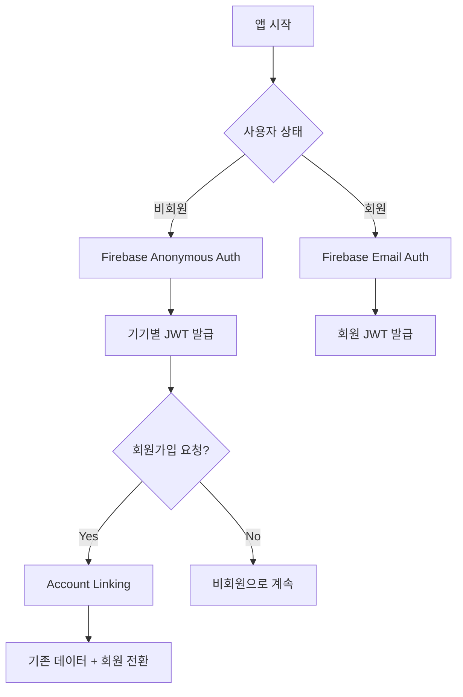

# Unity + Firebase 인증 삽질기: Anonymous에서 Account Linking까지


*Unity에서 Firebase 이중 인증 시스템을 구현하며 겪은 시행착오들*

## 🤦‍♂️ 이런 고민에서 시작됐다

**문제**: 게임 앱에서 비회원도 데이터를 저장하고, 나중에 회원가입해도 기존 데이터를 잃지 않게 하려면?

**해결**: Firebase Anonymous Authentication + Account Linking으로 매끄러운 사용자 경험 구현

처음엔 "그냥 기기 ID 쓰면 되지 않나?" 했는데, 기기 변경이나 앱 재설치 시 데이터가 날아가는 걸 보고 깨달았다. Firebase Anonymous Auth가 답이었다.



## 💻 핵심 구현 코드

### Firebase Anonymous 인증 (Unity)

```csharp
// 처음엔 이렇게만 했는데...
FirebaseAuth.DefaultInstance.SignInAnonymouslyAsync().ContinueWith(task => {
    if (task.IsCompletedSuccessfully) {
        FirebaseUser user = task.Result.User;
        Debug.Log("익명 로그인 성공: " + user.UserId);
    }
});

// 실제론 ID Token까지 받아야 서버에서 검증 가능
private async void AuthenticateAnonymously() {
    try {
        var result = await FirebaseAuth.DefaultInstance.SignInAnonymouslyAsync();
        var idToken = await result.User.GetIdTokenAsync(false);
        
        // 서버로 ID Token 전송
        await SendDeviceAuthRequest(idToken);
    } catch (Exception e) {
        Debug.LogError($"익명 인증 실패: {e.Message}");
    }
}
```

### Account Linking 구현 (가장 삽질했던 부분)

```csharp
// 처음엔 이게 왜 안 되는지 몰랐다
private async void LinkWithEmail(string email, string password) {
    try {
        var credential = EmailAuthProvider.GetCredential(email, password);
        
        // 핵심: 현재 익명 사용자에 이메일 계정 연결
        var result = await FirebaseAuth.DefaultInstance.CurrentUser
            .LinkWithCredentialAsync(credential);
            
        // 새로운 ID Token으로 서버에 알림
        var newIdToken = await result.User.GetIdTokenAsync(false);
        await SendLoginRequest(newIdToken);
        
        Debug.Log("Account Linking 성공!");
    } catch (FirebaseException e) {
        if (e.ErrorCode == AuthError.EmailAlreadyInUse) {
            Debug.LogError("이미 사용 중인 이메일입니다");
        }
    }
}
```

### 서버 측 처리 (AWS Lambda)

```javascript
// Firebase ID Token 검증 후 사용자 처리
exports.handler = async (event) => {
    try {
        const { idToken } = JSON.parse(event.body);
        
        // Firebase Admin SDK로 토큰 검증
        const decodedToken = await admin.auth().verifyIdToken(idToken);
        const { uid, email, firebase } = decodedToken;
        
        // DynamoDB에서 기존 사용자 조회
        const existingUser = await getUserByUID(uid);
        
        if (existingUser) {
            // Account Linking: 익명 → 회원 전환
            if (!existingUser.email && email) {
                await updateUserToMember(uid, email);
                return { 
                    success: true, 
                    isUpgrade: true,
                    message: "기존 JWT 토큰으로 계속 사용 가능합니다"
                };
            }
        } else {
            // 신규 사용자 생성
            await createNewUser(uid, email || null);
        }
        
        // JWT 발급 (익명/회원 구분하지 않음)
        const jwt = generateJWT({ uid, email, type: email ? 'user' : 'anonymous' });
        
        return { success: true, jwt, isNewUser: !existingUser };
    } catch (error) {
        return { success: false, error: error.message };
    }
};
```

## 🔧 삽질 과정에서 배운 것들

### 1. JWT Secret 통일의 중요성
처음엔 익명용, 회원용 JWT Secret을 따로 만들려고 했다. Account Linking 시 기존 토큰이 무효화되는 바람에 사용자가 로그아웃되는 문제가 발생했다.

**해결**: 단일 JWT Secret 사용으로 모드 전환 시 세션 연속성 보장

### 2. Firebase ID Token 만료 처리
Firebase ID Token은 1시간마다 만료된다. 처음엔 이걸 몰라서 "왜 갑자기 인증이 안 되지?" 했다.

**해결**: Firebase SDK가 자동으로 갱신해주니 클라이언트에서 별도 처리 불필요

### 3. DynamoDB 사용자 데이터 구조
```json
{
  "uid": "firebase_uid_here",
  "type": "anonymous", // 또는 "user"
  "email": null, // Account Linking 시 업데이트
  "createdAt": "2025-06-21T10:00:00Z",
  "lastLoginAt": "2025-06-21T15:30:00Z",
  "learningData": { /* 게임 진행 데이터 */ }
}
```

**핵심**: Account Linking 시 `type`과 `email`만 업데이트하고 `learningData`는 그대로 유지

### 4. 네트워크 오류 처리의 중요성
Firebase 의존성이 높은 만큼 네트워크 이슈에 민감하다. 오프라인 상황도 고려해야 한다.

```csharp
// 재시도 로직 포함
private async Task<string> GetIdTokenWithRetry(int maxRetries = 3) {
    for (int i = 0; i < maxRetries; i++) {
        try {
            return await FirebaseAuth.DefaultInstance.CurrentUser.GetIdTokenAsync(false);
        } catch (Exception e) {
            if (i == maxRetries - 1) throw;
            await Task.Delay(1000 * (i + 1)); // 지수 백오프
        }
    }
    return null;
}
```

## 💡 결과와 배운 점

### 성과
- **완벽한 데이터 연속성**: 비회원 → 회원 전환 시 데이터 100% 보존
- **매끄러운 UX**: 사용자가 모드 전환을 의식하지 못할 정도로 자연스러움
- **확장 가능한 구조**: 소셜 로그인 추가도 동일한 패턴으로 가능

### 아쉬운 점
- **Firebase 의존성**: Firebase 장애 시 전체 인증 시스템 마비
- **토큰 관리 복잡성**: 클라이언트에서 JWT 만료 처리가 생각보다 까다로움

앞으로 OAuth 소셜 로그인도 동일한 Account Linking 패턴으로 추가할 예정이다. 혹시 비슷한 시스템 구현하시는 분들께 도움이 되길 바라며, 더 나은 방법 아시는 분 계시면 댓글로 공유해주세요! 🙏