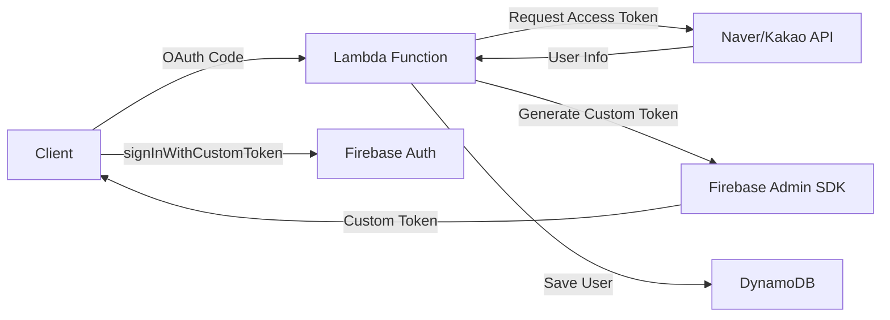

# Creating Naver/Kakao OIDC for Firebase? Reality is Different


*2 AM, wrestling with Firebase console that night...*

## 🤦‍♂️ This is What Happened

Last week, I needed to add Naver/Kakao login to Firebase Authentication for a project. "Oh, this should be simple. Just add an OIDC (OpenID Connect) provider in Firebase, right?" I thought...

I was so naive.

**The Problem**: Firebase supports adding OIDC providers, but Naver and Kakao don't fully comply with standard OIDC specifications!

```javascript
// I thought this would work...
const provider = new firebase.auth.OAuthProvider('naver.com');
// ❌ Error: Invalid provider ID
```

## 🔧 The Struggle

### First Attempt: Finding OIDC Discovery Documents

Standard OIDC providers offer a `/.well-known/openid-configuration` endpoint. So I went looking:

```bash
# Trying Naver
curl https://nid.naver.com/.well-known/openid-configuration
# 404 Not Found 😭

# Trying Kakao  
curl https://kauth.kakao.com/.well-known/openid-configuration
# 404 Not Found 😭
```

Neither had it...

### Second Attempt: Manual OIDC Configuration

I tried to configure it manually in Firebase console:

| Configuration Item | Required Value | Naver/Kakao Reality |
|-------------------|----------------|---------------------|
| Issuer URL | OIDC issuer URL | ❌ None |
| Client ID | OAuth client ID | ✅ Available |
| Client Secret | OAuth client secret | ✅ Available |
| Token URL | Token endpoint | ⚠️ OAuth 2.0 only |
| UserInfo URL | User info endpoint | ⚠️ Non-standard format |

Conclusion: **Impossible**. Naver and Kakao support OAuth 2.0, but not the OIDC standard.

### Third Attempt: Custom Token Strategy

"Then I'll just create Custom Tokens on the server!"

This was the right answer. But then another problem arose...

## 💡 Solution: Hybrid Strategy

Eventually solved it with this architecture:



The key is to **first create all users as Firebase anonymous users, then link accounts later**.

## 💻 Actual Implementation Code

### 1. Handling Naver Login in Lambda

```javascript
// Naver user → Firebase UID mapping
async function handleNaverLogin(naverUser) {
    // Check existing mapping
    const mappedUid = await getNaverUidMapping(naverUser.id);
    
    if (mappedUid) {
        // Existing user - use mapped UID
        return await loginExistingUser(mappedUid);
    } else {
        // New user - create anonymous account on server then link
        const anonymousUser = await admin.auth().createUser({
            disabled: false // anonymous user
        });
        
        // Update account with Naver info (Account Linking)
        await admin.auth().updateUser(anonymousUser.uid, {
            email: naverUser.email,
            displayName: naverUser.nickname,
            customClaims: {
                provider: 'naver',
                naver_id: naverUser.id
            }
        });
        
        // Save mapping
        await createNaverUidMapping(naverUser.id, anonymousUser.uid);
        
        return anonymousUser.uid;
    }
}
```

### 2. Saving Mapping Info in DynamoDB

```javascript
// Naver/Kakao ID → Firebase UID mapping
const mappingStructure = {
    PK: 'NLOGIN#naver_user_12345',  // Naver user ID
    SK: 'AbCdEfGhIjKlMnOpQrStUvWxYz', // Firebase UID
    createdAt: '2025-01-28T02:30:00Z'
};
```

This ensures the same Firebase UID is always used when logging in with the same Naver/Kakao account!

### 3. Using Custom Token on Client

```javascript
// Client (Unity/Web)
async function loginWithNaver(authCode) {
    // 1. Send Authorization Code to Lambda
    const response = await fetch('/auth/naver', {
        method: 'POST',
        body: JSON.stringify({ code: authCode })
    });
    
    const { customToken, jwt } = await response.json();
    
    // 2. Firebase login
    await firebase.auth().signInWithCustomToken(customToken);
    
    // 3. Store JWT token (for API calls)
    localStorage.setItem('authToken', jwt.accessToken);
}
```

## 📈 Results and Lessons Learned

### Pros
- ✅ Full Firebase features available (Rules, Analytics, etc.)
- ✅ Unified user management (all users have Firebase UID)
- ✅ Supports anonymous → social account conversion
- ✅ Multi-provider linking possible

### Cons
- ❌ Server infrastructure required (Lambda + DynamoDB)
- ❌ Additional costs
- ❌ Increased implementation complexity

### Key Insights

1. **Firebase Only Supports Global Standards**
   - Most Korean local services only support OAuth 2.0
   - Don't expect OIDC standard compliance

2. **Hybrid Strategy is the Answer**
   - Unified management with Firebase UID
   - Handle social logins with mapping tables
   - Leveraging anonymous users is key

3. **Serverless is Optimal**
   - Lambda + DynamoDB combo is cost-effective
   - Use Node.js 18.x considering cold starts
   - Manage secrets with Parameter Store

## 🎯 Conclusion

Initially, I thought "Just add an OIDC provider in Firebase and done!" but reality was different. However, this led to building a more flexible authentication system.

If you're in a similar situation, go with the Custom Token approach from the start. Don't waste time trying to add OIDC providers... 😅

Full code is available on [GitHub repository](https://github.com/realcoding2003/firebase-auth-apigateway)!

---

**P.S.** Implementing it this way made it easy to extend with the same pattern when adding Apple login later. Maybe it worked out for the better...? 🤔