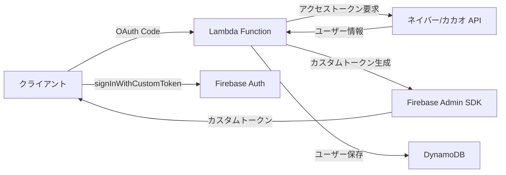

# FirebaseにネイバーカカオOIDCを作る？現実は違った


*午前2時、Firebase コンソールと格闘していたあの日...*

## 🤦‍♂️ こんなことが起きた

先週のプロジェクトで、Firebase Authenticationにネイバー/カカオログインを追加する必要があった。「ああ、簡単だね。FirebaseでOIDC（OpenID Connect）プロバイダーを追加すればいいでしょう？」と思った私...

本当に甘かった。

**問題**：FirebaseはOIDCプロバイダーの追加をサポートしているが、ネイバーとカカオは標準OIDC仕様を完全には準拠していない！

```javascript
// こうすればいけると思ったのに...
const provider = new firebase.auth.OAuthProvider('naver.com');
// ❌ Error: Invalid provider ID
```

## 🔧 奮闘の過程

### 最初の試み：OIDCディスカバリー文書を探す

標準OIDCプロバイダーは`/.well-known/openid-configuration`エンドポイントを提供する。それで探してみた：

```bash
# ネイバーを試す
curl https://nid.naver.com/.well-known/openid-configuration
# 404 Not Found 😭

# カカオを試す  
curl https://kauth.kakao.com/.well-known/openid-configuration
# 404 Not Found 😭
```

どちらもなかった...

### 二番目の試み：手動でOIDC設定

Firebaseコンソールで手動で設定しようとした：

| 設定項目 | 必要な値 | ネイバー/カカオの現実 |
|---------|---------|-------------------|
| Issuer URL | OIDC発行者URL | ❌ なし |
| Client ID | OAuthクライアントID | ✅ あり |
| Client Secret | OAuthクライアントシークレット | ✅ あり |
| Token URL | トークンエンドポイント | ⚠️ OAuth 2.0のみサポート |
| UserInfo URL | ユーザー情報エンドポイント | ⚠️ 非標準形式 |

結論：**不可能**。ネイバーとカカオはOAuth 2.0はサポートしているが、OIDC標準はサポートしていない。

### 三番目の試み：カスタムトークン戦略

「じゃあサーバーでカスタムトークンを作って渡せばいいね！」

これが正解だった。でもここでまた問題が...

## 💡 解決策：ハイブリッド戦略

結局こんな構造で解決した：



核心は**すべてのユーザーをFirebaseの匿名ユーザーとして先に作成し、後でアカウントを連携する方式**である。

## 💻 実際の実装コード

### 1. Lambdaでネイバーログイン処理

```javascript
// ネイバーユーザー → Firebase UIDマッピング
async function handleNaverLogin(naverUser) {
    // 既存マッピング確認
    const mappedUid = await getNaverUidMapping(naverUser.id);
    
    if (mappedUid) {
        // 既存ユーザー - マッピングされたUIDを使用
        return await loginExistingUser(mappedUid);
    } else {
        // 新規ユーザー - サーバーで匿名アカウント作成後に連携
        const anonymousUser = await admin.auth().createUser({
            disabled: false // 匿名ユーザー
        });
        
        // ネイバー情報でアカウント更新（Account Linking）
        await admin.auth().updateUser(anonymousUser.uid, {
            email: naverUser.email,
            displayName: naverUser.nickname,
            customClaims: {
                provider: 'naver',
                naver_id: naverUser.id
            }
        });
        
        // マッピング保存
        await createNaverUidMapping(naverUser.id, anonymousUser.uid);
        
        return anonymousUser.uid;
    }
}
```

### 2. DynamoDBにマッピング情報を保存

```javascript
// ネイバー/カカオ ID → Firebase UIDマッピング
const mappingStructure = {
    PK: 'NLOGIN#naver_user_12345',  // ネイバーユーザーID
    SK: 'AbCdEfGhIjKlMnOpQrStUvWxYz', // Firebase UID
    createdAt: '2025-01-28T02:30:00Z'
};
```

これで同じネイバー/カカオアカウントでログインしても常に同じFirebase UIDを使用できる！

### 3. クライアントでカスタムトークン使用

```javascript
// クライアント（Unity/Web）
async function loginWithNaver(authCode) {
    // 1. LambdaにAuthorization Codeを送信
    const response = await fetch('/auth/naver', {
        method: 'POST',
        body: JSON.stringify({ code: authCode })
    });
    
    const { customToken, jwt } = await response.json();
    
    // 2. Firebaseログイン
    await firebase.auth().signInWithCustomToken(customToken);
    
    // 3. JWTトークンを保存（API呼び出し用）
    localStorage.setItem('authToken', jwt.accessToken);
}
```

## 📈 結果と学んだこと

### メリット
- ✅ Firebaseのすべての機能を活用可能（Rules、Analyticsなど）
- ✅ 統合されたユーザー管理（すべてのユーザーがFirebase UIDを保有）
- ✅ 匿名 → ソーシャルアカウント転換をサポート
- ✅ マルチプロバイダー連携可能

### デメリット
- ❌ サーバーインフラが必要（Lambda + DynamoDB）
- ❌ 追加費用発生
- ❌ 実装の複雑度増加

### 核心的な洞察

1. **Firebaseはグローバル標準のみをサポートする**
   - 韓国のローカルサービスはほとんどOAuth 2.0のみサポート
   - OIDC標準を期待してはいけない

2. **ハイブリッド戦略が正解である**
   - Firebase UIDで統合管理
   - ソーシャルログインはマッピングテーブルで処理
   - 匿名ユーザーの活用が鍵

3. **サーバーレスが最適である**
   - Lambda + DynamoDBの組み合わせがコスト効率的
   - Cold Startを考慮してNode.js 18.xを使用
   - Parameter Storeでシークレット管理

## 🎯 まとめ

最初は「FirebaseでOIDCプロバイダーを追加すれば終わり！」と思っていたが、現実は違った。でもおかげでより柔軟な認証システムを作ることができた。

もし同じような状況にある方は、最初からカスタムトークン方式で行ってください。OIDCプロバイダーを追加しようと時間を無駄にしないで... 😅

全体コードは[GitHubリポジトリ](https://github.com/realcoding2003/firebase-auth-apigateway)で確認できます！

---

**追伸** この方式で実装したら、後でAppleログインを追加するときも同じパターンで簡単に拡張できました。むしろ良かったかも...？ 🤔