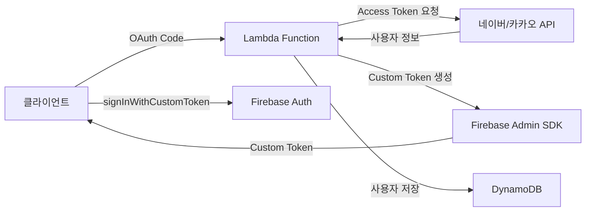

# Firebase에 네이버/카카오 OIDC 만들기? 현실은 다르더라


*새벽 2시, Firebase 콘솔과 씨름하던 그 날...*

## 🤦‍♂️ 이런 일이 생겼다

지난주 프로젝트에서 Firebase Authentication에 네이버/카카오 로그인을 추가해야 했다. "아, 간단하겠네. Firebase에서 OIDC(OpenID Connect) 프로바이더 추가하면 되겠지?" 라고 생각했던 나... 

진짜 순진했다.

**문제**: Firebase는 OIDC 프로바이더 추가를 지원하지만, 네이버와 카카오는 표준 OIDC 규격을 완벽하게 따르지 않는다!

```javascript
// 이렇게 하면 될 줄 알았는데...
const provider = new firebase.auth.OAuthProvider('naver.com');
// ❌ Error: Invalid provider ID
```

## 🔧 삽질 과정

### 첫 번째 시도: OIDC Discovery 문서 찾기

표준 OIDC 프로바이더는 `/.well-known/openid-configuration` 엔드포인트를 제공한다. 그래서 찾아봤다:

```bash
# 네이버 시도
curl https://nid.naver.com/.well-known/openid-configuration
# 404 Not Found 😭

# 카카오 시도  
curl https://kauth.kakao.com/.well-known/openid-configuration
# 404 Not Found 😭
```

둘 다 없더라... 

재밌는 건, [카카오는 Kakao Login 설정에서 "OpenID Connect Activation"을 활성화](https://velog.io/@dginovker/How-to-use-Kakao-for-SSO-on-Android-and-iOS-Flutter-apps-with-Firebase)할 수 있다고 해서 혹시나 싶어 확인해봤더니, 그래도 표준 Discovery 문서는 제공하지 않았다.

### 두 번째 시도: 수동으로 OIDC 설정

Firebase 콘솔에서 수동으로 설정해보려고 했다:

| 설정 항목 | 필요한 값 | 네이버/카카오 현실 |
|----------|----------|-------------------|
| Issuer URL | OIDC 발급자 URL | ❌ 없음 |
| Client ID | OAuth 클라이언트 ID | ✅ 있음 |
| Client Secret | OAuth 클라이언트 시크릿 | ✅ 있음 |
| Token URL | 토큰 엔드포인트 | ⚠️ OAuth 2.0만 지원 |
| UserInfo URL | 사용자 정보 엔드포인트 | ⚠️ 비표준 형식 |

결론: **불가능**. 네이버와 카카오는 OAuth 2.0은 지원하지만, 완전한 OIDC 표준은 지원하지 않는다.

### 세 번째 시도: Firebase Functions로 OIDC 프록시 만들기

"그럼 Firebase Functions로 중간 레이어를 만들어서 표준 OIDC로 변환하면 되지 않을까?"

이런 구조를 시도했다:

```javascript
// Firebase Function에서 OIDC 프록시 구현 시도
exports.oidcProxy = functions.https.onRequest(async (req, res) => {
    const { provider } = req.query; // 'naver' 또는 'kakao'
    
    if (req.path === '/.well-known/openid-configuration') {
        // 가짜 OIDC Discovery 문서 제공
        return res.json({
            issuer: `https://us-central1-myproject.cloudfunctions.net/oidcProxy`,
            authorization_endpoint: `https://us-central1-myproject.cloudfunctions.net/oidcProxy/authorize`,
            token_endpoint: `https://us-central1-myproject.cloudfunctions.net/oidcProxy/token`,
            userinfo_endpoint: `https://us-central1-myproject.cloudfunctions.net/oidcProxy/userinfo`,
            // ... 기타 OIDC 필수 필드들
        });
    }
    
    // 각 엔드포인트별 프록시 로직...
});
```

하지만 이 방식은 여러 문제에 부딪혔다:

1. **복잡도 폭발**: OIDC의 모든 엔드포인트를 구현해야 함
2. **상태 관리 지옥**: Authorization Code, Access Token 등을 어디에 저장할지
3. **보안 이슈**: 중간자 역할을 하면서 발생하는 추가 보안 고려사항
4. **비용 증가**: 모든 인증 요청이 Functions를 거쳐야 함

비슷한 시도를 한 사례들을 찾아보니:
- [네이버 블로그에서도 "국내에서 활발히 쓰이는 카카오 로그인/네이버 로그인이 아직 지원되지 않는다"고 언급](https://m.blog.naver.com/chltmddus23/221784299552)하며 Custom Token 방식을 제안
- [GitHub의 firebase-custom-login 프로젝트](https://github.com/zaiyou12/firebase-custom-login)에서도 "firebase function을 사용해 Custom Token을 반환하는 방식"을 채택
- [AWS Lambda와 Firebase Auth를 조합한 방식](https://goodgoodjm.github.io/kakao-and-naver-login-with-firebase-1/)도 결국 Custom Token으로 귀결

### 네 번째 시도: Custom Token 전략

결국 Firebase Functions로 OIDC를 흉내내는 것보다, 서버(Lambda)에서 Custom Token을 발급하는 것이 훨씬 깔끔하다는 결론에 도달했다.

이게 정답이었다. 근데 여기서 또 문제가...

## 💡 해결책: 하이브리드 전략

결국 이런 구조로 해결했다:



핵심은 **모든 사용자를 Firebase의 익명 사용자로 먼저 만들고, 나중에 계정을 연결하는 방식**이다.

## 💻 실제 구현 코드

### 1. Lambda에서 네이버 로그인 처리

```javascript
// 네이버 사용자 → Firebase UID 매핑
async function handleNaverLogin(naverUser) {
    // 기존 매핑 확인
    const mappedUid = await getNaverUidMapping(naverUser.id);
    
    if (mappedUid) {
        // 기존 사용자 - 매핑된 UID 사용
        return await loginExistingUser(mappedUid);
    } else {
        // 신규 사용자 - 서버에서 익명 계정 생성 후 연결
        const anonymousUser = await admin.auth().createUser({
            disabled: false // 익명 사용자
        });
        
        // 네이버 정보로 계정 업데이트 (Account Linking)
        await admin.auth().updateUser(anonymousUser.uid, {
            email: naverUser.email,
            displayName: naverUser.nickname,
            customClaims: {
                provider: 'naver',
                naver_id: naverUser.id
            }
        });
        
        // 매핑 저장
        await createNaverUidMapping(naverUser.id, anonymousUser.uid);
        
        return anonymousUser.uid;
    }
}
```

### 2. DynamoDB에 매핑 정보 저장

```javascript
// 네이버/카카오 ID → Firebase UID 매핑
const mappingStructure = {
    PK: 'NLOGIN#naver_user_12345',  // 네이버 사용자 ID
    SK: 'AbCdEfGhIjKlMnOpQrStUvWxYz', // Firebase UID
    createdAt: '2025-01-28T02:30:00Z'
};
```

이렇게 하면 동일한 네이버/카카오 계정으로 로그인해도 항상 같은 Firebase UID를 사용할 수 있다!

### 3. 클라이언트에서 Custom Token 사용

```javascript
// 클라이언트 (Unity/Web)
async function loginWithNaver(authCode) {
    // 1. Lambda로 Authorization Code 전송
    const response = await fetch('/auth/naver', {
        method: 'POST',
        body: JSON.stringify({ code: authCode })
    });
    
    const { customToken, jwt } = await response.json();
    
    // 2. Firebase 로그인
    await firebase.auth().signInWithCustomToken(customToken);
    
    // 3. JWT 토큰 저장 (API 호출용)
    localStorage.setItem('authToken', jwt.accessToken);
}
```

## 📈 결과와 배운 점

### 장점
- ✅ Firebase의 모든 기능 활용 가능 (Rules, Analytics 등)
- ✅ 통합된 사용자 관리 (모든 사용자가 Firebase UID 보유)
- ✅ 익명 → 소셜 계정 전환 지원
- ✅ 멀티 프로바이더 연결 가능

### 단점
- ❌ 서버 인프라 필요 (Lambda + DynamoDB)
- ❌ 추가 비용 발생
- ❌ 구현 복잡도 증가

### 핵심 인사이트

1. **Firebase는 글로벌 표준만 지원한다**
   - 한국 로컬 서비스들은 대부분 OAuth 2.0만 지원
   - OIDC 표준을 기대하면 안 됨
   - [Firebase 공식 문서](https://firebase.google.com/docs/auth/web/openid-connect)에서도 "OIDC compliant provider"를 명시

2. **Firebase Functions로 OIDC 프록시 만들기는 비현실적이다**
   - 이론적으로는 가능하지만 구현 복잡도가 너무 높음
   - 보안 취약점 발생 가능성 증가
   - 비용과 유지보수 부담이 크다
   - 여러 개발자들이 시도했지만 대부분 Custom Token 방식으로 회귀

3. **하이브리드 전략이 정답이다**
   - Firebase UID로 통합 관리
   - 소셜 로그인은 매핑 테이블로 처리
   - 익명 사용자 활용이 핵심
   - Account Linking으로 나중에 계정 연결 가능

4. **서버리스가 최적이다**
   - Lambda + DynamoDB 조합이 비용 효율적
   - Cold Start 고려해서 Node.js 18.x 사용
   - Parameter Store로 시크릿 관리

## 🎯 마무리

처음엔 "Firebase에서 OIDC 프로바이더 추가하면 끝!" 이라고 생각했는데, 현실은 달랐다. 하지만 덕분에 더 유연한 인증 시스템을 만들 수 있었다.

인터넷을 뒤져보니 나 같은 사람이 많더라:
- [카카오 데브톡에서도 2017년부터 Firebase 연동 질문](https://devtalk.kakao.com/t/firebase/30575)이 올라오고 있음
- [Stack Overflow에서도 OAuth 2.0 설정 관련 문제](https://stackoverflow.com/questions/79183709/oauth-2-0-not-working-properly-with-kakao-login-in-react-app)들이 계속 보고됨
- 대부분의 해결책이 Custom Token 방식으로 수렴

혹시 비슷한 상황에 계신 분들, 처음부터 Custom Token 방식으로 가세요. OIDC 프로바이더 추가하려고 시간 낭비하지 마시고... 😅

전체 코드는 [GitHub 레포지토리](https://github.com/realcoding2003/firebase-auth-apigateway)에서 확인할 수 있습니다!

---

**P.S.** 이 방식으로 구현하니까 나중에 Apple 로그인 추가할 때도 동일한 패턴으로 쉽게 확장할 수 있더라구요. 오히려 잘 됐나...? 🤔

**P.P.S.** 카카오가 OIDC를 부분적으로 지원한다고 해서 기대했는데, 결국 Firebase가 요구하는 표준과는 거리가 있었어요. 네이버는 아예 OIDC 계획이 없는 듯... 🥲